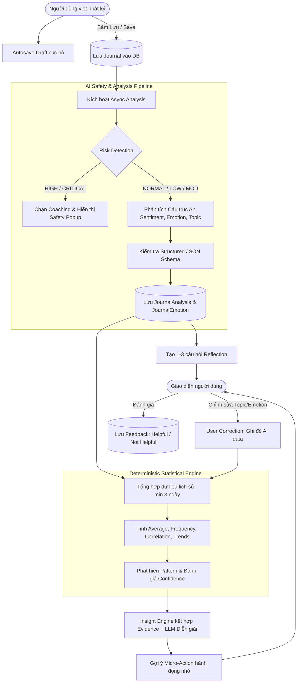

# 📔 MyLog – Smart Journal & Mental Wellness Platform

> **Nền tảng nhật ký thông minh kết hợp Trí tuệ nhân tạo (AI) và Công cụ Thống kê Định lượng (Statistical Engine), mang phong cách Playful Neo-Brutalism & Physical Scrapbook.**

[](https://nextjs.org/)
[](https://react.dev/)
[](https://spring.io/projects/spring-boot)
[](https://www.postgresql.org/)
[](https://tailwindcss.com/)
[-orange?style=flat-square)]()

---

## 📑 Mục lục (Table of Contents)

1. [Tổng quan dự án (Project Overview)](#-tổng-quan-dự-án-project-overview)
2. [Sự khác biệt cốt lõi (Core Differentiator)](#-sự-khác-biệt-cốt-lõi-core-differentiator)
3. [Kiến trúc hệ thống (System Architecture)](#-kiến-trúc-hệ-thống-system-architecture)
4. [Luồng xử lý chính (Core Data Flow)](#-luồng-xử-lý-chính-core-data-flow)
5. [Các phân hệ tính năng MVP (Key Functional Modules)](#-các-phân-hệ-tính-năng-mvp-key-functional-modules)
   - [5.1. Quản lý tài khoản & Bảo mật (Auth & Security)](#51-quản-lý-tài-khoản--bảo-mật-auth--security)
   - [5.2. Quản lý nhật ký (Journal CRUD & Autosave)](#52-quản-lý-nhật-ký-journal-crud--autosave)
   - [5.3. AI Analysis Pipeline & User Correction](#53-ai-analysis-pipeline--user-correction)
   - [5.4. Lưới an toàn & Nhận diện rủi ro (Safety & Risk Detection)](#54-lưới-an-toàn--nhận-diện-rủi-ro-safety--risk-detection)
   - [5.5. Reflection Questions & Suggested Actions](#55-reflection-questions--suggested-actions)
   - [5.6. Statistical Engine & Bằng chứng Insight](#56-statistical-engine--bằng-chứng-insight)
   - [5.7. Dashboard & Trực quan hoá dữ liệu](#57-dashboard--trực-quan-hoá-dữ-liệu)
6. [Mô hình dữ liệu (Database Schema & Relationships)](#-mô-hình-dữ-liệu-database-schema--relationships)
7. [Quy tắc nghiệp vụ & Xử lý biên (Business Rules & Edge Cases)](#-quy-tắc-nghiệp-vụ--xử-lý-biên-business-rules--edge-cases)
8. [Ngăn xếp công nghệ (Technology Stack)](#-ngăn-xếp-công-nghệ-technology-stack)
9. [Cấu trúc thư mục (Repository Structure)](#-cấu-trúc-thư-mục-repository-structure)
10. [Hướng dẫn cài đặt & Chạy cục bộ (Getting Started)](#-hướng-dẫn-cài-đặt--chạy-cục-bộ-getting-started)
11. [Lộ trình phát triển (Roadmap & MVP Scope)](#-lộ-trình-phát-triển-roadmap--mvp-scope)

---

## 🌟 Tổng quan dự án (Project Overview)

**MyLog** là một ứng dụng web nhật ký cá nhân giúp người dùng ghi chép lại suy nghĩ, cảm xúc thường nhật trong một không gian số mang xúc cảm thân thuộc của cuốn sổ tay dán ảnh (Scrapbook) và phong cách đồ họa nổi bật **Playful Neo-Brutalism**.

Không dừng lại ở việc lưu trữ văn bản đơn thuần, MyLog vận hành như một người bạn đồng hành thấu cảm:
- Tự động phân tích **cảm xúc (emotion)**, **sắc thái (sentiment)** và **chủ đề (topic)**.
- Kết hợp với **Statistical Engine độc lập** để giải mã các mẫu hình hành vi (patterns), xu hướng tâm trạng theo thời gian.
- Cung cấp các câu hỏi **phản tư (reflection)** sâu sắc và đề xuất những **hành động nhỏ (micro-actions)** giúp người dùng tự cân bằng tinh thần.

---

## 💎 Sự khác biệt cốt lõi (Core Differentiator)

Khác với các ứng dụng tích hợp chatbot AI thông thường chỉ gọi LLM để trả lời một đoạn nhật ký đơn lẻ rồi quên lãng:

| Tiêu chí | Ứng dụng AI Chatbot thông thường | **MyLog Platform** |
| :--- | :--- | :--- |
| **Xử lý số liệu** | Để LLM tự "bịa" hoặc tự suy diễn số liệu thống kê. | **Statistical Engine độc lập** trong backend tính toán trung bình, tần suất, tương quan toán học chính xác. |
| **Căn cứ tạo Insight** | Phỏng đoán mơ hồ dựa trên prompt. | **Evidence-Based Insight**: Mọi insight đều có bằng chứng định lượng (`sampleSize`, `matchingCount`, `frequency`). |
| **Tính nhân văn & Quyền làm chủ** | Người dùng thụ động nhận phán xét từ AI. | **User Correction First**: Người dùng có quyền sửa topic/cảm xúc. Dữ liệu sửa đổi được ưu tiên tuyệt đối (`User Corrected Data > Original AI Data`). |
| **An toàn tinh thần** | Thiếu kiểm soát rủi ro, dễ phát ngôn gây hại. | **Multi-tier Safety Pipeline**: Kiểm duyệt mức độ rủi ro (Risk Detection) trước khi gợi ý hành động; chặn coaching và kích hoạt Safety Popup hỗ trợ khi có dấu hiệu khủng hoảng. |
| **Trải nghiệm thị giác** | Giao diện SaaS đơn điệu, phẳng lì. | **Playful Neo-Brutalism + Scrapbook**: Giấy màu kem (`#F3EBDD`), viền đen đậm, bóng cứng, băng keo washi, tem dán polaroid. |

---

## 🏗 Kiến trúc hệ thống (System Architecture)

Backend được tổ chức theo **pragmatic modular monolith**: chia theo nghiệp vụ trước (`identity`, `journal`, `analysis`), rồi phân lớp bên trong từng module. Phụ thuộc mặc định đi theo chiều `controller → service → repository`; tích hợp ngoài như AI, RabbitMQ và Redis được cô lập tại adapter tương ứng.

```text
               ┌────────────────────────────────────────────────────────┐
               │              Frontend (Next.js 16 + React 19)          │
               │   Neo-Brutalist UI • Motion Animations • Recharts Data │
               └───────────────────────────┬────────────────────────────┘
                                           │ HTTPS / RESTful API (JSON)
                                           ▼
               ┌────────────────────────────────────────────────────────┐
               │           Backend (Java Spring Boot 3 + Security)      │
               ├────────────────────────────────────────────────────────┤
               │  [ Controller Layer ] -> REST Endpoints & Validation   │
               │                                                        │
               │  [ Feature Modules ]                                   │
               │   ├── identity/{controller,dto,service,entity,...}      │
               │   ├── journal/{controller,dto,service,entity,...}       │
               │   └── analysis/{controller,service,provider,...}        │
               │                                                        │
               │  [ AI Integration Layer - Abstraction Interface ]      │
               │   └── AiAnalysisProvider (OpenAI / Gemini / Mock)      │
               │                                                        │
               │  [ Common Infrastructure ]                             │
               │   Security • Outbox • Messaging • Error Handling       │
               └───────────────────────────┬────────────────────────────┘
                                           │
                                           ▼
                              ┌─────────────────────────┐
                              │  PostgreSQL Database    │
                              │  Structured Schema      │
                              └─────────────────────────┘
```

---

## 🔄 Luồng xử lý chính (Core Data Flow)



---

## 🧩 Các phân hệ tính năng MVP (Key Functional Modules)

### 5.1. Quản lý tài khoản & Bảo mật (Auth & Security)
- **Đăng ký & Đăng nhập (FR-AUTH-01, 02):** Xác thực bằng Email/Password, Display Name. Mật khẩu được mã hóa an toàn bằng **BCrypt / Argon2**.
- **Phiên làm việc Stateless (FR-AUTH-03, 04):** Cấp phát cặp token `Access Token` và `Refresh Token`. Hỗ trợ refresh token tự động ngầm dưới client.
- **Phân quyền tài nguyên (FR-AUTH-05):** Kiểm tra nghiêm ngặt `resource.userId == authenticatedUser.id`. Tuyệt đối không cho phép User A truy cập dữ liệu của User B.

### 5.2. Quản lý nhật ký (Journal CRUD & Autosave)
- **Tạo nhật ký (FR-JOURNAL-01 → 07):** 
  - Trường bắt buộc: `content` (văn bản có nghĩa), `moodScore` (1 đến 10).
  - Trường tùy chọn: `stressScore` (1-10), `energyScore` (1-10), danh sách thẻ `tags`, đính kèm ảnh polaroid.
  - Hỗ trợ viết nhiều nhật ký trong một ngày (`FR-JOURNAL-06`). Điểm tâm trạng trong ngày (`dailyMood`) được tính bằng trung bình cộng các lần viết.
- **Autosave Draft (FR-JOURNAL-12):** Tự động lưu bản nháp vào Local Storage của trình duyệt, không kích hoạt AI analysis khi đang gõ dở dang.
- **Máy trạng thái nhật ký (Journal State Machine - Section 9):**
  ```text
  DRAFT ──► SAVED ──► ANALYZING ──► ANALYZED
                           │
                           ├──► ANALYSIS_FAILED (khi AI lỗi, cho phép retry)
                           │
  [Sửa nội dung] ──────────┴──► ANALYSIS_OUTDATED ──► ANALYZING
  ```

### 5.3. AI Analysis Pipeline & User Correction
- **Xử lý Bất đồng bộ (FR-AI-01, 02):** Lưu nhật ký tức thì vào DB (≤ 2 giây), sau đó kích hoạt luồng background async gọi AI phân tích nhằm không nghẽn trải nghiệm người dùng.
- **Chuẩn hóa đầu ra (Structured Output - FR-AI-06):** LLM bắt buộc phải trả về JSON đúng schema định sẵn, không dùng free-form text:
  - `sentiment`: Duy nhất 1 giá trị (`POSITIVE`, `NEUTRAL`, `NEGATIVE`).
  - `emotions`: Danh sách kèm điểm số `0.0` đến `1.0` (quy đổi 0-100%).
  - `topics`: Danh sách các chủ đề được trích xuất linh hoạt (`deadline`, `work`, `family`, `health`...).
  - `riskLevel`: Mức độ an toàn (`NORMAL`, `LOW`, `MODERATE`, `HIGH`, `CRITICAL`).
- **Phân loại cảm xúc cố định (Emotion Taxonomy - Section 12):**
  > `JOY` • `SADNESS` • `ANGER` • `FEAR` • `ANXIETY` • `CALM` • `HOPE` • `GRATITUDE` • `LONELINESS` • `FRUSTRATION` • `EXCITEMENT`
- **Quyền sửa đổi dữ liệu của người dùng (User Correction - FR-CORRECTION-01 → 04):**
  - Người dùng có thể thêm/sửa/xóa topic và chỉnh sửa lại emotion do AI nhận diện.
  - **Quy tắc vàng:** `User Corrected Data > Original AI Data`. Statistical Engine bắt buộc dùng dữ liệu đã chỉnh sửa của người dùng để phân tích tiếp theo.
  - Bản ghi gốc của AI được lưu lại trường audit (`originalValue`, `correctedValue`, `correctedAt`) để phục vụ tinh chỉnh model.

### 5.4. Lưới an toàn & Nhận diện rủi ro (Safety & Risk Detection)
- **Tầng an toàn ưu tiên (Safety First - FR-SAFETY-01 → 05):** Mọi bài viết đều được thẩm định rủi ro trước khi tạo bất kỳ gợi ý nào.
- **Xử lý tình huống Khẩn cấp / Nguy cơ cao (`HIGH` / `CRITICAL`):**
  1. Lập tức **dừng** tạo các gợi ý hành động (suggested action) hay huấn luyện (coaching) thông thường.
  2. Không đưa ra chẩn đoán y khoa hay khẳng định AI có thể chữa lành khủng hoảng.
  3. Bật **Safety Modal Popup** dịu dàng, trang trọng, cung cấp số điện thoại đường dây nóng hỗ trợ tâm lý khẩn cấp và khuyến khích tìm kiếm sự trợ giúp từ chuyên gia/người thân.
  4. Ghi nhận `SafetyEvent` phục vụ bảo vệ người dùng (không log trực tiếp nội dung nhật ký nhạy cảm).

### 5.5. Reflection Questions & Suggested Actions
- **Writing Prompt (FR-PROMPT-01, 02):** Nút *"Gợi ý cho tôi"* trong editor giúp khơi gợi cảm hứng viết khi người dùng bị bế tắc ý tưởng.
- **Câu hỏi phản tư (FR-REFLECTION-01 → 05):** Sinh tối đa 3 câu hỏi đào sâu sau khi phân tích bài viết. Tôn trọng ngữ cảnh nhạy cảm, không cố tình gợi lại nỗi đau cũ không liên quan.
- **Hành động nhỏ đề xuất (FR-ACTION-01 → 04):** Đề xuất 1–3 hành động nhỏ, cụ thể, khả thi ngay (ví dụ: *"Dành 5 phút đi dạo quanh phòng và uống 1 cốc nước ấm"*), người dùng có thể bấm `ACCEPT` hoặc `IGNORE`.
- **Đánh giá phản hồi (FR-FEEDBACK-01 → 03):** Người dùng đánh giá `HELPFUL` / `NOT_HELPFUL` cho từng câu hỏi và hành động để hệ thống điều chỉnh độ ưu tiên nội dung hiển thị.

### 5.6. Statistical Engine & Bằng chứng Insight
- **Độc lập hoàn toàn với LLM (Section 15):** Toàn bộ phép tính định lượng do Backend Java phụ trách:
  - Ngưỡng tối thiểu: Cần ít nhất **3 ngày viết nhật ký khác nhau** mới bắt đầu kích hoạt tạo Insight lịch sử.
  - Tính điểm trung bình tâm trạng theo ngày, tuần, tháng.
  - Tần suất xuất hiện cảm xúc và chủ đề.
  - Tương quan Chủ đề - Tâm trạng (`Topic-Mood Correlation`), ví dụ: *Chủ đề "deadline" xuất hiện trong 6/8 ngày có điểm tâm trạng thấp ≤ 4*.
  - Nhận diện xu hướng giảm/tăng liên tục qua các tuần (`Trend Detection`).
- **Cấu trúc bằng chứng (Evidence-Based Insight - FR-INSIGHT-01 → 07):**
  - Mọi Insight đều lưu kèm object `evidence` (gồm `sampleSize`, `matchingCount`, `frequency`).
  - Mức độ tin cậy được phân cấp rõ ràng: `WEAK`, `MODERATE`, `STRONG` (dựa trên cỡ mẫu thực tế, không dùng % tự xưng của AI).
  - **Tuyệt đối cấm kết luận quan hệ nhân quả:** Insight không được nói "X gây ra Y" mà phải dùng ngôn ngữ khoa học: *"X thường xuất hiện cùng Y"*, *"Có xu hướng liên quan mật thiết"*.
  - Vòng đời Insight: `ACTIVE` ──► `FADING` ──► `EXPIRED`.

### 5.7. Dashboard & Trực quan hoá dữ liệu
- **Dashboard thời gian thực (FR-DASH-01 → 07):**
  - Mặc định hiển thị chu kỳ 7 ngày gần nhất.
  - Biểu đồ xu hướng kết hợp: Tâm trạng (`Mood`), Áp lực (`Stress`), Năng lượng (`Energy`).
  - Lịch tâm trạng cá nhân (Mood Calendar) trực quan theo ô ngày.
  - Phổ phân bố cảm xúc (Emotion Spectrum) và đám mây thẻ chủ đề nổi bật.

---

## 🗄 Mô hình dữ liệu (Database Schema & Relationships)

Mô hình dữ liệu quan hệ được quản lý phiên bản nghiêm ngặt bằng **Flyway Migration**:

```text
User (1)
 ├── (N) JournalEntry
 │        ├── (1) JournalAnalysis
 │        │        └── (N) JournalEmotion
 │        ├── (N) JournalTopic ──► Topic (N)
 │        └── (N) ReflectionQuestion
 ├── (N) Insight
 │        ├── (1..N) InsightEvidence
 │        └── (1..N) SuggestedAction
 ├── (N) Feedback
 ├── (N) WeeklyReport
 └── (N) SafetyEvent
```

### Bảng chi tiết thực thể cốt lõi:
- **`users`**: `id`, `email`, `password_hash`, `display_name`, `plan` (FREE/PLUS), `timezone`, timestamps.
- **`journal_entries`**: `id`, `user_id`, `content`, `mood_score` (1-10), `stress_score`, `energy_score`, `status`, timestamps.
- **`journal_analyses`**: `id`, `journal_entry_id`, `sentiment`, `risk_level`, `explanation`, `analyzed_at`, `version`.
- **`journal_emotions`**: `id`, `analysis_id`, `emotion_type`, `original_score`, `corrected_score`, `corrected_by_user`.
- **`topics` & `journal_topics`**: Quản lý thẻ chủ đề trích xuất từ AI hoặc do người dùng tạo thủ công (`source: AI / USER`).
- **`reflection_questions`**: `id`, `journal_entry_id`, `question`, `created_at`.
- **`insights` & `insight_evidences`**: `id`, `user_id`, `type`, `title`, `description`, `confidence` (WEAK/MODERATE/STRONG), `status` (ACTIVE/FADING/EXPIRED), kèm chi tiết kiểm chứng `sample_size`, `matching_count`, `evidence_json`.
- **`suggested_actions`**: `id`, `insight_id`, `description`, `status` (PENDING/ACCEPTED/IGNORED).
- **`feedbacks`**: `id`, `user_id`, `target_type` (REFLECTION/ACTION), `target_id`, `value` (HELPFUL/NOT_HELPFUL).
- **`safety_events`**: `id`, `user_id`, `journal_entry_id`, `risk_level`, `action_taken`, `created_at`.

---

## ⚖️ Quy tắc nghiệp vụ & Xử lý biên (Business Rules & Edge Cases)

| Mã | Tình huống / Quy tắc | Cách thức hệ thống xử lý |
| :--- | :--- | :--- |
| **BR-03 & 04** | Nhập điểm đánh giá | Điểm `moodScore` là bắt buộc (1–10). `stressScore` và `energyScore` là tùy chọn; nếu bỏ trống phải lưu `NULL` trong DB, tuyệt đối không tự gán bằng `0`. |
| **BR-09 & EC-01**| AI Provider bị timeout / lỗi mạng | **Không được làm mất bài viết của người dùng.** Nhật ký vẫn lưu thành công với trạng thái `ANALYSIS_FAILED` và cung cấp nút Thử lại (Retry) có giới hạn số lần. |
| **EC-02** | Người dùng sửa nhật ký khi AI đang phân tích | Sử dụng cơ chế `journalVersion`. Kết quả phân tích của phiên bản cũ sẽ bị hủy bỏ, tránh ghi đè dữ liệu sai lệch lên bản cập nhật mới. |
| **EC-03** | Người dùng xóa bài viết khi AI worker đang chạy | Worker kiểm tra trạng thái bài viết trước khi lưu; không tái tạo lại dữ liệu của bài viết đã bị xóa. |
| **BR-06 & EC-04**| Người dùng chỉ có 1-2 bài nhưng mở mục Insight | Không sinh insight rác. Giao diện thông báo thân thiện: *"Hãy viết nhật ký ít nhất 3 ngày để MyLog bắt đầu khám phá mẫu hình cảm xúc của bạn."* |
| **BR-12 & EC-06**| LLM giải thích trái ngược với số liệu thống kê | **Kết quả thống kê định lượng luôn là chân lý (Source of Truth).** Phản hồi giải thích vi phạm tiêu chuẩn kiểm chứng sẽ bị reject và tạo lại. |
| **NFR-PRIVACY** | Quyền riêng tư & Nhật ký hệ thống | Tuyệt đối **không ghi (log) nội dung nhật ký, mật khẩu, JWT token** vào file console log của máy chủ. Chỉ gửi dữ liệu cần thiết tối thiểu tới AI Provider. |

---

## 🛠 Ngăn xếp công nghệ (Technology Stack)

### Frontend (`/front-end/my-app`)
- **Core Framework:** [Next.js 16 (App Router)](https://nextjs.org/) + [React 19](https://react.dev/) + [TypeScript 5](https://www.typescriptlang.org/)
- **Styling:** [Tailwind CSS v4](https://tailwindcss.com/) (Custom Neo-Brutalist design tokens, border 2px/2.5px, hard shadows `shadow-neo`)
- **Animation & Micro-interactions:** [Motion (`motion/react` v13)](https://motion.dev/) (Spring physics, tactile button press, polaroid tilt, AnimatePresence transitions)
- **Icons & Visualization:** [Lucide React](https://lucide.dev/), SVG Custom Charts & Metric Indicators
- **Internationalization (i18n):** [i18next](https://www.i18next.com/) & [react-i18next](https://react.i18next.com/) (Hỗ trợ Tiếng Việt & English)

### Backend (`/backend`)
- **Core Platform:** Java 21 + [Spring Boot 4](https://spring.io/projects/spring-boot)
- **Security:** Spring Security, JWT (JSON Web Tokens), BCrypt Password Encoder
- **Persistence:** Spring Data JPA (Hibernate), HikariCP Connection Pool
- **Database Migration:** [Flyway](https://flywaydb.org/)
- **Asynchronous Execution:** RabbitMQ worker và Transactional Outbox
- **Database:** PostgreSQL trên [Supabase](https://supabase.com/)
- **Cache:** Redis
- **API Documentation:** OpenAPI / Swagger UI
- **AI Client Abstraction:** Spring AI hoặc WebClient kết nối OpenAI GPT / Google Gemini API

---

## 📁 Cấu trúc thư mục (Repository Structure)

```text
my-log-platform/
├── README.md                      # Tài liệu tổng quan dự án (tài liệu này)
├── front-end/
│   └── my-app/                    # Ứng dụng Next.js Frontend
│       ├── app/                   # App Router (Pages, Layouts, Route Handlers)
│       │   ├── (app)/             # Authenticated App Routes (Dashboard, Editor, History, Insights)
│       │   ├── auth/              # Màn hình Đăng nhập (login) & Đăng ký (register)
│       │   ├── globals.css        # Cấu hình Tailwind v4 & Neo-Brutalist theme variables
│       │   └── page.tsx           # Landing Page phong cách Editorial Scrapbook
│       ├── components/            # Tái sử dụng các UI Components
│       │   ├── layout/            # Navbar, Sidebar, TopHeader
│       │   └── ui/                # NeoButton, BentoCard, Toast, NotificationModal, PolaroidCard, WashiTape
│       ├── lib/                   # Utilities, Context Providers (Journal, Toast, i18n)
│       ├── locales/               # Từ điển đa ngôn ngữ (vi, en)
│       └── package.json           # Dependencies frontend
└── backend/                       # Ứng dụng Java Spring Boot Backend
    ├── src/
    │   ├── main/
    │   │   ├── java/com/mylog/    # Mã nguồn backend theo feature
    │   │   │   ├── identity/      # Đăng ký, đăng nhập, token, hồ sơ
    │   │   │   │   ├── controller/
    │   │   │   │   ├── dto/
    │   │   │   │   ├── service/
    │   │   │   │   ├── entity/
    │   │   │   │   ├── repository/
    │   │   │   │   ├── security/
    │   │   │   │   └── config/
    │   │   │   ├── journal/       # CRUD journal và idempotency
    │   │   │   │   └── {controller,dto,service,entity,repository}/
    │   │   │   ├── analysis/      # AI, safety, correction, reflection
    │   │   │   │   └── {controller,dto,service,entity,repository,provider,messaging,config}/
    │   │   │   ├── statistics/    # Dashboard và deterministic aggregates
    │   │   │   ├── insight/       # Evidence, confidence, lifecycle, action
    │   │   │   ├── feedback/      # Idempotent user feedback
    │   │   │   └── common/        # Hạ tầng dùng chung, không chứa nghiệp vụ
    │   │   │       └── {api,controller,config,exception,logging,messaging,outbox,security,web}/
    │   │   └── resources/
    │   │       ├── db/migration/  # Các script Flyway SQL Versioning
    │   │       └── application.yml# Cấu hình môi trường & Database
    │   └── test/                  # Unit Tests & Integration Tests
    └── pom.xml                    # Maven Configuration
```

Quy tắc package, chiều phụ thuộc và cách thêm module mới được mô tả tại [Code Organization](docs/CODE_ORGANIZATION.md). Thiết kế tổng thể backend nằm tại [Backend Architecture](docs/BACKEND_ARCHITECTURE.md).

---

## 🚀 Hướng dẫn cài đặt & Chạy cục bộ (Getting Started)

### Yêu cầu tiên quyết (Prerequisites)
- **Node.js:** phiên bản `v20.x` hoặc `v22.x` trở lên (kèm `npm`)
- **Java Development Kit (JDK):** phiên bản `21` trở lên
- **Supabase:** một project và database password
- **Docker:** dùng để chạy Redis, RabbitMQ và PostgreSQL local/test
- Không cần cài Maven toàn cục; project có Maven Wrapper.

---

### Bước 1: Lấy thông tin kết nối Supabase

Trong Supabase Dashboard, chọn **Connect > Session pooler** và sao chép chính xác host, username cùng database password. Backend dùng JDBC và SSL để kết nối trực tiếp tới PostgreSQL của Supabase.

---

### Bước 2: Cấu hình và khởi chạy Backend (Spring Boot)

1. Di chuyển vào thư mục backend:
   ```powershell
   cd backend
   ```

2. Thiết lập biến môi trường từ connection info của Supabase:
   ```powershell
   $env:SPRING_PROFILES_ACTIVE = 'api,supabase'
   $env:DB_URL = 'jdbc:postgresql://YOUR_POOLER_HOST:5432/postgres'
   $env:DB_USERNAME = 'postgres.YOUR_PROJECT_REF'
   $env:DB_PASSWORD = 'YOUR_DATABASE_PASSWORD'
   $env:DB_SSL_MODE = 'require'
   ```

3. Chạy Redis, RabbitMQ và backend:
   ```powershell
   docker compose up -d redis rabbitmq
   .\mvnw.cmd spring-boot:run
   ```
   > Backend sẽ khởi động mặc định tại cổng: `http://localhost:8080`. Flyway sẽ tự động chạy các script khởi tạo bảng trong database.

---

### Bước 3: Cấu hình và khởi chạy Frontend (Next.js)

1. Mở một terminal mới và di chuyển vào thư mục frontend:
   ```bash
   cd front-end/my-app
   ```

2. Cài đặt các gói phụ thuộc (Dependencies):
   ```bash
   npm install
   ```

3. Cấu hình file biến môi trường `.env.local`:
   ```env
   NEXT_PUBLIC_API_BASE_URL=http://localhost:8080/api
   ```

4. Chạy server phát triển (Development Server):
   ```bash
   npm run dev
   ```

5. Mở trình duyệt và truy cập:
   ```text
   http://localhost:3000
   ```

---

## 🗺 Lộ trình phát triển (Roadmap & MVP Scope)

### 🔴 P0 – Cốt lõi MVP (Hoàn thành trong 1 tháng)
- [x] Thiết kế hệ thống nhận diện Playful Neo-Brutalism + Scrapbook.
- [x] Landing Page, Auth UI, Dashboard, Journal Editor, History & Calendar UI.
- [x] Hệ thống Toast & Modal xác nhận Scrapbook với `motion/react`.
- [ ] Backend Spring Boot: Authentication (Register, Login, JWT Refresh).
- [ ] Backend Journal CRUD & Local Autosave Draft.
- [ ] AI Integration: Phân tích JSON cấu trúc (Sentiment, Emotion, Topic, Risk).
- [ ] Risk Detection & Safety Popup cảnh báo rủi ro cao.
- [ ] User Correction: Giao diện & API cho phép người dùng sửa Topic/Emotion.
- [ ] Statistical Engine: Tổng hợp số liệu từ ≥ 3 ngày viết nhật ký.
- [ ] Insight Engine: Khám phá tương quan Topic - Mood kèm Evidence định lượng.
- [ ] Phản hồi người dùng: Đánh giá Helpful / Not Helpful.

### 🟡 P1 – Mở rộng khi timeline cho phép
- [ ] Báo cáo tổng kết tuần tự động (Weekly Summary Snapshot).
- [ ] Xuất nhật ký ra file PDF kỷ niệm phong cách Scrapbook.
- [ ] Đính kèm hình ảnh thực tế vào trang viết.
- [ ] Thiết lập thông tin Liên hệ Khẩn cấp (Emergency Contact).

### 🟢 P2 – Tầm nhìn tương lai (Future Horizons)
- [ ] Tìm kiếm ngữ nghĩa nhật ký (Semantic Journal Search & RAG).
- [ ] Ứng dụng di động thuần túy (React Native / Flutter).
- [ ] Tích hợp cổng thanh toán gói dịch vụ Plus / Premium.
- [ ] Phân tích tương quan chất lượng giấc ngủ chuyên sâu (Sleep-Mood Insights).

---

## 👥 Đội ngũ phát triển (Development Team)

- **Quy mô nhóm:** 02 thành viên
- **Thời gian triển khai MVP:** 01 tháng
- **Bản quyền & Giấy phép:** Dự án phục vụ mục đích học tập và nghiên cứu công nghệ cá nhân.
