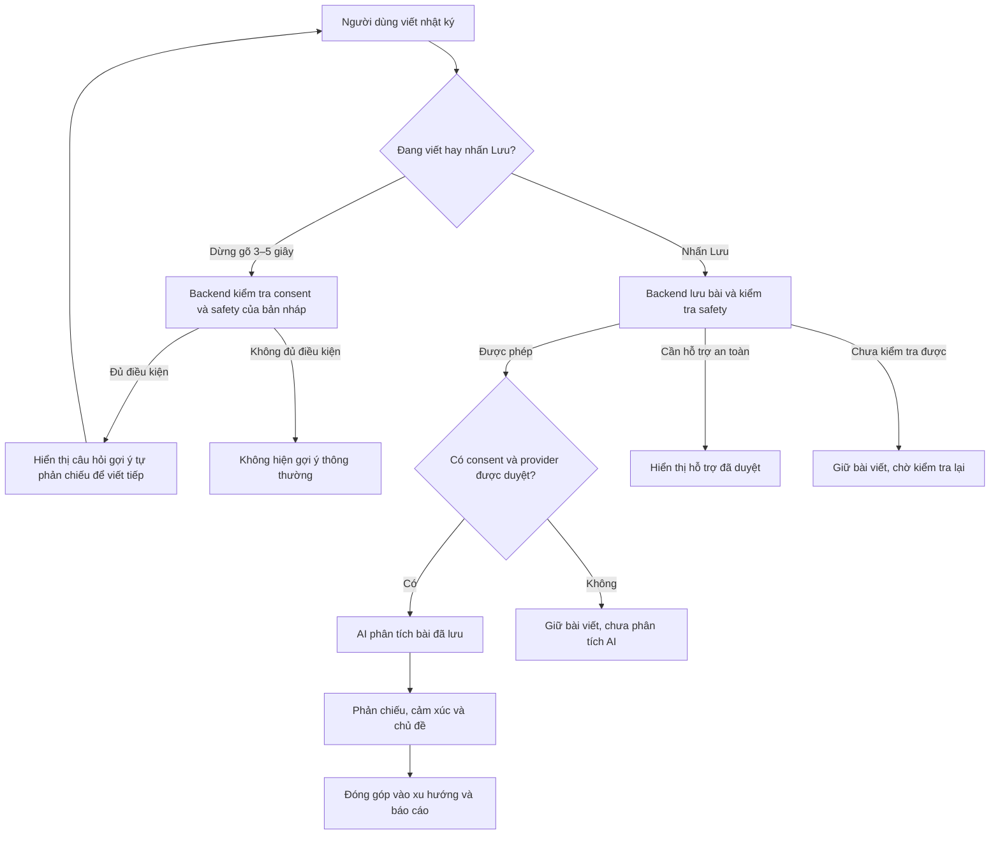
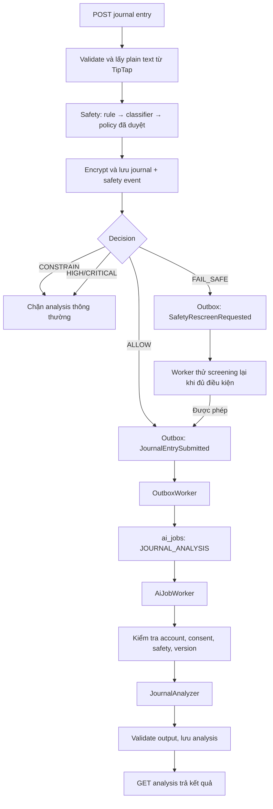

# Hướng dẫn hiểu luồng AI, phân tích và RAG của backend mylog

Tài liệu này giải thích **code đang có**, đồng thời chỉ rõ phần nào mới là thiết kế hoặc còn thiếu để chạy với dữ liệu người dùng thật. Đọc cùng [kiến trúc backend](BACKEND_ARCHITECTURE.md), [kế hoạch phát triển](BACKEND_DEVELOPMENT_PLAN.md), [ADR safety](adr/0003-layered-safety-screening.md) và [ADR AI provider](adr/0004-ai-provider-and-data-handling.md). Flyway migration là nguồn schema thực thi; sơ đồ dưới đây chỉ nhằm giải thích luồng.

## Sơ đồ AI đơn giản



Có **hai loại phản hồi ở hai thời điểm**: lúc đang viết là câu hỏi gợi ý để viết tiếp; sau khi lưu là kết quả phân tích của bài đã lưu, gồm reflection và các nhãn cảm xúc/chủ đề. Nhánh đang viết là trải nghiệm dự kiến: backend hiện chỉ có câu hỏi mẫu, mặc định tắt, chưa gọi AI tạo sinh và frontend chưa kết nối. Bài viết được lưu trước khi có kết quả phân tích AI. Sơ đồ chi tiết về outbox và worker nằm ở mục 3.

## 1. Bốn khái niệm dễ bị gọi chung là “AI”

| Phần | Câu hỏi nó trả lời | Hiện trạng |
|---|---|---|
| **Safety screening** | Nội dung này có được đi vào phân tích/phản hồi thông thường không? | Có rule, classifier port, HTTP adapter cho model nội bộ và policy gate. Classifier mặc định unavailable; model/rule/nội dung hỗ trợ chưa được duyệt. |
| **Journal analysis** | Bài viết có sentiment, emotion, topic gì; reflection nào có thể hiển thị? | Có outbox, job, lưu kết quả, API, fake analyzer và adapter Chat Completions có API key. Provider thật chưa được duyệt và adapter mặc định tắt. |
| **Insight, dashboard, report** | Dữ liệu nhiều ngày cho thấy mẫu quan sát nào? | Backend tính từ check-in, chỉ số và analysis có cấu trúc; report narrative hiện là câu dựng theo dữ liệu, không gọi LLM trên request path. |
| **Knowledge/recommendation, RAG** | Có nguồn kiến thức đã duyệt phù hợp topic/locale không? | Có workflow duyệt, chunk, retrieval và citation. API hiện trả excerpt nguyên văn; chưa có embedding provider, semantic ranking hay LLM generation. |

AI không chẩn đoán hoặc điều trị. Risk classifier phục vụ quyết định an toàn; `JournalAnalyzer` phục vụ phân tích nhật ký. Hai thành phần này khác nhau và không thay thế cho nhau.

### Gợi ý khi đang viết và phân tích sau khi lưu

Safety và nội dung gợi ý theo bản nháp đều thuộc backend. Editor hiện **không tự sinh gợi ý sau khi ngừng gõ và không tự kết luận safety**. FE đăng nhập/journal vẫn dùng `JournalContext`/`localStorage` mock, chưa cấp JWT thật để gọi API bản nháp; bản nháp/bài viết local chưa được mã hóa theo backend và không phù hợp production. Editor đã bỏ đường tạo reflection giả trước khi lưu. Khi tích hợp auth thật, FE chỉ debounce 3–5 giây, gửi plain text qua API có xác thực và hiển thị `status`/`suggestion` backend trả về; nếu người dùng gõ tiếp thì hủy hoặc bỏ kết quả cũ. Gợi ý không được dùng thay cho safety trên request lưu bài.

Backend có `POST /api/v1/journal-writing-suggestions` cho lần tích hợp FE có xác thực sau này. Request `{ "text": "..." }` nhận plain text tối đa 4.000 ký tự; response gồm `status`, `suggestion`, `promptVersion`. Endpoint yêu cầu JWT, giới hạn 20 lần/15 phút/user, kiểm tra consent `AI_PROCESSING` trước khi screen, không lưu bản nháp. Chỉ `ALLOW` mới trả câu hỏi mẫu cố định **do backend sở hữu**; `SAFETY_FLOW`/`CONSTRAIN` không trả gợi ý; `FAIL_SAFE` trả `UNAVAILABLE`. Cờ `MYLOG_WRITING_SUGGESTIONS_ENABLED` mặc định `false` vì nội dung câu hỏi, classifier và policy chưa được duyệt. API này **không gọi LLM**; muốn sinh câu hỏi theo ngữ cảnh bằng provider phải bổ sung output validation, kiểm tra chính sách dữ liệu và đánh giá riêng.

Sau khi FE được nối với journal API, thao tác lưu vẫn đi qua safety đồng bộ ở `JournalService` rồi mới tạo outbox/job phân tích bất đồng bộ. Kết quả `sentiment`/`emotions`/`topics`/reflection chỉ thuộc **phiên bản bài đã lưu**, không thuộc bản nháp. Mỗi lần sửa và lưu lại tăng `contentVersion`; kết quả cũ không được kích hoạt cho phiên bản mới.

## 2. Bản đồ module và chiều phụ thuộc

```text
journal/api → journal/application/JournalService → JournalStore, JournalContentCipher
                         │                       → platform/outbox/OutboxPublisher
                         └→ safety/application/SafetyScreeningUseCase

platform/outbox/OutboxWorker → journal/JournalSafetyOutboxHandler
                             → analysis/JournalAnalysisOutboxHandler → ai_jobs

analysis/AiJobWorker → analysis/application/AnalysisJobHandler
                     → JournalAnalysisAccess, SafetyAnalysisPermission,
                       UserProfileUseCase, JournalAnalyzer, AnalysisStore
```

`application` sở hữu use case và các port; `infrastructure` hiện thực port bằng JPA hoặc provider adapter. JPA entity của feature nằm trong `infrastructure/persistence/entity/`. Module `analysis` đọc nội dung qua `JournalAnalysisAccess` của `journal`, không import JPA entity của `journal`. `platform` cung cấp cơ chế outbox dùng chung, không quyết định một bài viết có an toàn hay không.

Các class chính để bắt đầu đọc code:

| Việc | File |
|---|---|
| Lưu/sửa nhật ký, gọi screening, publish event | [`JournalService`](../src/main/java/com/mylog/journal/application/JournalService.java) |
| Rule → classifier → policy gate | [`SafetyScreeningService`](../src/main/java/com/mylog/safety/application/SafetyScreeningService.java) |
| Đọc và phân phối outbox | [`OutboxWorker`](../src/main/java/com/mylog/platform/outbox/OutboxWorker.java) |
| Chuyển event nhật ký thành AI job | [`JournalAnalysisOutboxHandler`](../src/main/java/com/mylog/analysis/infrastructure/persistence/JournalAnalysisOutboxHandler.java) |
| Claim job, retry, lease recovery | [`AiJobWorker`](../src/main/java/com/mylog/analysis/infrastructure/persistence/AiJobWorker.java) |
| Kiểm tra consent/safety/version và gọi analyzer | [`AnalysisJobHandler`](../src/main/java/com/mylog/analysis/application/AnalysisJobHandler.java) |
| Contract phân tích độc lập provider | [`JournalAnalyzer`](../src/main/java/com/mylog/analysis/application/JournalAnalyzer.java) |
| Đọc kết quả theo owner | [`AnalysisController`](../src/main/java/com/mylog/analysis/api/AnalysisController.java) |

## 3. Luồng từ thao tác lưu nhật ký đến kết quả



### 3.1 Trong request lưu nhật ký

1. `JournalService.create` kiểm tra request và idempotency key; lấy plain text từ TipTap JSON để screen, sau đó mã hóa payload nhật ký.
2. `SafetyScreeningService` kiểm tra rule tiếng Việt/Anh, gọi `RiskClassifier`, rồi tìm policy `APPROVED` đúng rule/provider/version/confidence. `HIGH/CRITICAL` đi vào safety flow; classifier lỗi hoặc policy chưa sẵn sàng thành `FAIL_SAFE`.
3. Cùng một transaction ghi `journal_entries`, safety event tối thiểu và outbox event thích hợp. Chỉ `ALLOW` tạo `JournalEntrySubmitted`; `FAIL_SAFE` tạo `SafetyRescreenRequested`; `CONSTRAIN` và rủi ro cao không tạo job reflection thông thường. Outbox chỉ mang entry ID và `contentVersion`, không mang văn bản nhật ký.
4. API trả kết quả lưu trước khi phân tích xong. `analysisStatus` ban đầu có thể là `PENDING` hoặc `BLOCKED_BY_SAFETY`; trạng thái lưu bài viết và trạng thái phân tích là hai thứ riêng.

### 3.2 Sau request: hai tầng xử lý nền

- **Outbox** giải quyết việc “đã commit nhật ký thì không được quên công việc cần làm”. `OutboxWorker` claim event bằng `FOR UPDATE SKIP LOCKED`, lease và retry. `JournalAnalysisOutboxHandler` chỉ tạo `ai_jobs` cho entry/version còn hiện hành và trạng thái phù hợp. Khóa idempotency `journal-analysis:<entryId>:<version>` ngăn tạo trùng job.
- **AI job** giải quyết việc “phân tích có thể chậm, lỗi hoặc cần thử lại”. `AiJobWorker` claim job từ PostgreSQL; `AnalysisJobHandler` kiểm tra tài khoản còn active, consent `AI_PROCESSING` và safety **ngay lúc thực thi**. Nó chỉ giải mã entry cần thiết qua `JournalAnalysisAccess`, gọi `JournalAnalyzer` ngoài DB transaction, kiểm tra output rồi mới lưu kết quả.
- Nếu classifier/policy chưa sẵn sàng, `JournalSafetyOutboxHandler` thử screening lại với backoff. Chỉ khi được phép mới tạo event phân tích. Bật worker không tự làm cho policy hoặc provider trở nên hợp lệ.

PostgreSQL giữ outbox/job bền vững. Redis không phải queue duy nhất. Worker không gửi nội dung nhật ký tới provider nếu consent hoặc safety không cho phép.

### 3.3 Khi sửa hoặc xóa nhật ký

Mỗi lần sửa nội dung/metadata ảnh hưởng phân tích, `contentVersion` tăng. Event `JournalEntryChanged` đánh dấu analysis cũ `STALE`; bản mới phải qua safety và job riêng. Xóa tạo `JournalEntryDeleted`, cũng làm kết quả cũ hết hiệu lực. Khi job hoàn tất, code kiểm tra lại lease, consent, safety và version trước khi gắn analysis thành kết quả hiện hành. Vì vậy kết quả đến muộn của bản cũ không ghi đè bản mới.

## 4. Safety là cổng vào và cổng ra

| Decision | Tác động hiện tại |
|---|---|
| `ALLOW` | Có thể enqueue analysis thông thường. |
| `CONSTRAIN` | Lưu bài nhưng chặn reflection thông thường; luồng phản hồi có ràng buộc riêng còn cần thiết kế và duyệt. |
| `SAFETY_FLOW` (`HIGH/CRITICAL`) | Không enqueue reflection thông thường; dùng luồng/nội dung hỗ trợ đã duyệt. |
| `FAIL_SAFE` | Vẫn lưu nhật ký, chặn analysis và yêu cầu rescreen. |

`AnalysisOutputValidator` hiện kiểm tra enum, score, độ dài, số phần tử và một số từ khóa không được có trong reflection. Đây là **baseline**, chưa phải đánh giá safety đầu ra đầy đủ. Không coi việc output qua validator là bằng chứng reflection đã an toàn trong mọi tình huống. LLM cũng không được tự tạo hotline hay nguồn hỗ trợ.

## 5. Kết quả nào được lưu và trả về?

| Bảng/trạng thái | Vai trò |
|---|---|
| `journal_entries.analysis_status`, `content_version`, `latest_analysis_id` | Trạng thái hiện tại và liên kết đến kết quả còn hiệu lực của bài viết. |
| `outbox_events` | Event đã commit để worker xử lý; payload chỉ có ID/version cần thiết. |
| `ai_jobs` | Vòng đời job: `PENDING`, `PROCESSING`, `RETRY_WAIT`, `SUCCEEDED`, `FAILED`, `DEAD`; attempt, lease và error code đã sanitize. |
| `ai_analyses` | Kết quả gắn với journal/content version và provenance provider/model/prompt/policy; reflection nằm trong output mã hóa. |
| `analysis_emotions`, `analysis_topics` | Code cảm xúc/chủ đề có cấu trúc để đọc và aggregate. |
| `ai_usage_records` | Token, latency và chi phí ước lượng; không lưu raw prompt/response. |

Schema thực tế nằm ở [`V8__ai_analysis_and_jobs.sql`](../src/main/resources/db/migration/V8__ai_analysis_and_jobs.sql) và các migration trước đó. `GET /api/v1/journal-entries/{entryId}/analysis` chỉ lấy entry thuộc current user; khi chưa `ANALYZED`, response có status nhưng chưa có reflection. `POST /api/v1/journal-entries/{entryId}/analysis:retry` yêu cầu consent/safety phù hợp, kiểm tra job và giới hạn retry; gọi retry không tạo bài viết mới.

Ví dụ kết quả **minh họa** sau khi analysis thành công:

```json
{
  "status": "ANALYZED",
  "sentiment": "NEUTRAL",
  "emotions": ["CALM"],
  "topics": ["OTHER"],
  "reflection": "Một lời gợi mở ngắn đã qua kiểm tra đầu ra"
}
```

Response thật còn có `entryId`, `contentVersion`, `analysisId`, `sentimentScore` theo [`AnalysisResponse`](../src/main/java/com/mylog/analysis/api/response/AnalysisResponse.java). Ví dụ không phải kết quả của model production.

## 6. Insight/report không đồng nghĩa với LLM

[`InsightService`](../src/main/java/com/mylog/insight/application/InsightService.java) tính quan hệ quan sát từ dữ liệu từng ngày khi đủ mẫu. [`ReportService`](../src/main/java/com/mylog/reporting/application/ReportService.java) tổng hợp số ngày có dữ liệu, trung bình mood/stress/energy/sleep, streak và top emotion/topic; narrative hiện được dựng theo mẫu câu từ các số liệu đó. Dashboard đọc dữ liệu đã tính, không gọi LLM mỗi lần mở trang. Quan hệ quan sát không chứng minh nguyên nhân.

Phân tích một **bài** nhật ký và insight từ **nhiều ngày** là hai bước khác nhau: bài viết có thể chưa có AI analysis nhưng check-in vẫn là điểm dữ liệu cho dashboard. Xem thêm M4 trong [kế hoạch](BACKEND_DEVELOPMENT_PLAN.md).

### Các trải nghiệm self-compassion đang được đề xuất

[Thư gửi tương lai, Micro-Wins Vault và bản chuẩn bị buổi tham vấn](SELF_COMPASSION_FEATURE_PROPOSALS.md) là **ý tưởng sản phẩm chưa triển khai**, không phải ba loại kết quả AI hiện có. Thư do người dùng viết và chỉ được mời xem theo lựa chọn của họ; điểm năng lượng thấp không tự động mở thư hoặc thay thế safety response. Micro-win có thể nhập thủ công; nếu trích xuất từ journal bằng AI sau này, phải có consent, safety, kiểm tra `contentVersion`, xác nhận/sửa của người dùng trước khi lưu. Bản chuẩn bị tham vấn lấy metrics có nguồn và đủ mẫu, cho người dùng xem trước/loại mục trước khi xuất; không tự gửi ra ngoài hoặc tạo nhãn chẩn đoán. Cả ba cần đánh giá riêng về privacy, nội dung có thể gây khó chịu và quyền xóa/export.

## 7. Knowledge base và RAG

**RAG** là cách tìm đoạn tài liệu phù hợp từ kho kiến thức, đưa đoạn đó làm ngữ cảnh cho model, rồi trả lời kèm nguồn. Kiến trúc mục tiêu: `draft → review → approve → chunk → embed → retrieve → generate → output safety validation`.

Hiện code đã có workflow duyệt/chunk và [`ApprovedKnowledgeRetriever`](../src/main/java/com/mylog/knowledge/infrastructure/ApprovedKnowledgeRetriever.java) chỉ đọc version `APPROVED`, đúng locale và còn hiệu lực. [`RecommendationService`](../src/main/java/com/mylog/knowledge/application/RecommendationService.java) nhận `topicCode`, lấy locale từ profile và trả tối đa ba excerpt cùng citation. Endpoint này **chưa gọi LLM**, chưa dùng journal text, chưa có embedding provider/model được duyệt hay semantic vector retrieval. Xem [M6 knowledge API](KNOWLEDGE_M6_API.md).

## 8. Cấu hình, demo và giới hạn hiện tại

ADR-0009 tách **training** khỏi **inference**. [`safety-model/train.py`](../../safety-model/train.py)
nhận hai CSV đã được phép dùng và được gắn nhãn, tạo artifact/manifest chưa phê duyệt;
[`safety-model/serve.py`](../../safety-model/serve.py) chỉ phục vụ artifact đã duyệt qua
private endpoint. Backend gọi endpoint bằng `HttpRiskClassifier` trong bước screening đồng bộ,
với timeout tối đa 10 giây và mặc định 2 giây. Nếu service lỗi, journal vẫn lưu và kết quả là
`FAIL_SAFE`. Không có luồng tự động trích journal production làm dữ liệu train.

Adapter `OpenAiJournalAnalyzer` chỉ tồn tại ở worker khi `MYLOG_AI_PROVIDER=openai` và hai
cờ phê duyệt dữ liệu provider/output safety được bật rõ. Nó không được gọi trong transaction
PostgreSQL. Mô hình safety nội bộ, model tạo reflection qua API key và embedding cho RAG là
ba trách nhiệm khác nhau; hiện embedding vẫn để mở. Xem [ADR-0009](adr/0009-hybrid-ai-inference.md).
Kế hoạch chi tiết cho model team sẽ train nằm ở [SAFETY_CLASSIFIER_MODEL_PLAN.md](SAFETY_CLASSIFIER_MODEL_PLAN.md).

| Cấu hình | Mặc định | Ý nghĩa |
|---|---|---|
| `MYLOG_JOBS_ENABLED` | `false` | Bật outbox/AI job worker khi môi trường và policy phù hợp. |
| `MYLOG_AI_FAKE_ENABLED` | `false` | `true` dùng analyzer cố định cho local/test; không gọi mạng. |
| `MYLOG_AI_PROVIDER` | `none` | `openai` bật adapter Chat Completions trong worker; cần model, API key và provider approval. |
| `MYLOG_AI_INPUT_USD_PER_MILLION`, `MYLOG_AI_OUTPUT_USD_PER_MILLION` | `0` | Khi bật provider phải cấu hình giá dương của model để tính chi phí ước lượng từ token usage. |
| `MYLOG_AI_PROVIDER_DATA_APPROVED`, `MYLOG_AI_OUTPUT_SAFETY_APPROVED` | `false` | Cả hai phải được bật sau khi có hồ sơ duyệt; thiếu một trong hai thì cấu hình provider bị từ chối. |
| `MYLOG_SAFETY_CLASSIFIER_URL` | rỗng | HTTPS endpoint nội bộ `/classify`; rỗng dùng classifier unavailable. |
| `MYLOG_APP_PROFILE` | `all` | `api` không chạy scheduled workers; `worker` dành cho xử lý nền. |

`JournalAnalyzer` mặc định là [`UnavailableJournalAnalyzer`](../src/main/java/com/mylog/analysis/infrastructure/UnavailableJournalAnalyzer.java). [`FakeJournalAnalyzer`](../src/main/java/com/mylog/analysis/infrastructure/FakeJournalAnalyzer.java) chỉ trả kết quả mẫu cố định. Adapter [`OpenAiJournalAnalyzer`](../src/main/java/com/mylog/analysis/infrastructure/OpenAiJournalAnalyzer.java) gửi title/plain text tối thiểu qua HTTPS khi được bật rõ (HTTP chỉ cho loopback local/test), yêu cầu JSON schema, không gửi ID/email và không log raw request/response. API key chỉ có ở worker; `store=false` không thay thế việc thẩm định retention/no-training/region của provider. Backend còn có [`HttpRiskClassifier`](../src/main/java/com/mylog/safety/infrastructure/HttpRiskClassifier.java) cho model nội bộ; pipeline train/inference mẫu ở [`safety-model`](../../safety-model/README.md). Bật adapter **không đồng nghĩa với được phê duyệt production**. Chưa có model classifier được duyệt, policy/safety content hoàn chỉnh, output safety eval hoặc provider data-handling sign-off. Frontend còn các phần mock và chưa hoàn tất trải nghiệm status/retry của M3.

Các việc chính còn mở trước production:

1. Duyệt rule, classifier, policy và nguồn hỗ trợ safety; đánh giá false negative/false positive bằng corpus synthetic tiếng Việt/Anh.
2. Chọn provider theo ADR-0004, kiểm tra no-training/retention/region/deletion, thêm adapter với timeout và circuit breaker; không log raw request/response.
3. Hoàn thiện output safety validation và đánh giá chất lượng reflection; chỉ bật ordinary analysis khi các cổng vào/ra đạt yêu cầu.
4. Tích hợp frontend polling/trạng thái failed/blocked, kiểm thử end-to-end; với RAG, chốt embedding model, index, retrieval eval và kiểm tra generation/citation.

Để kiểm tra code hiện có, xem [`AiPipelineIntegrationTest`](../src/test/java/com/mylog/analysis/infrastructure/persistence/AiPipelineIntegrationTest.java), [`AnalysisJobHandlerTest`](../src/test/java/com/mylog/analysis/AnalysisJobHandlerTest.java), [`SafetyScreeningCorpusTest`](../src/test/java/com/mylog/safety/SafetyScreeningCorpusTest.java) và [`M6IntegrationTest`](../src/test/java/com/mylog/knowledge/M6IntegrationTest.java). Các test dùng dữ liệu synthetic, không dùng nhật ký thật.
