# Thiết kế database mylog

> Database blueprint v1  
> PostgreSQL 17 + pgvector + Flyway  
> Phạm vi: MVP và đường mở rộng đã xác định trong kiến trúc backend

Tài liệu này là nguồn thiết kế chính cho schema. File DBML đi kèm để dựng sơ đồ trực quan: [database/mylog.dbml](database/mylog.dbml).

## 1. Mục tiêu thiết kế

- Bảo vệ journal và dữ liệu dẫn xuất từ AI như dữ liệu nhạy cảm.
- Mọi truy vấn dữ liệu cá nhân đều có `user_id` để kiểm tra ownership và tạo index.
- Lưu được nguồn gốc, version và evidence của kết quả AI.
- Không để lỗi hoặc độ trễ AI ảnh hưởng transaction lưu journal.
- Hỗ trợ export, xóa tài khoản, retention và audit.
- Schema đủ rõ cho MVP nhưng không khóa cứng vào một AI provider/model.
- Tránh dùng JSONB thay cho mô hình quan hệ ở những dữ liệu cần constraint hoặc analytics.

## 2. Quy ước chung

### 2.1 Naming và kiểu dữ liệu

| Thành phần | Quy ước |
|---|---|
| Table/column/index | `snake_case` |
| Primary key | Mặc định `id UUID`; bảng nối có thể dùng khóa ghép, bảng trạng thái theo một subject hoặc quan hệ một–một có thể dùng khóa nghiệp vụ nếu tránh được `id` dư thừa |
| ID tạo ở application | UUIDv7 để index locality tốt; test có thể dùng fixed UUID |
| Timestamp | `TIMESTAMPTZ`, luôn lưu UTC |
| Ngày theo người dùng | `local_date DATE` + `timezone VARCHAR(64)` |
| Tiền | `NUMERIC`, không dùng floating point |
| Điểm 1–10 | `NUMERIC(3,1)` với `CHECK` |
| Xác suất/score AI | `NUMERIC(6,5)` trong khoảng `0..1` |
| Enum nghiệp vụ | `VARCHAR` + `CHECK`, không dùng PostgreSQL enum trong MVP |
| Flexible metadata | `JSONB`, có schema/version ở application |
| Optimistic locking | `row_version BIGINT NOT NULL DEFAULT 0` |
| Soft delete | `deleted_at TIMESTAMPTZ NULL` chỉ khi nghiệp vụ cần restore/grace period |

Tất cả table mutable có `created_at` và `updated_at`. Table append-only như audit/outbox không cần `updated_at` nếu state không thay đổi; job có timestamp riêng theo lifecycle.

### 2.2 Database schema

MVP dùng một PostgreSQL schema `public`. Boundary được thể hiện bằng prefix/tên table và package Java, tránh tăng độ phức tạp Flyway/JPA bằng nhiều database schema quá sớm.

Nếu tách service sau này, nhóm table được chuyển theo module ownership, không chia sẻ quyền ghi giữa service.

### 2.3 Foreign key

- Dữ liệu thuần sở hữu bởi user dùng `ON DELETE CASCADE` khi xóa vật lý account.
- Dữ liệu vận hành/audit dùng `ON DELETE SET NULL` hoặc pseudonymous subject ID theo retention policy.
- Không tạo foreign key polymorphic kiểu `source_type + source_id`; application và cleanup job kiểm tra các reference đó.
- Foreign key column luôn có index nếu được join/filter thường xuyên.

### 2.4 JSONB

Chỉ dùng JSONB cho:

- snapshot metrics/evidence có version;
- provider metadata đã sanitize;
- cấu hình có schema rõ;
- payload outbox chỉ chứa ID/version.

Không dùng JSONB cho user, journal, emotion, topic, role hoặc completion vì các dữ liệu này cần constraint và query rõ ràng.

## 3. Sơ đồ quan hệ mức cao

```mermaid
erDiagram
    USERS ||--|| USER_PROFILES : has
    USERS ||--o{ USER_CONSENTS : decides
    USERS ||--o{ USER_ROLES : assigned
    ROLES ||--o{ USER_ROLES : contains
    ROLES ||--o{ ROLE_PERMISSIONS : grants
    PERMISSIONS ||--o{ ROLE_PERMISSIONS : contains
    USERS ||--o{ AUTH_SESSIONS : owns

    USERS ||--o{ JOURNAL_ENTRIES : writes
    JOURNAL_ENTRIES ||--o{ JOURNAL_ENTRY_TAGS : tagged
    JOURNAL_TAGS ||--o{ JOURNAL_ENTRY_TAGS : classifies
    JOURNAL_ENTRIES ||--o{ JOURNAL_ASSETS : contains
    USERS ||--o{ DAILY_CHECKINS : records

    JOURNAL_ENTRIES ||--o{ AI_ANALYSES : analyzed
    AI_ANALYSES ||--o{ ANALYSIS_EMOTIONS : detects
    AI_ANALYSES ||--o{ ANALYSIS_TOPICS : detects
    JOURNAL_ENTRIES ||--o{ SAFETY_EVENTS : screened

    USERS ||--o{ INSIGHTS : receives
    INSIGHTS ||--o{ INSIGHT_EVIDENCE : supported_by
    USERS ||--o{ REPORTS : receives
    REPORTS ||--o{ REPORT_EVIDENCE : supported_by

    USERS ||--o{ SELFCARE_GOALS : creates
    SELFCARE_GOALS ||--o{ HABITS : contains
    HABITS ||--o{ HABIT_COMPLETIONS : tracks

    KNOWLEDGE_ITEMS ||--o{ KNOWLEDGE_VERSIONS : versions
    KNOWLEDGE_VERSIONS ||--o{ KNOWLEDGE_CHUNKS : splits
    KNOWLEDGE_CHUNKS ||--o{ KNOWLEDGE_EMBEDDINGS : embeds

    AI_JOBS ||--o{ AI_USAGE_RECORDS : consumes
    USERS ||--o{ EXPORT_REQUESTS : requests
    USERS ||--o{ DELETION_REQUESTS : requests
```



## 4. Identity và access control

### 4.1 `users`

Chứa identity tối thiểu, không chứa profile wellness.

| Column | Type | Constraint/ý nghĩa |
|---|---|---|
| `id` | UUID | PK |
| `email_lookup_hash` | BYTEA | NOT NULL; partial unique khi `deleted_at IS NULL`, HMAC của email normalize |
| `encrypted_email` | BYTEA | NOT NULL |
| `email_iv`, `email_wrapped_key` | BYTEA | nonce và wrapped DEK |
| `email_key_version` | VARCHAR(32) | NOT NULL |
| `password_hash` | VARCHAR(255) | NULL nếu external IdP |
| `auth_provider` | VARCHAR(32) | `LOCAL`, `GOOGLE`, `OIDC` |
| `status` | VARCHAR(24) | `PENDING`, `ACTIVE`, `SUSPENDED`, `DELETION_PENDING`, `DELETED` |
| `email_verified_at` | TIMESTAMPTZ | NULL khi chưa verify |
| `last_login_at` | TIMESTAMPTZ | nullable |
| `failed_login_count` | INTEGER | >= 0 |
| `locked_until` | TIMESTAMPTZ | nullable |
| `created_at` | TIMESTAMPTZ | NOT NULL |
| `updated_at` | TIMESTAMPTZ | NOT NULL |
| `deleted_at` | TIMESTAMPTZ | grace period/soft delete |
| `row_version` | BIGINT | optimistic locking |

Email normalize bằng `trim + Unicode normalize + lowercase` theo policy cố định. Hash phải là keyed HMAC, không phải SHA-256 trần để tránh dò từ danh sách email.

Indexes:

- unique `email_lookup_hash` khi `deleted_at IS NULL`;
- `(status, created_at DESC)` cho admin metadata;
- `(deleted_at)` partial index cho cleanup.

### 4.2 `user_profiles`

| Column | Type | Ghi chú |
|---|---|---|
| `user_id` | UUID | PK, FK users CASCADE |
| `encrypted_profile` | BYTEA | display name, pen name và dữ liệu riêng tư |
| `profile_iv`, `profile_wrapped_key` | BYTEA | nonce và wrapped DEK |
| `profile_key_version` | VARCHAR(32) | key version |
| `timezone` | VARCHAR(64) | IANA timezone, ví dụ `Asia/Ho_Chi_Minh` |
| `locale` | VARCHAR(10) | `vi`, `en` |
| `onboarding_completed_at` | TIMESTAMPTZ | nullable |
| `preferred_journal_time` | TIME | nullable |
| `created_at`, `updated_at` | TIMESTAMPTZ | audit thời gian |
| `row_version` | BIGINT | optimistic locking |

### 4.3 `user_consents`

Một user có nhiều quyết định consent theo loại và version.

| Column | Type | Ghi chú |
|---|---|---|
| `id` | UUID | PK |
| `user_id` | UUID | FK users CASCADE |
| `consent_type` | VARCHAR(40) | `TERMS`, `PRIVACY`, `AI_PROCESSING`, `ANALYTICS`, `MODEL_TRAINING` |
| `document_version` | VARCHAR(40) | version văn bản user đã xem |
| `granted` | BOOLEAN | quyết định |
| `decided_at` | TIMESTAMPTZ | thời điểm quyết định |
| `source` | VARCHAR(24) | `ONBOARDING`, `SETTINGS`, `ADMIN_IMPORT` |

Không update lịch sử consent. Mỗi quyết định mới tạo row riêng, kể cả rút lại/chấp thuận lại cùng `document_version`. Index `(user_id, consent_type, decided_at DESC)` phục vụ truy vấn quyết định mới nhất.

### 4.4 RBAC

```text
roles(id, code, name, description, system_role, created_at)
permissions(id, code, description, created_at)
role_permissions(role_id, permission_id, created_at)
user_roles(user_id, role_id, assigned_by, assigned_at, expires_at)
```

Unique theo `code`, composite PK cho join table. `assigned_by` FK users với `ON DELETE SET NULL`. Mọi thay đổi role phải sinh audit event.

### 4.5 `auth_sessions`

| Column | Type | Ghi chú |
|---|---|---|
| `id` | UUID | PK/session ID |
| `user_id` | UUID | FK users CASCADE |
| `current_token_hash` | BYTEA | UNIQUE, HMAC của refresh token hiện tại; không lưu token thô |
| `token_family_id` | UUID | phát hiện refresh token reuse |
| `device_name` | VARCHAR(120) | nullable, user-facing |
| `user_agent_hash` | BYTEA | optional, không lưu raw nếu không cần |
| `ip_prefix` | INET | optional, giảm độ chính xác |
| `last_used_at`, `expires_at` | TIMESTAMPTZ | NOT NULL |
| `revoked_at` | TIMESTAMPTZ | nullable |
| `revoke_reason` | VARCHAR(40) | nullable |
| `created_at` | TIMESTAMPTZ | NOT NULL |

Index `(user_id, revoked_at, expires_at)` và cleanup index `(expires_at)`.

`auth_refresh_history` có `id UUID` làm khóa chính và `token_hash BYTEA NOT NULL UNIQUE` để tra cứu HMAC của token đã dùng, phát hiện replay và revoke toàn bộ `token_family_id`. V4 backfill UUID cho dòng cũ; dòng mới nhận UUIDv7 từ application. Token verify/reset dùng table chung `auth_action_tokens` với `token_hash`, `purpose`, `expires_at`, `consumed_at`; tuyệt đối không lưu token thô. `auth_rate_limits` lưu HMAC của IP/email pseudonym và cửa sổ giới hạn, được cleanup định kỳ.

Chọn khóa chính theo vai trò dữ liệu: bản ghi có vòng đời hoặc cần tham chiếu độc lập dùng `id UUID`; bảng nối thuần túy dùng khóa ghép của hai khóa ngoại nếu mỗi cặp chỉ được tồn tại một lần; quan hệ một–một như `user_profiles` có thể dùng `user_id` vừa là PK vừa là FK; bảng trạng thái chỉ có một dòng cho mỗi subject như `auth_rate_limits` có thể dùng subject hash làm PK. Nếu thêm `id` cho bảng vốn được định danh bằng giá trị khác, vẫn phải giữ `UNIQUE` trên giá trị đó. Tránh dùng `byte[]` làm `@Id` cho bản ghi có vòng đời trong JPA. Xác định PK, unique và mục đích truy vấn trước khi viết migration; không thêm `id` chỉ để mọi bảng giống nhau.

## 5. Journal và check-in

### 5.1 `journal_entries`

| Column | Type | Constraint/ý nghĩa |
|---|---|---|
| `id` | UUID | PK |
| `user_id` | UUID | NOT NULL, FK users CASCADE |
| `encrypted_payload` | BYTEA | title, TipTap JSON, plain text, location |
| `payload_iv` | BYTEA | nonce AES-GCM duy nhất |
| `wrapped_data_key` | BYTEA | data key được KMS/master key wrap |
| `encryption_key_version` | VARCHAR(32) | hỗ trợ rotate |
| `content_format_version` | SMALLINT | schema payload |
| `occurred_at` | TIMESTAMPTZ | thời điểm journal |
| `local_date` | DATE | ngày theo timezone lúc ghi |
| `timezone` | VARCHAR(64) | IANA timezone snapshot |
| `mood_code` | VARCHAR(32) | stable code như `calm-joy` |
| `mood_score` | NUMERIC(3,1) | NULL hoặc 1..10 |
| `stress_score` | NUMERIC(3,1) | NULL hoặc 1..10 |
| `energy_score` | NUMERIC(3,1) | NULL hoặc 1..10 |
| `sleep_minutes` | SMALLINT | NULL hoặc 0..1440 |
| `favorite` | BOOLEAN | default false |
| `entry_status` | VARCHAR(24) | `DRAFT`, `SAVED`, `DELETED` |
| `risk_level` | VARCHAR(16) | `UNKNOWN`, `NORMAL`, `LOW`, `MODERATE`, `HIGH`, `CRITICAL` |
| `analysis_status` | VARCHAR(32) | `NOT_REQUESTED`, `PENDING`, `ANALYZING`, `ANALYZED`, `ANALYSIS_FAILED`, `ANALYSIS_OUTDATED`, `BLOCKED_BY_SAFETY` |
| `content_version` | INTEGER | bắt đầu 1, tăng khi nội dung/metric đổi |
| `latest_analysis_id` | UUID | nullable; FK thêm sau để tránh cycle migration |
| `created_at`, `updated_at` | TIMESTAMPTZ | NOT NULL |
| `deleted_at` | TIMESTAMPTZ | soft delete trước purge |
| `row_version` | BIGINT | optimistic locking |

Payload trước khi mã hóa:

```json
{
  "schemaVersion": 1,
  "title": "...",
  "contentJson": {},
  "plainText": "...",
  "location": "..."
}
```

`plainText` do server sinh từ TipTap JSON đã sanitize, dùng cho safety/AI. Không tin plain text do client tự gửi.

Constraints/indexes:

```sql
CHECK (content_version >= 1)
CHECK (mood_score IS NULL OR mood_score BETWEEN 1 AND 10)
CHECK (stress_score IS NULL OR stress_score BETWEEN 1 AND 10)
CHECK (energy_score IS NULL OR energy_score BETWEEN 1 AND 10)
CHECK (sleep_minutes IS NULL OR sleep_minutes BETWEEN 0 AND 1440)

INDEX (user_id, occurred_at DESC) WHERE deleted_at IS NULL
INDEX (user_id, local_date DESC) WHERE deleted_at IS NULL
INDEX (user_id, favorite, occurred_at DESC)
  WHERE favorite = TRUE AND deleted_at IS NULL
INDEX (analysis_status, updated_at)
  WHERE analysis_status IN ('PENDING', 'ANALYSIS_FAILED', 'ANALYSIS_OUTDATED')
```

### 5.2 Tag

`journal_tags`:

| Column | Type | Ghi chú |
|---|---|---|
| `id` | UUID | PK |
| `user_id` | UUID | FK users CASCADE |
| `name_lookup_hash` | BYTEA | HMAC tên đã normalize |
| `encrypted_name` | BYTEA | tên tag hiển thị |
| `name_key_version` | VARCHAR(32) | key version |
| `color` | VARCHAR(9) | nullable, hex được validate app/DB |
| `created_at`, `updated_at` | TIMESTAMPTZ | NOT NULL |

Unique `(user_id, name_lookup_hash)`. `journal_entry_tags(entry_id, tag_id, created_at)` có composite PK. Application kiểm tra entry và tag cùng owner; trigger có thể bổ sung ở hardening phase.

### 5.3 `journal_assets`

Chỉ lưu metadata; binary ảnh nằm trên Cloudinary theo ADR-0006.

```text
id UUID PK
journal_entry_id UUID FK journal_entries CASCADE
user_id UUID FK users CASCADE
provider_asset_id VARCHAR(255) UNIQUE NOT NULL
public_id VARCHAR(512) UNIQUE NOT NULL
provider_version BIGINT NOT NULL
format VARCHAR(32) NOT NULL
delivery_type VARCHAR(32) NOT NULL CHECK AUTHENTICATED/PRIVATE
asset_type VARCHAR(24) CHECK IMAGE/ATTACHMENT
mime_type VARCHAR(120)
size_bytes BIGINT CHECK >= 0
sha256 BYTEA
width INTEGER, height INTEGER
status VARCHAR(24) CHECK PENDING_SCAN/READY/REJECTED/DELETED
encrypted_caption BYTEA NULL
caption_key_version VARCHAR(32) NULL
created_at, deleted_at TIMESTAMPTZ
```

Không lưu signed URL vì URL có thời hạn; backend sinh URL Cloudinary đã ký khi trả response. `public_id` không chứa PII hoặc nội dung journal.

### 5.4 `daily_checkins`

| Column | Type | Ghi chú |
|---|---|---|
| `id` | UUID | PK |
| `user_id` | UUID | FK users CASCADE |
| `local_date` | DATE | ngày của user |
| `timezone` | VARCHAR(64) | snapshot |
| `mood_code` | VARCHAR(32) | nullable |
| `mood_score`, `stress_score`, `energy_score` | NUMERIC(3,1) | 1..10 |
| `sleep_minutes` | SMALLINT | 0..1440 |
| `encrypted_note` | BYTEA | optional |
| `note_key_version` | VARCHAR(32) | optional |
| `source` | VARCHAR(24) | `USER`, `JOURNAL_FALLBACK`, `IMPORT` |
| `created_at`, `updated_at` | TIMESTAMPTZ | NOT NULL |
| `row_version` | BIGINT | optimistic lock |

Unique `(user_id, local_date)`. Dashboard ưu tiên `USER/IMPORT`; journal observation chỉ làm fallback và không được tạo check-in giả âm thầm.

`checkin_activities(id, checkin_id, activity_code, duration_minutes, intensity, created_at)` cho các activity có cấu trúc. Custom label nếu có phải mã hóa riêng.

## 6. AI analysis

### 6.1 `ai_analyses`

Mỗi lần phân tích tạo một row bất biến; không overwrite kết quả cũ.

| Column | Type | Ghi chú |
|---|---|---|
| `id` | UUID | PK |
| `journal_entry_id` | UUID | FK journal_entries CASCADE |
| `user_id` | UUID | FK users CASCADE, hỗ trợ ownership/index |
| `content_version` | INTEGER | version journal đã phân tích |
| `analysis_version` | INTEGER | lần chạy cho cùng content version |
| `status` | VARCHAR(24) | `RUNNING`, `SUCCEEDED`, `FAILED`, `STALE`, `REJECTED_BY_SAFETY` |
| `sentiment_label` | VARCHAR(24) | `POSITIVE`, `NEUTRAL`, `NEGATIVE`, `MIXED` |
| `sentiment_score` | NUMERIC(6,5) | 0..1 |
| `encrypted_output` | BYTEA | summary, questions, mindful action, entities |
| `output_iv`, `wrapped_data_key` | BYTEA | envelope encryption |
| `encryption_key_version` | VARCHAR(32) | key version |
| `output_schema_version` | SMALLINT | structured output schema |
| `provider` | VARCHAR(40) | provider code |
| `model` | VARCHAR(120) | model ID |
| `model_version` | VARCHAR(120) | nullable |
| `prompt_template_version` | VARCHAR(40) | NOT NULL |
| `safety_policy_version` | VARCHAR(40) | NOT NULL |
| `started_at`, `completed_at` | TIMESTAMPTZ | lifecycle |
| `created_at` | TIMESTAMPTZ | NOT NULL |

Unique `(journal_entry_id, content_version, analysis_version)`. Partial unique bảo đảm tối đa một active success cho một `content_version` nếu policy cần.

`journal_entries.latest_analysis_id` chỉ được cập nhật nếu content version vẫn khớp, ngăn job cũ ghi đè kết quả mới.

### 6.2 Emotion/topic

```text
analysis_emotions(
  analysis_id UUID FK ai_analyses CASCADE,
  emotion_code VARCHAR(32),
  score NUMERIC(6,5),
  rank SMALLINT,
  PRIMARY KEY (analysis_id, emotion_code)
)

analysis_topics(
  id UUID PK,
  analysis_id UUID FK ai_analyses CASCADE,
  topic_code VARCHAR(48) NULL,
  encrypted_custom_label BYTEA NULL,
  label_key_version VARCHAR(32) NULL,
  score NUMERIC(6,5),
  rank SMALLINT,
  CHECK ((topic_code IS NOT NULL) <> (encrypted_custom_label IS NOT NULL))
)
```

Chỉ curated `emotion_code/topic_code` được dùng trực tiếp cho aggregate. Custom label và extracted entity nằm trong encrypted output để giảm rò rỉ.

### 6.3 `ai_jobs`

```text
id UUID PK
job_type VARCHAR(40)
aggregate_type VARCHAR(40)
aggregate_id UUID
user_id UUID NULL FK users CASCADE
status VARCHAR(24)
priority SMALLINT DEFAULT 100
attempt INTEGER DEFAULT 0
max_attempts INTEGER
available_at TIMESTAMPTZ
locked_at TIMESTAMPTZ NULL
locked_by VARCHAR(120) NULL
lease_expires_at TIMESTAMPTZ NULL
idempotency_key VARCHAR(160) UNIQUE
payload JSONB                 -- chỉ ID/version, không raw journal
payload_version SMALLINT
last_error_code VARCHAR(80) NULL
last_error_summary VARCHAR(500) NULL  -- sanitized
created_at, started_at, finished_at TIMESTAMPTZ
```

Claim index `(status, priority, available_at, created_at)` partial cho `PENDING/RETRY_WAIT`. Worker dùng `FOR UPDATE SKIP LOCKED`.

### 6.4 `ai_usage_records`

Theo dõi chi phí mà không lưu prompt:

```text
id UUID PK
job_id UUID FK ai_jobs SET NULL
analysis_id UUID FK ai_analyses SET NULL
provider, model VARCHAR
operation VARCHAR(32)
input_tokens, output_tokens INTEGER CHECK >= 0
estimated_cost_usd NUMERIC(12,6) CHECK >= 0
latency_ms INTEGER CHECK >= 0
request_status VARCHAR(24)
created_at TIMESTAMPTZ
```

## 7. Safety

### 7.1 `safety_events`

Chỉ lưu dữ liệu tối thiểu, không lưu câu/đoạn text kích hoạt rule.

| Column | Type | Ghi chú |
|---|---|---|
| `id` | UUID | PK |
| `user_id` | UUID | nullable theo retention; FK SET NULL |
| `subject_ref` | BYTEA | pseudonymous HMAC để aggregate sau khi xóa user |
| `journal_entry_id` | UUID | nullable, FK SET NULL |
| `risk_level` | VARCHAR(16) | decision cuối |
| `decision` | VARCHAR(32) | `ALLOW`, `CONSTRAIN`, `SAFETY_FLOW`, `FAIL_SAFE` |
| `rule_version` | VARCHAR(40) | nullable |
| `classifier`, `classifier_version` | VARCHAR | provenance |
| `policy_version` | VARCHAR(40) | NOT NULL |
| `confidence` | NUMERIC(6,5) | nullable |
| `resource_set_version` | VARCHAR(40) | response/resources đã dùng |
| `created_at` | TIMESTAMPTZ | NOT NULL |

Index `(created_at, risk_level)` cho aggregate và `(journal_entry_id)` cho cleanup/tracing có quyền.

### 7.2 Policy/resources

```text
safety_policy_versions(
  id UUID PK, version VARCHAR(40) UNIQUE,
  status VARCHAR(24), config JSONB,
  approved_by UUID FK users SET NULL,
  approved_at, effective_from, effective_to TIMESTAMPTZ,
  created_at TIMESTAMPTZ
)

safety_resources(
  id UUID PK, locale VARCHAR(10), country_code CHAR(2),
  resource_type VARCHAR(32), name VARCHAR(200),
  contact_value VARCHAR(300), description TEXT,
  source_url TEXT, verified_at TIMESTAMPTZ,
  status VARCHAR(24), version INTEGER,
  created_at, updated_at TIMESTAMPTZ
)
```

Không cho LLM ghi trực tiếp vào hai table này.

## 8. Insight và report

### 8.1 `insights`

```text
id UUID PK
user_id UUID FK users CASCADE
insight_type VARCHAR(40)
period_start DATE
period_end DATE
timezone VARCHAR(64)
status VARCHAR(24) CHECK ACTIVE/SUPERSEDED/HIDDEN
direction VARCHAR(16) NULL
strength NUMERIC(6,5) NULL
sample_size INTEGER CHECK >= 0
algorithm_version VARCHAR(40)
metrics_snapshot JSONB
encrypted_narrative BYTEA NULL
narrative_key_version VARCHAR(32) NULL
generated_by VARCHAR(24) CHECK RULE/STATISTICAL/AI_ASSISTED
created_at, superseded_at TIMESTAMPTZ
```

Unique business key gợi ý `(user_id, insight_type, period_start, period_end, algorithm_version)`.

### 8.2 `insight_evidence`

```text
id UUID PK
insight_id UUID FK insights CASCADE
source_type VARCHAR(32)       -- JOURNAL, CHECKIN, HABIT
source_id UUID NULL
evidence_date DATE
metric_name VARCHAR(48)
metric_value NUMERIC(12,4) NULL
weight NUMERIC(6,5) NULL
metadata JSONB
created_at TIMESTAMPTZ
```

Không copy journal text vào evidence.

### 8.3 `reports` và `report_evidence`

`reports` gồm user, `report_type` (`WEEKLY`, `MONTHLY`), period, timezone, version, status, sample size, metrics snapshot, encrypted narrative, model/prompt/policy version và timestamps. Unique `(user_id, report_type, period_start, version)`.

`report_evidence` liên kết report với `insight_id` hoặc structured metric. Không nhúng raw journal.

## 9. Self-care

### 9.1 `selfcare_goals`

```text
id UUID PK
user_id UUID FK users CASCADE
category VARCHAR(32) CHECK SLEEP/MINDFULNESS/EXERCISE/SOCIAL/CUSTOM
encrypted_title BYTEA
encrypted_description BYTEA NULL
encryption_key_version VARCHAR(32)
status VARCHAR(24) CHECK ACTIVE/PAUSED/COMPLETED/ARCHIVED
start_date, target_date DATE NULL
created_at, updated_at, completed_at TIMESTAMPTZ
row_version BIGINT
```

### 9.2 `habits` và `habit_completions`

```text
habits(
  id UUID PK,
  goal_id UUID FK selfcare_goals CASCADE,
  user_id UUID FK users CASCADE,
  encrypted_title BYTEA,
  encryption_key_version VARCHAR(32),
  target_value NUMERIC(10,2), unit VARCHAR(32),
  frequency_type VARCHAR(24), frequency_config JSONB,
  status VARCHAR(24), created_at, updated_at TIMESTAMPTZ,
  row_version BIGINT
)

habit_completions(
  id UUID PK,
  habit_id UUID FK habits CASCADE,
  user_id UUID FK users CASCADE,
  local_date DATE,
  value NUMERIC(10,2),
  source VARCHAR(24),
  created_at, updated_at TIMESTAMPTZ,
  UNIQUE (habit_id, local_date)
)
```

Giữ `user_id` ở completion để ownership query không phải join nhiều tầng và hỗ trợ partition/cleanup.

## 10. Knowledge base và RAG

### 10.1 Content lifecycle

```text
knowledge_items(
  id UUID PK, slug VARCHAR(160) UNIQUE,
  topic_code VARCHAR(48), locale VARCHAR(10),
  source_name VARCHAR(240), source_url TEXT,
  owner_team VARCHAR(80), status VARCHAR(24),
  created_by UUID FK users SET NULL,
  created_at, updated_at TIMESTAMPTZ
)

knowledge_versions(
  id UUID PK, item_id UUID FK knowledge_items CASCADE,
  version INTEGER, title VARCHAR(300), content TEXT,
  content_sha256 BYTEA,
  status VARCHAR(24), review_notes TEXT,
  created_by UUID FK users SET NULL,
  approved_by UUID FK users SET NULL,
  approved_at, effective_from, effective_to TIMESTAMPTZ,
  created_at TIMESTAMPTZ,
  UNIQUE (item_id, version)
)
```

Knowledge content là nội dung công khai/đã kiểm duyệt, không phải journal nên không cần journal encryption. Nếu nguồn có license hạn chế, lưu reference và excerpt theo chính sách bản quyền.

### 10.2 Chunk và embedding

```text
knowledge_chunks(
  id UUID PK,
  knowledge_version_id UUID FK knowledge_versions CASCADE,
  chunk_index INTEGER,
  content TEXT,
  token_count INTEGER,
  metadata JSONB,
  created_at TIMESTAMPTZ,
  UNIQUE (knowledge_version_id, chunk_index)
)

knowledge_embeddings(
  id UUID PK,
  chunk_id UUID FK knowledge_chunks CASCADE,
  provider VARCHAR(40), model VARCHAR(120),
  model_version VARCHAR(120), dimensions INTEGER,
  embedding VECTOR,
  created_at TIMESTAMPTZ,
  UNIQUE (chunk_id, provider, model, model_version),
  CHECK (vector_dims(embedding) = dimensions)
)
```

Dùng `VECTOR` không cố định dimension trong schema nền vì model chưa chốt. Khi chọn model, tạo partial expression index:

```sql
CREATE INDEX idx_knowledge_embedding_model_1536
ON knowledge_embeddings
USING hnsw ((embedding::vector(1536)) vector_cosine_ops)
WHERE model = 'chosen-model' AND dimensions = 1536;
```

Retrieval luôn join tới version/item và filter `APPROVED`, locale, effective date.

## 11. Prompt và nội dung hệ thống

`journal_prompts`:

```text
id UUID PK
code VARCHAR(80) UNIQUE
locale VARCHAR(10)
category VARCHAR(48)
prompt_text TEXT
status VARCHAR(24) CHECK DRAFT/PUBLISHED/ARCHIVED
display_order INTEGER
valid_from, valid_to TIMESTAMPTZ
created_by, updated_by UUID FK users SET NULL
created_at, updated_at TIMESTAMPTZ
```

Đây là prompt hiển thị cho user, không phải LLM system prompt. Template LLM nên version trong source/config deployment; database chỉ lưu identifier/provenance trừ khi có workflow duyệt riêng.

## 12. Platform và reliability

### 12.1 `outbox_events`

```text
id UUID PK
aggregate_type VARCHAR(40)
aggregate_id UUID
event_type VARCHAR(120)
event_version SMALLINT
payload JSONB                 -- ID/version only
status VARCHAR(24) CHECK PENDING/PROCESSING/PUBLISHED/FAILED
attempt INTEGER
available_at TIMESTAMPTZ
locked_at TIMESTAMPTZ NULL
locked_by VARCHAR(120) NULL
created_at, published_at TIMESTAMPTZ
```

Index partial `(available_at, created_at) WHERE status IN ('PENDING','FAILED')`. Insert cùng transaction với aggregate.

### 12.2 `idempotency_keys`

```text
id UUID PK
user_id UUID FK users CASCADE
operation VARCHAR(80)
idempotency_key VARCHAR(160)
request_hash BYTEA
response_status INTEGER NULL
response_reference UUID NULL
state VARCHAR(24) CHECK PROCESSING/COMPLETED/FAILED
expires_at TIMESTAMPTZ
created_at, completed_at TIMESTAMPTZ
UNIQUE (user_id, operation, idempotency_key)
```

Không lưu response chứa journal trong table này; chỉ lưu resource reference/status.

### 12.3 `audit_logs`

Append-only:

```text
id UUID PK
actor_user_id UUID NULL FK users SET NULL
actor_type VARCHAR(24)
action VARCHAR(120)
target_type VARCHAR(60)
target_id UUID NULL
reason_code VARCHAR(60) NULL
safe_metadata JSONB
trace_id VARCHAR(64)
occurred_at TIMESTAMPTZ
```

Không chứa journal text, email plaintext, token hoặc provider payload. Index `(occurred_at DESC)`, `(actor_user_id, occurred_at DESC)`, `(target_type, target_id, occurred_at DESC)`. Khi volume tăng, partition theo tháng.

### 12.4 `system_configs`

```text
id UUID PK
config_key VARCHAR(120)
environment VARCHAR(24)
version INTEGER
value JSONB
status VARCHAR(24)
created_by UUID FK users SET NULL
approved_by UUID FK users SET NULL
created_at, effective_at TIMESTAMPTZ
UNIQUE (config_key, environment, version)
```

Không lưu secret/API key. Chỉ lưu feature/policy config không bí mật và mọi thay đổi phải audit.

## 13. Export, deletion và feedback

### 13.1 `export_requests`

```text
id UUID PK
user_id UUID FK users CASCADE
format VARCHAR(16) CHECK CSV/PDF/JSON
status VARCHAR(24)
scope JSONB
storage_key VARCHAR(512) NULL
file_sha256 BYTEA NULL
expires_at TIMESTAMPTZ NULL
attempt INTEGER
last_error_code VARCHAR(80) NULL
created_at, started_at, completed_at TIMESTAMPTZ
```

File export mã hóa/private, signed URL sinh khi download. Cleanup xóa object khi hết hạn rồi clear `storage_key`.

### 13.2 `deletion_requests`

```text
id UUID PK
user_id UUID FK users CASCADE
status VARCHAR(24) CHECK REQUESTED/GRACE_PERIOD/PROCESSING/COMPLETED/CANCELLED/FAILED
requested_at TIMESTAMPTZ
scheduled_for TIMESTAMPTZ
started_at, completed_at, cancelled_at TIMESTAMPTZ NULL
checkpoint JSONB
last_error_code VARCHAR(80) NULL
```

Unique partial: tối đa một request active/user. Checkpoint chỉ chứa tên bước và ID kỹ thuật, không chứa dữ liệu đã xóa.

### 13.3 `feedback`

```text
id UUID PK
user_id UUID NULL FK users SET NULL
category VARCHAR(32)
status VARCHAR(24)
encrypted_message BYTEA
message_key_version VARCHAR(32)
app_version VARCHAR(40) NULL
assigned_to UUID NULL FK users SET NULL
created_at, updated_at, resolved_at TIMESTAMPTZ
```

Không tự động đính kèm journal. Nếu user chủ động chia sẻ context, cần consent riêng và retention ngắn.

## 14. Encryption matrix

| Dữ liệu | Cách lưu | Query được trực tiếp? |
|---|---|---|
| Email | encrypted value + HMAC lookup | chỉ equality bằng HMAC |
| Journal title/content/location | envelope-encrypted payload | không |
| Tag name | encrypted + HMAC lookup | equality, không full-text |
| Profile name/pen name | encrypted payload | không |
| AI summary/reflection/entities | encrypted output | không |
| Emotion/topic curated code | plaintext code + score | có |
| Mood/stress/energy/sleep | plaintext structured metric | có, nhưng luôn theo owner |
| Goal/habit text | encrypted | không |
| Knowledge base approved | plaintext | có |
| Audit metadata | allowlisted JSONB | có, không chứa sensitive content |

Mỗi encrypted payload cần ciphertext, IV/nonce, wrapped DEK và key version. Không tái sử dụng nonce. AAD tối thiểu gồm table, row ID, owner ID và field/payload version.

## 15. Ownership và authorization query

Không dùng repository method chỉ theo resource ID cho dữ liệu cá nhân:

```sql
-- Đúng
SELECT *
FROM journal_entries
WHERE id = :entry_id
  AND user_id = :current_user_id
  AND deleted_at IS NULL;

-- Không dùng trong user flow
SELECT * FROM journal_entries WHERE id = :entry_id;
```

Admin metadata dùng projection/view riêng, không reuse entity/repository có khả năng decrypt journal.

PostgreSQL Row Level Security là defense-in-depth cho phase hardening. Chưa bật trong MVP cho tới khi connection pooling có cơ chế set/reset user context được kiểm thử chắc chắn; cấu hình RLS sai có thể gây leak giữa request.

## 16. Xóa và retention

| Dữ liệu | Xử lý đề xuất |
|---|---|
| Journal/check-in/analysis/goal | hard delete sau grace period |
| Asset/export file | xóa object trước, sau đó xóa metadata |
| Refresh/action token | xóa khi hết hạn theo scheduled cleanup |
| Outbox/job thành công | giữ ngắn hạn rồi purge |
| AI usage | giữ aggregate theo chính sách tài chính, giảm định danh |
| Safety event | retention riêng, loại user link khi hết nhu cầu |
| Audit admin | giữ theo policy vận hành; không giữ sensitive content |
| Backup | expiry riêng; deletion SLA phải tính cả backup lifecycle |

Account deletion worker xóa theo batch/idempotent. Không dựa hoàn toàn vào cascade vì còn Cloudinary assets, cache và provider-side artifacts.

## 17. Transaction boundaries

### Tạo journal bình thường

Một transaction:

1. insert `journal_entries`;
2. insert/update tags và join rows;
3. insert `safety_events` tối thiểu;
4. insert `outbox_events` nếu policy cho phép analysis;
5. commit.

Không gọi AI provider bên trong database transaction.

### Worker hoàn thành analysis

Một transaction:

1. lock/kiểm tra `ai_jobs` lease;
2. insert immutable `ai_analyses`, emotions, topics;
3. update `journal_entries.latest_analysis_id` chỉ khi `content_version` khớp;
4. update analysis/job status;
5. insert outbox event `AnalysisCompleted`;
6. commit.

### Cập nhật journal

`UPDATE ... WHERE id=? AND user_id=? AND row_version=?`; nếu affected row bằng 0 trả `409 Conflict`. Tăng `content_version` và chuyển analysis status sang `ANALYSIS_OUTDATED` trong cùng transaction.

## 18. Migration plan

Giữ `V1__platform_foundation.sql` cho extension. Các migration tiếp theo nên nhỏ theo dependency:

```text
V2__identity_and_rbac.sql          -- bao gồm audit_logs cần cho session revoke
V3__user_profile_and_consent.sql
V4__auth_refresh_history_id.sql   -- thêm id, giữ token_hash unique
V5__journal_and_checkin.sql
V6__platform_outbox_idempotency_audit.sql  -- không tạo lại audit_logs
V7__safety.sql
V8__ai_analysis_and_jobs.sql
V9__insights_and_reports.sql
V10__selfcare.sql
V11__knowledge_and_prompts.sql
V12__exports_deletion_feedback.sql
V13__seed_extended_admin_roles_permissions.sql
```

Quy tắc Flyway:

- Migration đã merge/deploy không được sửa.
- DDL mới có migration mới, kể cả sửa constraint/index.
- V2 seed luôn role `USER` tối thiểu để registration hoạt động; V13 dự kiến bổ sung các admin role/permission đã ổn định.
- Seed chỉ dành cho stable system codes/roles, không seed journal/user thật.
- Index lớn production dùng kế hoạch online/concurrent riêng; `CREATE INDEX CONCURRENTLY` không chạy trong transaction Flyway mặc định.
- Mỗi migration phải chạy được trên database rỗng và database có dữ liệu representative.

## 19. Thứ tự triển khai MVP

### Bắt buộc phase Identity/Journal

- `users`, profile, consent, roles, permissions, sessions/action tokens.
- `journal_entries`, tags, assets, daily check-ins/activities.
- `safety_events`, policy/resources.
- `outbox_events`, `idempotency_keys`, `audit_logs`.

### Phase AI/Dashboard

- `ai_jobs`, analyses, emotions, topics, usage.
- insights/evidence, reports/evidence.

### Phase Self-care/RAG/Admin

- goals, habits, completions.
- knowledge items/versions/chunks/embeddings.
- prompts, system configs, export/deletion/feedback.

## 20. Checklist review schema

- [ ] Mọi bảng user-owned có `user_id` và ownership index.
- [ ] Không có plaintext journal/email/token trong database/log.
- [ ] Mọi score/range có `CHECK` constraint.
- [ ] Unique business rule được bảo vệ ở DB, không chỉ application.
- [ ] FK delete behavior đã được chọn có chủ đích.
- [ ] AI result có model/prompt/policy/content version.
- [ ] Job/outbox payload không chứa raw content.
- [ ] Insight/report có sample size và evidence.
- [ ] Migration chạy qua PostgreSQL/pgvector Testcontainers.
- [ ] Account deletion test xác nhận không còn dữ liệu ở DB, cache và Cloudinary.
