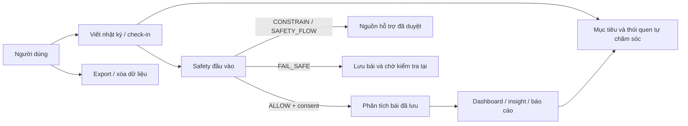

# Danh mục use case toàn dự án mylog

> Ảnh chụp thiết kế và repository: 2026-10-07. Phạm vi gồm backend, web, mobile scaffold và dịch vụ `safety-model`. Đây là **danh mục nghiệp vụ**, không phải lời khẳng định mọi chức năng đã sẵn sàng cho production. Flyway và code quyết định hành vi thực tế; kế hoạch và tài liệu đề xuất mô tả phần chưa triển khai.

## 1. Mục đích, tác nhân và cách đọc

mylog giúp người dùng ghi nhận trải nghiệm, tự suy ngẫm, quan sát thay đổi theo thời gian và tìm nội dung hỗ trợ phù hợp. Ứng dụng không chẩn đoán, điều trị hoặc thay thế chuyên gia. Một use case trả lời **ai muốn đạt điều gì, hệ thống làm gì, khi nào dừng hoặc chuyển luồng**; worker/model là tác nhân hỗ trợ, không phải người ra quyết định thay người dùng.

| Ký hiệu trạng thái | Nghĩa |
|---|---|
| **B** | Có API/use case backend; có thể còn phụ thuộc cấu hình, nội dung duyệt hoặc tích hợp frontend. |
| **D** | Có màn hình web demo nhưng chưa nối đầy đủ với backend; dữ liệu trình duyệt không phải dữ liệu production. |
| **G** | Có code nền nhưng cổng policy/consent/provider/feature flag chưa cho phép sử dụng thông thường. |
| **P** | Đề xuất/roadmap; chưa có contract và triển khai hoàn chỉnh. |

**Tác nhân chính:** khách chưa đăng nhập; người dùng; quản trị tài khoản; biên tập viên nội dung; người duyệt nội dung/safety; nhân viên hỗ trợ có quyền; worker theo lịch. **Hệ thống ngoài:** PostgreSQL, Cloudinary, nhà cung cấp AI đã duyệt, dịch vụ classifier nội bộ và hệ thống email. **Chuyên gia tâm lý** chỉ nhận bản người dùng tự mang/chia sẻ nếu tính năng handout được triển khai; họ không có quyền truy cập tài khoản theo mặc định.

Điều kiện xuyên suốt: dữ liệu cá nhân phải được giới hạn theo chủ sở hữu; secret và nội dung nhật ký không vào log; phản hồi AI cần consent và safety; insight cần nguồn/số mẫu; lỗi AI không làm mất bài đã lưu. Web hiện đăng nhập và lưu nhật ký bằng mock/`localStorage`, chưa đi trọn các luồng backend. Mobile hiện là Expo scaffold, chưa có luồng nghiệp vụ mylog. Xem [AI analysis guide](AI_ANALYSIS_GUIDE.md) và [kế hoạch](BACKEND_DEVELOPMENT_PLAN.md).

## 2. Tài khoản, hồ sơ và quyền quyết định dữ liệu

### UC-01 — Đăng ký và xác minh email · B, web D

- **Tác nhân/khởi phát:** khách tạo tài khoản bằng email và mật khẩu; sau đó yêu cầu/xác nhận email.
- **Luồng chính/kết quả:** backend chuẩn hóa email, lưu dạng mã hóa và HMAC để tra cứu, hash mật khẩu, tạo user/profile/quyền USER, gửi token xác minh; token hợp lệ chuyển email sang đã xác minh. API: `POST /auth/register`, `/auth/email-verifications`, `/auth/email-verifications:confirm`.
- **Nhánh:** email trùng, token hết hạn hoặc yêu cầu quá nhiều lần không tạo thêm tài khoản/quyền; phản hồi không lộ thông tin nhạy cảm. Email delivery production còn cần cấu hình SMTP phù hợp.

### UC-02 — Đăng nhập, gia hạn và đăng xuất · B, web D

- **Tác nhân/khởi phát:** người dùng nhập thông tin hoặc client gia hạn phiên.
- **Luồng chính/kết quả:** đăng nhập cấp access JWT ngắn hạn và refresh token opaque; refresh xoay token, đăng xuất thu hồi session. API: `POST /auth/login`, `/auth/refresh`, `/auth/logout`.
- **Nhánh:** sai mật khẩu bị giới hạn/khóa tạm; reuse refresh token thu hồi token family; tài khoản bị đình chỉ/đang xóa không lấy token mới. Nút Google trên web hiện chỉ là demo, chưa phải OAuth thật.

### UC-03 — Xem và thu hồi phiên đăng nhập · B

- **Tác nhân/khởi phát:** người dùng nghi có thiết bị lạ hoặc muốn đăng xuất nơi khác.
- **Luồng chính/kết quả:** xem danh sách phiên đã giảm dữ liệu nhận dạng, thu hồi một phiên hoặc tất cả phiên khác. API: `GET /me/sessions`, `DELETE /me/sessions/{sessionId}`, `DELETE /me/sessions?exceptCurrent=true`.
- **Nhánh:** không thể thao tác phiên của người khác; hoạt động thu hồi nhạy cảm được audit ở mức metadata.

### UC-04 — Hoàn thành onboarding và quản lý hồ sơ · B, web D

- **Tác nhân/khởi phát:** người dùng chọn tên hiển thị, locale, múi giờ và mục tiêu wellness.
- **Luồng chính/kết quả:** đọc/sửa hồ sơ, đánh dấu onboarding hoàn tất; dữ liệu nhạy cảm được mã hóa. API: `GET/PATCH /me`, `POST /me/onboarding:complete`.
- **Nhánh:** timezone/locale không hợp lệ bị từ chối; `If-Match` bảo vệ khi hai nơi cùng sửa; mục tiêu không được diễn đạt như chẩn đoán/kế hoạch điều trị.

### UC-05 — Xem, cấp hoặc rút consent · B

- **Tác nhân/khởi phát:** người dùng quyết định `TERMS`, `PRIVACY`, `AI_PROCESSING` và các lựa chọn tùy chọn.
- **Luồng chính/kết quả:** lưu quyết định theo version, cho xem lịch sử/hiệu lực. API: `GET /me/consents`, `PUT /me/consents/{type}`.
- **Nhánh:** rút `AI_PROCESSING` chặn xử lý AI tương lai, kể cả job đã được enqueue nhưng chưa chạy. Đồng ý xử lý AI **không** đồng nghĩa đồng ý dùng nhật ký để train model.

## 3. Nhật ký và check-in hằng ngày

### UC-06 — Xin câu hỏi gợi viết khi đang soạn · B/G, web P

- **Tác nhân/khởi phát:** người dùng tạm dừng viết; frontend mục tiêu đợi khoảng 3–5 giây trước khi hỏi backend.
- **Luồng chính/kết quả:** `POST /journal-writing-suggestions` nhận plain text bản nháp có giới hạn, kiểm tra JWT/quota/consent/safety rồi trả một câu hỏi mẫu cố định nếu `ALLOW`. Không lưu bản nháp, không gọi AI tạo sinh; feature flag mặc định tắt.
- **Nhánh:** thiếu consent, safety bị chặn hoặc classifier lỗi thì không trả gợi ý thông thường; frontend phải bỏ response cũ nếu người dùng đã gõ tiếp. Editor web hiện chưa gọi endpoint này.

### UC-07 — Tạo bài nhật ký · B, web D

- **Tác nhân/khởi phát:** người dùng nhấn Lưu.
- **Luồng chính/kết quả:** backend validate nội dung TipTap/chỉ số, tự tạo plain text để screen, mã hóa title/content, lưu bài và safety event/outbox trong cùng transaction. `POST /journal-entries` yêu cầu `Idempotency-Key`; API trả bài đã lưu trước khi AI hoàn tất.
- **Nhánh:** safety không cho phép thì vẫn có thể lưu bài nhưng không mở ordinary analysis; provider lỗi không làm mất bài. Web hiện chỉ lưu trong trình duyệt, chưa chạy luồng này.

### UC-08 — Đọc, lọc và xem lại bài · B, web D

- **Tác nhân/khởi phát:** người dùng mở lịch sử/lịch hoặc một bài cụ thể.
- **Luồng chính/kết quả:** `GET /journal-entries` lọc theo ngày, tag, favorite và cursor; `GET /journal-entries/{entryId}` trả bài thuộc chính user. Bài đã soft-delete không ở danh sách bình thường.
- **Nhánh:** ID của người khác không làm lộ sự tồn tại hay nội dung bài; dữ liệu demo web không phải kết quả owner-scoped từ backend.

### UC-09 — Sửa hoặc xóa bài · B, web D

- **Tác nhân/khởi phát:** người dùng cập nhật nội dung/chỉ số hoặc yêu cầu xóa.
- **Luồng chính/kết quả:** `PATCH/DELETE /journal-entries/{entryId}` dùng `If-Match`; sửa nội dung liên quan AI tăng `contentVersion`, chạy lại safety và làm analysis cũ hết hiệu lực. Xóa là soft-delete, có worker purge theo retention.
- **Nhánh:** version cũ trả xung đột; AI job cho phiên bản cũ không được kích hoạt kết quả; asset phải được dọn trước khi purge vật lý.

### UC-10 — Đánh dấu yêu thích và quản lý tag · B, web có UI demo

- **Tác nhân/khởi phát:** người dùng muốn tổ chức các bài.
- **Luồng chính/kết quả:** `PUT/DELETE /journal-entries/{entryId}/favorite`; tạo/xem tag bằng `POST/GET /journal-tags`, gắn/bỏ tag qua `/journal-entries/{entryId}/tags/{tagId}`. Tag nhạy cảm mã hóa, equality lookup bằng HMAC theo user.
- **Nhánh:** không gắn tag thuộc user khác; giới hạn số tag mỗi bài và độ dài tên; thao tác favorite lặp lại vẫn an toàn.

### UC-11 — Thêm ảnh vào nhật ký · P, có UI demo

- **Tác nhân/khởi phát:** người dùng chọn ảnh khi viết bài.
- **Luồng mục tiêu:** backend cấp workflow upload/delivery có ký với Cloudinary, lưu metadata và liên kết ảnh với bài; tải/xóa theo quyền chủ sở hữu.
- **Giới hạn:** Cloudinary configuration và quy tắc kiến trúc đã có, nhưng API upload ảnh journal cùng kiểm tra MIME/size/checksum/malware chưa hoàn tất. Không coi thao tác chèn URL/ảnh trong UI demo là private upload production.

### UC-12 — Ghi và xem check-in theo ngày · B

- **Tác nhân/khởi phát:** người dùng tự chấm mood, stress, energy, sleep và activity.
- **Luồng chính/kết quả:** `PUT /check-ins/{localDate}` upsert một check-in/user/ngày; `GET /check-ins/{localDate}` hoặc `GET /check-ins` để xem lại. Ngày theo timezone người dùng, chỉ số có range validation.
- **Nhánh:** dashboard ưu tiên check-in của ngày; chỉ dùng quan sát journal làm fallback có đánh dấu nguồn, không đếm trùng hoặc coi điểm mood là chẩn đoán.

## 4. Safety, phân tích AI và phản hồi cho một bài

### UC-13 — Phân loại safety đầu vào · B/G

- **Tác nhân/khởi phát:** hệ thống screen bản nháp được hỏi gợi ý hoặc bài khi tạo/sửa.
- **Luồng chính/kết quả:** validate → curated rules → `RiskClassifier` → `SafetyPolicyGate` theo version. Decision là `ALLOW`, `CONSTRAIN`, `SAFETY_FLOW` hoặc `FAIL_SAFE`; safety event chỉ chứa metadata tối thiểu.
- **Nhánh:** `HIGH/CRITICAL` chặn ordinary reflection; `MODERATE/CONSTRAIN` cũng chưa có luồng reflection riêng. Classifier timeout/unavailable dẫn tới fail-safe; bài vẫn lưu nhưng AI thường bị chặn. Rule/model/policy thật còn cần duyệt và đánh giá.

### UC-14 — Xem nguồn hỗ trợ safety · B/G

- **Tác nhân/khởi phát:** người dùng mở danh sách nguồn hỗ trợ hoặc hệ thống cần đưa ra safety response.
- **Luồng chính/kết quả:** `GET /safety/resources` chỉ đọc nguồn đã duyệt, còn hiệu lực, khớp locale/country và có HTTPS source. LLM không được tự tạo hotline.
- **Nhánh:** hiện chưa có nguồn thật được duyệt trong DB; kết quả có thể rỗng. Không tự liên hệ bên thứ ba hoặc mặc định gửi nội dung nhật ký cho người khác.

### UC-15 — Chuyển yêu cầu phân tích thành AI job · B/G

- **Tác nhân/khởi phát:** bài đã lưu với decision `ALLOW` hoặc bản fail-safe được screen lại và sau đó được phép.
- **Luồng chính/kết quả:** outbox chứa ID/`contentVersion`, worker claim bằng lease/lock; handler tạo job idempotent cho đúng bài và version. PostgreSQL là nguồn công việc bền vững.
- **Nhánh:** worker lỗi sẽ retry/backoff hoặc chuyển dead; không chứa raw journal trong outbox. `CONSTRAIN`/`SAFETY_FLOW` không tạo job reflection thông thường.

### UC-16 — Phân tích bài đã lưu và tạo reflection · B/G

- **Tác nhân/khởi phát:** `AiJobWorker` xử lý job.
- **Luồng chính/kết quả:** kiểm tra account, consent và safety **lúc chạy**, đọc đúng bài/version, gọi `JournalAnalyzer` ngoài transaction, validate structured output rồi lưu sentiment, emotions, topics và reflection mã hóa với model/prompt/policy provenance.
- **Nhánh:** thiếu consent, safety không cho phép, provider lỗi hay output sai schema không trả reflection thường; result đến muộn cho version cũ thành stale. Adapter API key có sẵn nhưng mặc định tắt/chưa được duyệt; fake chỉ dùng local/test, output safety validator còn là baseline.

### UC-17 — Xem trạng thái/kết quả và thử lại analysis · B, web P

- **Tác nhân/khởi phát:** người dùng mở bài sau khi lưu hoặc yêu cầu phân tích lại khi phù hợp.
- **Luồng chính/kết quả:** `GET /journal-entries/{entryId}/analysis` trả trạng thái, chỉ có reflection khi bản hiện hành `ANALYZED`; `POST /journal-entries/{entryId}/analysis:retry` có quota và kiểm tra điều kiện trước khi tạo công việc lại.
- **Nhánh:** đang chờ/lỗi/bị safety chặn phải hiển thị riêng; retry không tạo bài mới, không bypass consent/safety. Web chưa có polling/status end-to-end.

## 5. Nhìn lại nhiều ngày và tự chăm sóc

### UC-18 — Xem dashboard 7/30/90 ngày · B, web D

- **Tác nhân/khởi phát:** người dùng mở trang tổng quan.
- **Luồng chính/kết quả:** `GET /dashboard?range=7d|30d|90d` trả timeline chỉ số theo timezone, số bài, streak, top emotion/topic từ analysis đang active; dashboard không gọi LLM trong request.
- **Nhánh:** ít dữ liệu thì hiển thị thiếu mẫu thay vì suy đoán; check-in ưu tiên hơn journal fallback; FE dashboard hiện chưa phải bản tích hợp API đầy đủ.

### UC-19 — Xem insight có bằng chứng · B

- **Tác nhân/khởi phát:** người dùng xem quan sát từ dữ liệu nhiều ngày.
- **Luồng chính/kết quả:** `GET /insights` lấy insight theo khoảng ngày/cursor; hiện thuật toán tính quan hệ mood–sleep khi đủ mẫu mặc định 7, lưu strength, sample size, evidence, algorithm version.
- **Nhánh:** thiếu mẫu thì không tạo kết luận; quan hệ quan sát không chứng minh nguyên nhân và không được nói như chẩn đoán. Luồng generate insight định kỳ hiện gắn với scheduler báo cáo, mà cờ report mặc định tắt.

### UC-20 — Xem báo cáo tuần/tháng · B/G, web D

- **Tác nhân/khởi phát:** scheduler đến đầu tuần/tháng theo timezone user; người dùng mở báo cáo.
- **Luồng chính/kết quả:** report worker tạo metrics snapshot bất biến, narrative theo rule và evidence; `GET /reports`, `GET /reports/{reportId}` đọc theo owner. Job idempotent theo kỳ/version.
- **Nhánh:** `MYLOG_REPORTS_ENABLED` mặc định false; thiếu dữ liệu phải ghi rõ. AI narrative qua output safety chưa triển khai/duyệt, không giả định báo cáo hiện do LLM viết.

### UC-21 — Tạo, xem và cập nhật mục tiêu tự chăm sóc · B

- **Tác nhân/khởi phát:** người dùng chọn mục tiêu wellness như ngủ, vận động, kết nối xã hội.
- **Luồng chính/kết quả:** `POST/GET/PATCH /self-care/goals`; title/description mã hóa; `If-Match` bảo vệ cập nhật, có trạng thái active/paused/completed/archived.
- **Nhánh:** không dùng mục tiêu như treatment plan; phạm vi nội dung cần duyệt thêm trước production. Web chưa nối API self-care.

### UC-22 — Tạo thói quen, ghi hoặc bỏ hoàn thành · B

- **Tác nhân/khởi phát:** người dùng tạo habit dưới goal và đánh dấu một ngày.
- **Luồng chính/kết quả:** `POST /self-care/goals/{goalId}/habits`, `PUT/DELETE /self-care/habits/{habitId}/completions/{localDate}`; lịch theo timezone snapshot và tần suất, completion idempotent; `GET /goals` cho thấy progress.
- **Nhánh:** không ghi ngày tương lai, ngoài lịch hoặc goal không active; liên hệ habit–mood chỉ hiển thị nếu mỗi nhóm đủ ít nhất 7 check-in có mood, không diễn giải thành tác dụng điều trị.

### UC-23 — Đọc nội dung hỗ trợ đã duyệt · B/G

- **Tác nhân/khởi phát:** người dùng chọn một `topicCode` cần tìm hiểu.
- **Luồng chính/kết quả:** `GET /recommendations?topicCode=...` tìm tối đa ba excerpt khớp locale từ knowledge version `APPROVED`, còn hiệu lực, kèm citation.
- **Nhánh:** không có nguồn phù hợp thì không bịa lời khuyên; API hiện không dùng journal raw, embedding/semantic ranking hoặc LLM generation. Chất lượng thực tế phụ thuộc kho nội dung đã duyệt.

## 6. Quyền dữ liệu, hỗ trợ và quản trị

### UC-24 — Yêu cầu, theo dõi và tải bản xuất dữ liệu · B

- **Tác nhân/khởi phát:** người dùng yêu cầu CSV/PDF dữ liệu của mình.
- **Luồng chính/kết quả:** `POST /exports` tạo job; `GET /exports/{id}` theo dõi; xác thực lại mật khẩu qua `POST /exports/{id}:authorize-download` rồi tải `GET /exports/{id}/file` với JWT, chữ ký ngắn hạn và owner check. Artifact mã hóa trong PostgreSQL, giới hạn 5 MB, TTL 24 giờ.
- **Nhánh:** hết hạn, sai mật khẩu, sai chủ sở hữu hoặc vượt quota không tải được. Đây là export dữ liệu cá nhân đầy đủ, **khác** bản chuẩn bị buổi tham vấn đề xuất ở UC-41.

### UC-25 — Yêu cầu, xem trạng thái hoặc hủy xóa tài khoản · B

- **Tác nhân/khởi phát:** người dùng yêu cầu xóa và xác thực lại.
- **Luồng chính/kết quả:** `POST /account-deletion-requests` tạo yêu cầu, thu hồi session; trong grace period 7 ngày, dùng email/mật khẩu + request ID để xem trạng thái hoặc hủy. Worker dọn dữ liệu với checkpoint/retry.
- **Nhánh:** thất bại khi xóa asset/provider/cache không được báo hoàn tất giả; khả năng dọn Cloudinary thật và các adapter tương lai còn cần kiểm chứng. Metadata audit tối thiểu tuân theo retention.

### UC-26 — Gửi và xem phản hồi hỗ trợ sản phẩm · B

- **Tác nhân/khởi phát:** người dùng gửi góp ý/bug và xem lại phản hồi của mình.
- **Luồng chính/kết quả:** `POST /feedback`, `GET /feedback/{id}`; message mã hóa, không tự kèm nhật ký.
- **Nhánh:** không đọc feedback của user khác; nội dung chỉ được nhân viên có quyền xem theo workflow/audit.

### UC-27 — Quản trị metadata tài khoản · B

- **Tác nhân/khởi phát:** admin có quyền cần xem trạng thái hoặc đình chỉ/khôi phục tài khoản.
- **Luồng chính/kết quả:** `GET /admin/users`, `GET /admin/users/{id}/metadata`, `POST /admin/users/{id}:suspend|:restore`; hành động cần quyền riêng và reason code.
- **Nhánh:** admin thông thường không đọc/decrypt nhật ký thô; role assignment API còn là roadmap, không ghi như đã có.

### UC-28 — Quan sát vận hành và retry AI job · B

- **Tác nhân/khởi phát:** admin vận hành điều tra job lỗi.
- **Luồng chính/kết quả:** `GET /admin/dashboard`, `GET /admin/ai-jobs`, `POST /admin/ai-jobs/{id}:retry`; chỉ trả metadata/job state và error code đã sanitize.
- **Nhánh:** retry không bypass policy/consent/safety, không đưa raw prompt hay nội dung journal vào dashboard/log.

### UC-29 — Soạn, duyệt, từ chối và lưu trữ tri thức · B

- **Tác nhân/khởi phát:** người biên tập tạo/sửa knowledge item; người duyệt độc lập quyết định publish.
- **Luồng chính/kết quả:** `/admin/knowledge-items` có create, version, draft update, submit, approve/reject/archive; chỉ version approved và còn hiệu lực được retrieval, chunk/citation giữ nguồn gốc.
- **Nhánh:** người tạo không tự duyệt; bản đã duyệt bất biến. Embedding và retrieval eval còn mở, nên đây chưa phải RAG sinh nội dung hoàn chỉnh.

### UC-30 — Quản lý feedback của người dùng · B

- **Tác nhân/khởi phát:** nhân viên hỗ trợ có quyền xem, phân công và cập nhật trạng thái.
- **Luồng chính/kết quả:** `GET /admin/feedback[/{id}]`, `PATCH /admin/feedback/{id}` với `If-Match`; quyền `feedback:read/manage`, audit truy cập.
- **Nhánh:** version xung đột trả lỗi; quyền admin khác không tự được đọc nội dung feedback.

## 7. Use case vận hành, model và các luồng còn trong roadmap

### UC-31 — Train, đánh giá và phát hành classifier safety · G

- **Tác nhân/khởi phát:** nhóm model chuẩn bị dataset hợp lệ và một bản model mới.
- **Luồng chính/kết quả:** `safety-model/train.py` học từ train CSV và đánh giá trên holdout độc lập, tạo artifact/manifest chưa duyệt; safety owner xem recall `HIGH/CRITICAL`, false negative, lát cắt Việt/Anh, phủ định/trích dẫn và latency. `serve.py` chỉ phục vụ artifact đã duyệt qua endpoint nội bộ.
- **Nhánh:** không dùng nhật ký production để train tự động; `AI_PROCESSING` không phải `MODEL_TRAINING`. Bật service không tự phê duyệt policy. Xem [model plan](SAFETY_CLASSIFIER_MODEL_PLAN.md) và [README](../../safety-model/README.md).

### UC-32 — Cấu hình và đánh giá provider phân tích AI · G

- **Tác nhân/khởi phát:** nhóm vận hành muốn bật adapter dùng API key trong worker.
- **Luồng mục tiêu:** kiểm tra no-training, retention, region, xóa dữ liệu và output safety; chỉ gửi title/plain text tối thiểu khi consent/safety hợp lệ; ghi usage/provenance, không ghi raw request/response.
- **Nhánh:** mặc định `MYLOG_AI_PROVIDER=none`; adapter tồn tại không có nghĩa đã được chấp thuận dùng với dữ liệu thật. Không đặt API key ở frontend.

### UC-33 — Duyệt policy và nguồn hỗ trợ safety · P/G

- **Tác nhân/khởi phát:** người chịu trách nhiệm safety chuẩn bị rule/threshold/response/resource theo locale/country.
- **Luồng mục tiêu:** đánh giá corpus, ghi version và phê duyệt policy; chỉ nguồn đã xác minh, có HTTPS và còn hiệu lực mới hiện cho user. Mỗi lần đổi model/rule/threshold cần regression evaluation.
- **Giới hạn:** persistence/policy gate và API đọc resource đã có; admin workflow/API nhập và duyệt safety resource, dữ liệu nguồn thật cùng sign-off vận hành chưa hoàn tất.

### UC-34 — Quản lý câu hỏi mẫu và sinh gợi ý theo ngữ cảnh · P

- **Tác nhân/khởi phát:** biên tập viên muốn quản lý prompt; người dùng muốn câu hỏi phù hợp nội dung đang viết.
- **Luồng mục tiêu:** version/review/publish nội dung, rồi backend trả gợi ý khi consent/safety cho phép; nếu dùng LLM phải bổ sung provider approval, output validation, rate limit và stale-request handling.
- **Giới hạn:** endpoint bản nháp UC-06 hiện chỉ chọn câu hỏi cố định trong code; admin prompt API trong blueprint chưa có.

### UC-35 — Hoàn thiện retrieval/RAG có trích dẫn · P

- **Tác nhân/khởi phát:** người dùng cần nội dung được duyệt phù hợp hơn theo topic/locale.
- **Luồng mục tiêu:** chỉ embed/chỉ mục knowledge đã duyệt, filter quyền/hiệu lực trước ranking, nếu sinh diễn giải thì kiểm tra output safety và giữ citation.
- **Giới hạn:** hiện có excerpt retrieval ở UC-23; chưa có embedding provider/semantic index/LLM generation được duyệt.

### UC-36 — Tích hợp web và mobile với API thật · P/D

- **Tác nhân/khởi phát:** người dùng đăng nhập, viết bài, check-in hoặc xem insight trên client.
- **Luồng mục tiêu:** client có JWT/session thật; journal và dữ liệu nhạy cảm đi qua backend, polling có trạng thái chờ/lỗi/bị chặn; không lưu raw journal ở `localStorage` production. Web hiện có các màn hình demo; mobile mới là Expo scaffold, chưa có use case mylog.
- **Giới hạn:** không quảng bá safety, AI, export hoặc quyền riêng tư backend như đã chạy end-to-end qua UI cho tới khi tích hợp và kiểm thử thật.

### UC-37 — Khôi phục mật khẩu · D/P

- **Tác nhân/khởi phát:** người dùng quên mật khẩu và mở màn hình khôi phục trên web.
- **Luồng mục tiêu/kết quả:** gửi yêu cầu tới backend, nhận bằng chứng xác minh qua kênh đã đăng ký, đặt mật khẩu mới và thu hồi các phiên cũ theo policy.
- **Giới hạn:** web hiện mô phỏng OTP cố định trong client; `IdentityController` chưa có API reset password. Không dùng OTP demo hoặc thông báo “đã gửi email” của UI như bằng chứng quy trình khôi phục tài khoản thật.

### UC-38 — Quản trị role và tra cứu audit · P

- **Tác nhân/khởi phát:** quản trị viên được ủy quyền cần gán quyền hoặc kiểm tra hành động nhạy cảm.
- **Luồng mục tiêu/kết quả:** cấp/thu hồi quyền có reason code, giới hạn người được xem audit metadata và lưu dấu truy cập; không trao quyền đọc journal thô qua role thông thường.
- **Giới hạn:** RBAC và audit ghi sự kiện đã có, nhưng endpoint gán role và đọc audit trong blueprint chưa được triển khai. Không nhầm chúng với UC-27/28 đã có.

## 8. Ba use case self-compassion mới đề xuất

Ba mục sau lấy từ [đề xuất self-compassion](SELF_COMPASSION_FEATURE_PROPOSALS.md); **chưa có API, migration hoặc UI hoàn chỉnh**. Chúng không mặc nhiên trở thành output mới của `JournalAnalyzer`.

### UC-39 — Viết và đọc lại “Thư gửi tương lai” · P

- **Tác nhân/khởi phát:** người dùng tự viết lời nhắn cho ngày khó khăn; sau này tự mở hoặc chọn xem khi app gợi ý kín đáo.
- **Luồng mục tiêu/kết quả:** tạo/sửa/xóa thư, chọn cách nhắc; app hỏi “Bạn có muốn đọc lời nhắn mình từng để lại không?” và tôn trọng bỏ qua/tắt. Thư là lời của người dùng, không do AI viết thay.
- **Nhánh:** năng lượng thấp một ngày không đủ để tự động mở hoặc push thư; safety flow rủi ro cao vẫn ưu tiên nguồn hỗ trợ đã duyệt, thư không thay thế phản hồi an toàn.

### UC-40 — Lưu “Điểm sáng nhỏ” · P

- **Tác nhân/khởi phát:** người dùng tự ghi một việc nhỏ đáng nhớ hoặc nhận đề xuất từ bài đã lưu.
- **Luồng mục tiêu/kết quả:** người dùng xem câu gốc, sửa, xác nhận hoặc bỏ qua trước khi lưu vào vault; sau đó tự xem/sửa/xóa. Bắt đầu bằng nhập thủ công là phương án ít rủi ro hơn.
- **Nhánh:** AI không tự tạo thành tích hoặc lưu kết quả chưa xác nhận; trích xuất chỉ xét bài hiện hành sau consent/safety và kiểm tra `contentVersion`. Nội dung mới cần mã hóa, owner-scope, export/deletion.

### UC-41 — Tạo bản chuẩn bị buổi tham vấn · P

- **Tác nhân/khởi phát:** người dùng sắp trao đổi với chuyên gia/người hỗ trợ và muốn mang ghi chú ngắn.
- **Luồng mục tiêu/kết quả:** chọn kỳ, xem trước một trang gồm chỉ số tự ghi nhận có nguồn/số mẫu, chủ đề đủ điều kiện và câu hỏi do người dùng tự viết; bỏ từng mục, xác nhận rồi tự tải/chia sẻ.
- **Nhánh:** không mặc định kèm nhật ký thô, safety event, suy đoán nguyên nhân hoặc nhãn chẩn đoán; không tự gửi cho bên thứ ba. Handout là bản chọn lọc, khác UC-24. Nếu xuất file, phải chốt mã hóa, TTL, xác thực tải và dọn artifact.

## 9. Kịch bản xuyên suốt để thảo luận và kiểm thử

### Kịch bản A — Một ngày viết nhật ký bình thường

1. Người dùng có phiên hợp lệ và đã quyết định consent (UC-02/05). Nếu tính năng gợi viết được bật, client có thể xin câu hỏi khi dừng gõ (UC-06); đây chưa phải reflection của bài đã lưu.
2. Người dùng lưu bài (UC-07). Backend screen safety (UC-13), mã hóa và commit bài; chỉ kết quả `ALLOW` phù hợp policy mới tạo yêu cầu ordinary analysis (UC-15).
3. Worker kiểm tra lại tài khoản, consent, safety và version trước khi gọi analyzer (UC-16). Người dùng xem trạng thái/kết quả của chính bài đó (UC-17). Họ có thể check-in riêng (UC-12).
4. Sau nhiều ngày, dashboard/insight/report chỉ dùng dữ liệu có nguồn và đủ mẫu (UC-18/19/20). Người dùng tự chọn mục tiêu/habit hoặc đọc nội dung đã duyệt (UC-21/22/23).

### Kịch bản B — Bài có rủi ro hoặc dependency safety lỗi

1. Backend vẫn lưu bài; `SAFETY_FLOW` hoặc `CONSTRAIN` không enqueue reflection thường. Nếu classifier/policy chưa sẵn sàng, decision `FAIL_SAFE` tạo yêu cầu screen lại theo policy (UC-07/13/15).
2. Chỉ nguồn hỗ trợ đã được xác minh và duyệt mới được hiển thị (UC-14). Hiện kho nguồn thật chưa được duyệt nên không được hứa rằng hotline cụ thể sẽ xuất hiện.
3. Không dùng mood/energy score đơn lẻ để suy ra khủng hoảng, không tự gửi thư quá khứ (UC-39), không gửi dữ liệu cho bên thứ ba. Khi người dùng sửa bài, `contentVersion` mới làm kết quả cũ stale (UC-09/16).

### Kịch bản C — Người dùng kiểm soát và mang dữ liệu ra ngoài

1. Người dùng rút consent AI (UC-05); job chưa chạy phải kiểm tra lại và không gửi nội dung cho provider (UC-16).
2. Họ có thể tải bản xuất toàn bộ dữ liệu của mình sau xác thực lại (UC-24), hoặc sau này chọn từng mục cho bản chuẩn bị buổi tham vấn (UC-41). Hai tài liệu có mục đích và phạm vi khác nhau.
3. Nếu yêu cầu xóa tài khoản (UC-25), phiên bị thu hồi và worker dọn dữ liệu theo retention/checkpoint; việc xóa ở Cloudinary và các provider tương lai phải được xác minh trước khi báo hoàn tất.

## 10. Ranh giới và đường kiểm chứng

| Nội dung dễ nhầm | Kết luận đúng tại thời điểm viết |
|---|---|
| Có API backend ⇒ web đã dùng? | Không. Auth và journal web còn demo; cần nối JWT và data flow thật. |
| Safety `ALLOW` ⇒ AI chắc chắn trả reflection? | Không. Còn consent, provider/feature flag, output validation, trạng thái job và `contentVersion`. |
| `SAFETY_FLOW` ⇒ xóa hoặc chặn lưu nhật ký? | Không. Bài vẫn được lưu theo luồng; ordinary reflection bị chặn và nội dung hỗ trợ phải được duyệt. |
| Có report ⇒ AI viết báo cáo? | Không. Narrative hiện từ rule/metrics; scheduler mặc định tắt. |
| Có recommendation ⇒ RAG tạo sinh? | Không. Hiện trả excerpt đã duyệt kèm citation. |
| Consent AI ⇒ được train model? | Không. Quyền train là quyết định riêng, không suy từ consent xử lý AI. |

Nguồn để rà soát khi tài liệu thay đổi: [kiến trúc](BACKEND_ARCHITECTURE.md), [kế hoạch milestone](BACKEND_DEVELOPMENT_PLAN.md), [database overview](DATABASE_OVERVIEW.md), [DBML](database/mylog.dbml), [ADR](adr/README.md), [AI guide](AI_ANALYSIS_GUIDE.md), [self-compassion proposal](SELF_COMPASSION_FEATURE_PROPOSALS.md), các `api/*Controller.java`, Flyway migrations và test trong `backend/src/test`. Endpoint trong tài liệu này dùng path tương đối sau tiền tố `/api/v1` trừ khi ghi rõ khác.
