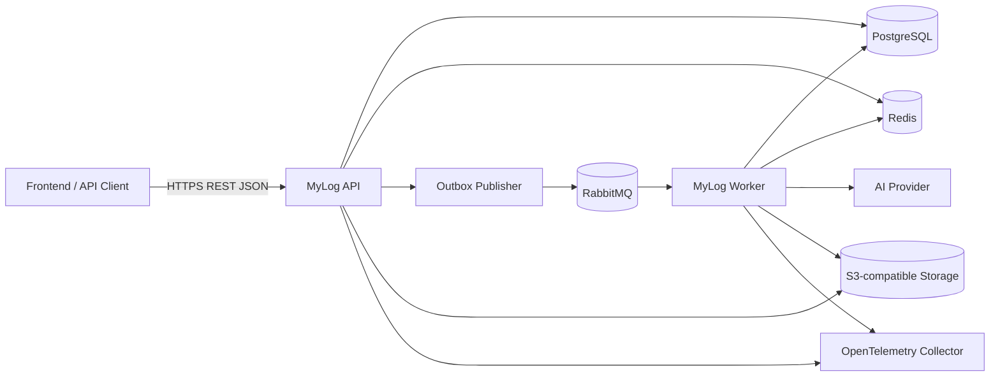
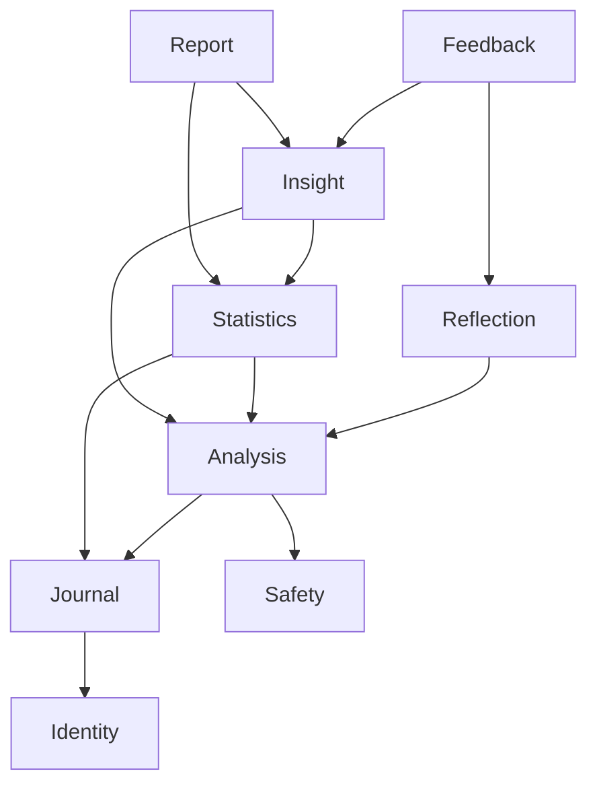
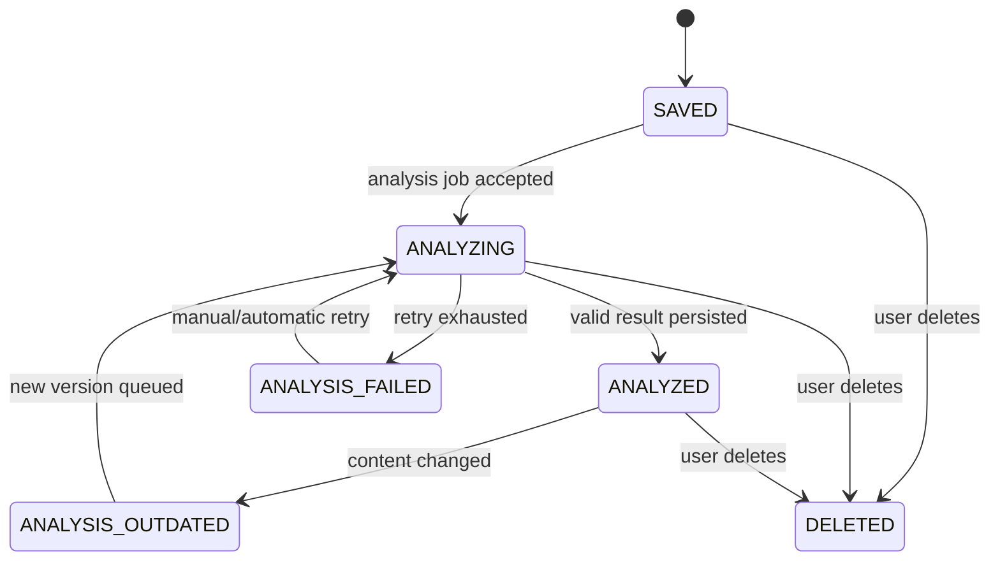
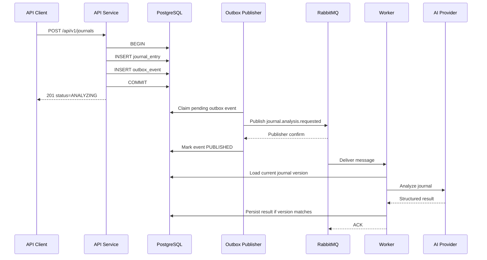
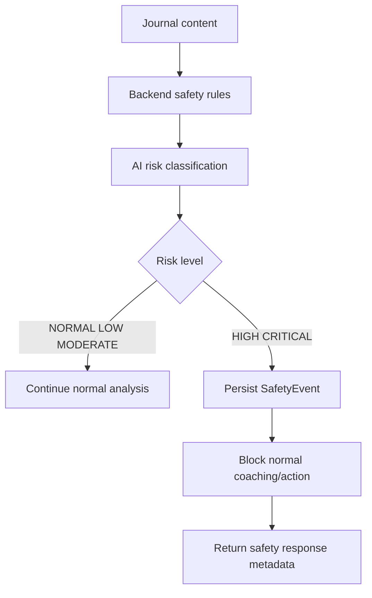

# MYLOG – BACKEND ARCHITECTURE & TECHNICAL DESIGN

| Field | Value |
| --- | --- |
| Version | 1.0 |
| Status | Proposed |
| Scope | Backend only |
| Architecture | Modular monolith with separately scalable API and worker runtimes |
| Primary language | Java 21 LTS |
| Primary framework | Spring Boot |
| Last updated | 2026-09-20 |

---

## 1. Purpose

Tài liệu này mô tả kiến trúc kỹ thuật cho backend MyLog, bao gồm:

- Ranh giới và trách nhiệm của các module nghiệp vụ.
- Cách tổ chức source code.
- Thiết kế REST API giao tiếp với frontend.
- Mô hình dữ liệu và nguyên tắc lưu trữ.
- Quy trình xử lý AI bất đồng bộ.
- Cách sử dụng PostgreSQL, Redis và RabbitMQ.
- Transactional Outbox và cơ chế chống xử lý trùng.
- Security, privacy và safety requirements.
- Observability, testing, deployment và vận hành.

Tài liệu này là blueprint triển khai backend. Khi có xung đột với SRS hiện tại, quyết định trong tài liệu này được xem là đề xuất kiến trúc mới và cần được phản ánh lại vào SRS sau khi được phê duyệt.

---

## 2. Architecture Goals

Backend phải đáp ứng các mục tiêu sau:

1. Journal luôn được lưu thành công độc lập với trạng thái AI provider.
2. Không mất tác vụ phân tích nếu process restart hoặc RabbitMQ tạm thời không khả dụng.
3. Không để kết quả AI của journal version cũ ghi đè journal version mới.
4. Statistical Engine là nguồn sự thật cho dữ liệu định lượng.
5. LLM chỉ phân loại hoặc diễn giải, không tự tạo số liệu thống kê.
6. Dữ liệu của mỗi user phải được cô lập ở mọi API và background worker.
7. Journal content không xuất hiện trong application log, metric label hoặc message broker payload.
8. API và worker có thể scale độc lập mà không cần tách thành microservices.
9. Mỗi module có ranh giới rõ ràng, kiểm thử được độc lập.
10. Hạ tầng có thể chạy local bằng Docker Compose và chuyển sang managed services khi production.

### 2.1. Non-goals

Trong giai đoạn đầu, backend không hướng tới:

- Microservices theo từng domain.
- Event sourcing toàn hệ thống.
- Kafka hoặc stream processing quy mô lớn.
- Kubernetes.
- Data warehouse hoặc ClickHouse.
- Elasticsearch/OpenSearch.
- Vector database độc lập.
- Workflow engine như Temporal.
- Real-time collaboration trên journal editor.

---

## 3. Key Architecture Decisions

| ID | Decision | Rationale |
| --- | --- | --- |
| ADR-001 | Sử dụng modular monolith | Giữ transaction và vận hành đơn giản nhưng vẫn có ranh giới module rõ ràng. |
| ADR-002 | API và worker dùng chung codebase nhưng chạy riêng | Có thể scale AI worker mà không nhân bản toàn bộ API traffic. |
| ADR-003 | PostgreSQL là source of truth | Dữ liệu journal, analysis và insight cần transaction và độ bền cao. |
| ADR-004 | Redis chỉ lưu dữ liệu tạm thời | Redis phục vụ cache, rate limit và idempotency ngắn hạn; không giữ journal duy nhất. |
| ADR-005 | RabbitMQ xử lý background jobs | Hỗ trợ acknowledgment, retry, dead-letter và kiểm soát consumer. |
| ADR-006 | Transactional Outbox khi publish event | Tránh khoảng trống giữa commit database và publish message. |
| ADR-007 | Consumer phải idempotent | RabbitMQ cung cấp at-least-once delivery nên duplicate message là tình huống hợp lệ. |
| ADR-008 | AI provider nằm sau application port | Có thể đổi provider mà không sửa domain logic. |
| ADR-009 | Statistical Engine không phụ thuộc LLM | Đảm bảo insight có bằng chứng định lượng và có thể tái lập. |
| ADR-010 | OpenAPI là contract với frontend | Giảm sai lệch DTO giữa Java và TypeScript. |

---

## 4. System Context



### 4.1. Runtime components

#### API runtime

API runtime chịu trách nhiệm:

- Authentication và authorization.
- Journal CRUD.
- Trả trạng thái analysis.
- User correction.
- Dashboard và insight query.
- Feedback.
- Tạo presigned upload URL.
- Validation, idempotency và rate limiting.
- Ghi domain event vào outbox trong cùng database transaction.

API runtime không gọi AI provider đồng bộ trong request tạo journal.

#### Worker runtime

Worker runtime chịu trách nhiệm:

- Consume RabbitMQ message.
- Risk detection và safety pipeline.
- AI analysis.
- Reflection generation.
- Statistical aggregation.
- Insight generation.
- Suggested action generation.
- Report generation.
- Retry, dead-letter handling và recovery.

#### Shared infrastructure

- PostgreSQL: dữ liệu bền vững và transactional state.
- Redis: cache, quota, short-lived idempotency và coordination.
- RabbitMQ: durable asynchronous delivery.
- S3/MinIO: file, image và exported report.
- OpenTelemetry Collector: nhận trace, metric và log correlation.

---

## 5. Recommended Technology Stack

### 5.1. Core dependencies

| Category | Technology |
| --- | --- |
| Runtime | Java 21 LTS |
| Framework | Spring Boot stable release compatible with Java 21 |
| HTTP | Spring Web MVC |
| Security | Spring Security |
| Validation | Jakarta Bean Validation |
| Persistence | Spring Data JPA / Hibernate |
| SQL migration | Flyway |
| Database | PostgreSQL |
| Cache | Spring Data Redis with Lettuce |
| Messaging | Spring AMQP with RabbitMQ |
| AI adapter | Spring AI behind internal provider interfaces |
| Resilience | Resilience4j |
| API contract | springdoc-openapi |
| DTO mapping | MapStruct |
| Observability | Actuator, Micrometer, OpenTelemetry |
| Testing | JUnit 5, AssertJ, Mockito, Testcontainers, WireMock |
| Build | Maven |
| Local infrastructure | Docker Compose |

### 5.2. Dependency rules

- Domain package không được import Spring MVC, RabbitMQ hoặc provider SDK.
- Controller không truy cập repository trực tiếp.
- Module khác không được truy cập package `infrastructure` hoặc entity JPA nội bộ.
- Cross-module write sử dụng application service hoặc domain event.
- Cross-module read có thể sử dụng public query interface.
- Spring AI chỉ xuất hiện trong provider adapter.
- Redis không được dùng để đảm bảo duy nhất tính đúng của dữ liệu nghiệp vụ.

---

## 6. Repository Structure

```text
backend/
├── pom.xml
├── compose.yaml
├── Dockerfile
├── .env.example
├── README.md
│
├── src/main/java/com/mylog/
│   ├── MyLogApplication.java
│   │
│   ├── shared/
│   │   ├── config/
│   │   ├── security/
│   │   ├── exception/
│   │   ├── messaging/
│   │   ├── outbox/
│   │   ├── cache/
│   │   ├── idempotency/
│   │   ├── observability/
│   │   └── persistence/
│   │
│   ├── identity/
│   ├── journal/
│   ├── analysis/
│   ├── safety/
│   ├── reflection/
│   ├── statistics/
│   ├── insight/
│   ├── feedback/
│   ├── report/
│   └── media/
│
├── src/main/resources/
│   ├── application.yml
│   ├── application-local.yml
│   ├── application-test.yml
│   ├── application-api.yml
│   ├── application-worker.yml
│   └── db/migration/
│       ├── V001__create_identity_tables.sql
│       ├── V002__create_journal_tables.sql
│       ├── V003__create_analysis_tables.sql
│       └── ...
│
└── src/test/java/com/mylog/
    ├── architecture/
    ├── integration/
    └── fixtures/
```

### 6.1. Internal module structure

```text
journal/
├── api/
│   ├── JournalController.java
│   ├── CreateJournalRequest.java
│   ├── UpdateJournalRequest.java
│   └── JournalResponse.java
├── application/
│   ├── CreateJournalUseCase.java
│   ├── UpdateJournalUseCase.java
│   ├── DeleteJournalUseCase.java
│   └── JournalQueryService.java
├── domain/
│   ├── JournalEntry.java
│   ├── JournalStatus.java
│   ├── JournalRepository.java
│   └── event/
│       ├── JournalSaved.java
│       └── JournalUpdated.java
└── infrastructure/
    ├── persistence/
    │   ├── JpaJournalEntity.java
    │   ├── SpringDataJournalRepository.java
    │   └── JournalRepositoryAdapter.java
    └── messaging/
        └── JournalEventPublisher.java
```

### 6.2. Runtime profiles

| Profile | Enabled components |
| --- | --- |
| `local` | Local infrastructure configuration and developer-friendly logging. |
| `api` | REST controllers, authentication, query endpoints và outbox publisher. |
| `worker` | RabbitMQ consumers, AI processing, statistics và report jobs. |
| `test` | Testcontainers, mock provider và deterministic clock. |

Production chạy ít nhất hai container từ cùng image:

```text
mylog-backend:version + profile api
mylog-backend:version + profile worker
```

---

## 7. Module Responsibilities

### 7.1. Identity module

Chịu trách nhiệm:

- Register, login, logout và refresh token.
- Password hashing.
- User profile, timezone và language.
- Refresh token rotation và revocation.
- Cung cấp authenticated principal cho các module khác.

Không chịu trách nhiệm:

- Journal authorization cụ thể.
- AI quota calculation.
- Product plan billing.

### 7.2. Journal module

Chịu trách nhiệm:

- Journal CRUD.
- Mood, stress, energy và tags.
- Journal state machine.
- Optimistic locking bằng journal version.
- Phát sự kiện khi journal được tạo, sửa hoặc xóa.
- Xác nhận journal thuộc authenticated user.

### 7.3. Analysis module

Chịu trách nhiệm:

- Orchestrate AI analysis.
- Provider abstraction.
- Validate structured output.
- Lưu sentiment, emotion, topic và provider metadata.
- Quản lý analysis attempt, retry và failure state.
- Không ghi kết quả nếu journal version không còn hiện hành.

### 7.4. Safety module

Chịu trách nhiệm:

- Backend safety rules.
- AI risk classification.
- Quyết định có được tiếp tục normal coaching hay không.
- Lưu SafetyEvent tối thiểu.
- Phát safety status cho API response.

### 7.5. Reflection module

Chịu trách nhiệm:

- Sinh tối đa số lượng reflection question được cấu hình.
- Regenerate question khi user yêu cầu.
- Giảm việc nhắc lại nội dung nhạy cảm.
- Liên kết feedback với reflection question.

### 7.6. Statistics module

Chịu trách nhiệm:

- Daily, weekly và monthly averages.
- Emotion distribution và frequency.
- Topic frequency.
- Topic–mood association.
- Period comparison.
- Sample size và confidence classification.

Statistics module chỉ dùng effective data, tức dữ liệu user-corrected được ưu tiên hơn AI original data.

### 7.7. Insight module

Chịu trách nhiệm:

- Chuyển statistical result thành structured evidence.
- Kiểm tra minimum sample và confidence threshold.
- Nhờ AI diễn giải evidence bằng ngôn ngữ tự nhiên.
- Validate diễn giải không khẳng định causation.
- Quản lý insight lifecycle.
- Sinh suggested action có rủi ro thấp.

### 7.8. Feedback module

Chịu trách nhiệm:

- Helpful và Not Helpful.
- Accept và Ignore suggested action.
- Chống duplicate feedback.
- Cung cấp dữ liệu personalization rule-based.

### 7.9. Report module

P1 module, chịu trách nhiệm:

- Weekly report snapshot.
- Report status VALID/STALE.
- PDF export job.
- Không tự động rewrite report cũ.

### 7.10. Media module

P1 module, chịu trách nhiệm:

- Presigned upload URL.
- Validate MIME type và file size.
- Lưu object metadata.
- Xóa object khi journal hoặc account bị xóa.

---

## 8. Module Dependency Direction



Quy tắc:

- Không tạo dependency vòng.
- `statistics` không phụ thuộc `insight`.
- `analysis` không phụ thuộc `reflection`.
- `journal` không biết AI provider.
- Module chỉ expose interface cần thiết qua package public.

Spring Modulith có thể được dùng để kiểm tra dependency rule và module integration test, nhưng không bắt buộc để domain code hoạt động.

---

## 9. Journal State Model



`DRAFT` mặc định được lưu ở client. Nếu backend draft được triển khai sau, draft không kích hoạt AI analysis.

### 9.1. Versioning rule

Mỗi lần content hoặc input ảnh hưởng phân tích thay đổi:

```text
journal.version = journal.version + 1
journal.status = ANALYSIS_OUTDATED
```

Analysis result phải mang `journalVersion`. Worker chỉ lưu kết quả thành current result khi:

```text
analysis.journalVersion == journal.version
AND journal.deletedAt IS NULL
```

Kết quả stale có thể được lưu để audit nhưng không được hiển thị như kết quả hiện hành.

---

## 10. Asynchronous Processing

### 10.1. Save flow



### 10.2. Event payload rule

Message broker payload không chứa journal content.

```json
{
  "eventId": "01900000-0000-7000-8000-000000000001",
  "eventType": "journal.analysis.requested",
  "eventVersion": 1,
  "userId": "01900000-0000-7000-8000-000000000002",
  "journalId": "01900000-0000-7000-8000-000000000003",
  "journalVersion": 1,
  "occurredAt": "2026-09-20T10:00:00Z",
  "traceId": "01J00000000000000000000000"
}
```

Worker tải dữ liệu cần thiết từ PostgreSQL sau khi xác minh user, journal và version.

### 10.3. RabbitMQ topology

Exchange:

```text
mylog.events
type = topic
durable = true
```

Queues:

| Queue | Routing keys | Consumer |
| --- | --- | --- |
| `mylog.analysis.requested` | `journal.analysis.requested` | Analysis worker |
| `mylog.reflection.requested` | `journal.analysis.completed` | Reflection worker |
| `mylog.statistics.requested` | `journal.analysis.completed`, `journal.corrected` | Statistics worker |
| `mylog.insight.requested` | `statistics.updated` | Insight worker |
| `mylog.report.requested` | `report.generation.requested` | Report worker |
| `mylog.dead` | dead-lettered messages | Manual inspection/replay |

Production queue dùng durable quorum queue. Local development có thể chạy single-node RabbitMQ.

### 10.4. Retry policy

| Failure | Retry | Policy |
| --- | --- | --- |
| AI provider timeout | Yes | Exponential backoff with jitter |
| AI provider 429 | Yes | Respect Retry-After when present |
| AI provider 5xx | Yes | Limited retry |
| Invalid structured output | Yes | One repair/regeneration attempt, then fail |
| Journal version changed | No | Mark obsolete and ACK |
| Journal deleted | No | Cancel and ACK |
| Authentication/config error | No | Dead-letter immediately |
| Database temporary failure | Yes | Short retry with bounded attempts |

Baseline retry schedule:

```text
Attempt 1: immediate
Attempt 2: 30 seconds
Attempt 3: 5 minutes
Attempt 4: 30 minutes
After attempt 4: dead-letter / ANALYSIS_FAILED
```

Không requeue vô hạn cùng một message.

### 10.5. Consumer idempotency

Mỗi consumer kiểm tra `processed_messages` trước khi xử lý:

```text
PRIMARY KEY (consumer_name, message_id)
```

Việc ghi business result và `processed_messages` phải nằm trong cùng database transaction.

---

## 11. Transactional Outbox

### 11.1. Table design

```text
outbox_events
- id UUID PK
- aggregate_type VARCHAR(50)
- aggregate_id UUID
- event_type VARCHAR(100)
- event_version INTEGER
- payload JSONB
- status VARCHAR(20)
- attempt_count INTEGER
- next_attempt_at TIMESTAMPTZ
- occurred_at TIMESTAMPTZ
- published_at TIMESTAMPTZ NULL
- last_error_code VARCHAR(100) NULL
```

Status:

```text
PENDING
PUBLISHING
PUBLISHED
FAILED
```

### 11.2. Publisher algorithm

1. Lấy batch event `PENDING` có `next_attempt_at <= now()`.
2. Claim row bằng row-level lock và `SKIP LOCKED`.
3. Publish persistent message.
4. Chờ publisher confirm.
5. Đánh dấu `PUBLISHED` khi broker xác nhận.
6. Khi lỗi, tăng attempt và đặt `next_attempt_at`.
7. Job cleanup xóa/archival published event sau retention period.

### 11.3. Delivery semantics

Hệ thống sử dụng:

```text
At-least-once delivery
+ Idempotent consumer
= Effectively-once business outcome
```

Không mô tả hệ thống là exactly-once delivery.

---

## 12. Redis Design

### 12.1. Permitted use cases

- Cache dashboard/statistical query.
- Rate limiting.
- Short-lived HTTP idempotency response.
- Short-lived token revocation cache.
- Distributed coordination khi thực sự cần.

### 12.2. Key naming

```text
mylog:{environment}:{purpose}:{scope}:{identifier}
```

Examples:

```text
mylog:prod:cache:profile:{userId}
mylog:prod:cache:dashboard:{userId}:{periodHash}
mylog:prod:cache:insights:{userId}:active
mylog:prod:rate:login:{ipHash}
mylog:prod:rate:analysis:{userId}
mylog:prod:idempotency:{userId}:{key}
mylog:prod:token:revoked:{tokenId}
```

Không đưa email hoặc journal text vào Redis key.

### 12.3. Baseline TTL

| Data | TTL |
| --- | --- |
| User profile | 15–30 minutes |
| Dashboard | 2–5 minutes |
| Statistics | 2–5 minutes |
| Active insights | 5–15 minutes |
| HTTP idempotency response | 24 hours |
| Revoked access token | Remaining token lifetime |
| Login rate limit window | 15 minutes |

TTL là cấu hình, không hard-code trong annotation rải rác.

### 12.4. Cache strategy

Sử dụng cache-aside:

```text
Read:
Redis hit  → return
Redis miss → query PostgreSQL → cache → return

Write:
commit PostgreSQL → publish domain event → evict related cache
```

Không cache journal content trong giai đoạn đầu. Chỉ cache dữ liệu tổng hợp hoặc metadata không nhạy cảm hơn mức cần thiết.

### 12.5. Invalidation events

| Event | Cache invalidated |
| --- | --- |
| `journal.saved` | dashboard, statistics |
| `journal.updated` | dashboard, statistics, active insights |
| `journal.deleted` | dashboard, statistics, active insights |
| `journal.corrected` | statistics, active insights |
| `insight.updated` | active insights |
| `user.profile.updated` | profile |

### 12.6. Rate limiting

Baseline limits phải cấu hình theo environment và product plan.

Examples:

| Operation | Example limit |
| --- | --- |
| Login | 10 attempts / 15 minutes / IP |
| Register | 5 attempts / hour / IP |
| Journal creation | 60 / hour / user |
| AI analysis retry | 5 / hour / user |
| Reflection regeneration | 10 / hour / user |

Rate limit failure trả HTTP `429 Too Many Requests` và `Retry-After`.

---

## 13. Persistence Model

### 13.1. Identity tables

#### `users`

```text
id UUID PK
email VARCHAR UNIQUE NOT NULL
password_hash VARCHAR NOT NULL
display_name VARCHAR NOT NULL
plan VARCHAR NOT NULL
timezone VARCHAR NOT NULL
language VARCHAR NOT NULL
status VARCHAR NOT NULL
created_at TIMESTAMPTZ NOT NULL
updated_at TIMESTAMPTZ NOT NULL
version BIGINT NOT NULL
```

#### `refresh_tokens`

```text
id UUID PK
user_id UUID FK NOT NULL
token_hash VARCHAR UNIQUE NOT NULL
family_id UUID NOT NULL
expires_at TIMESTAMPTZ NOT NULL
revoked_at TIMESTAMPTZ NULL
replaced_by UUID NULL
created_at TIMESTAMPTZ NOT NULL
```

Refresh token plaintext không được lưu database.

### 13.2. Journal tables

#### `journal_entries`

```text
id UUID PK
user_id UUID FK NOT NULL
content TEXT NOT NULL
mood_score SMALLINT NOT NULL
stress_score SMALLINT NULL
energy_score SMALLINT NULL
status VARCHAR NOT NULL
journal_version BIGINT NOT NULL
created_at TIMESTAMPTZ NOT NULL
updated_at TIMESTAMPTZ NOT NULL
deleted_at TIMESTAMPTZ NULL
```

Constraints:

```text
mood_score BETWEEN 1 AND 10
stress_score IS NULL OR BETWEEN 1 AND 10
energy_score IS NULL OR BETWEEN 1 AND 10
```

Missing value phải lưu `NULL`, không lưu `0`.

### 13.3. Analysis tables

#### `journal_analyses`

```text
id UUID PK
journal_entry_id UUID FK NOT NULL
journal_version BIGINT NOT NULL
sentiment VARCHAR NOT NULL
risk_level VARCHAR NOT NULL
summary TEXT NULL
explanation TEXT NULL
provider VARCHAR NOT NULL
model VARCHAR NOT NULL
prompt_version VARCHAR NOT NULL
schema_version VARCHAR NOT NULL
input_token_count INTEGER NULL
output_token_count INTEGER NULL
latency_ms BIGINT NULL
status VARCHAR NOT NULL
analyzed_at TIMESTAMPTZ NOT NULL
created_at TIMESTAMPTZ NOT NULL
UNIQUE (journal_entry_id, journal_version)
```

#### `journal_emotions`

```text
id UUID PK
analysis_id UUID FK NOT NULL
emotion_type VARCHAR NOT NULL
original_score NUMERIC(5,4) NOT NULL
corrected_score NUMERIC(5,4) NULL
corrected_by_user BOOLEAN NOT NULL
corrected_at TIMESTAMPTZ NULL
```

#### `topics`

```text
id UUID PK
normalized_name VARCHAR UNIQUE NOT NULL
display_name VARCHAR NOT NULL
created_at TIMESTAMPTZ NOT NULL
```

#### `journal_topics`

```text
journal_entry_id UUID FK NOT NULL
topic_id UUID FK NOT NULL
source VARCHAR NOT NULL
active BOOLEAN NOT NULL
created_at TIMESTAMPTZ NOT NULL
PRIMARY KEY (journal_entry_id, topic_id, source)
```

### 13.4. Correction audit

```text
journal_corrections
- id UUID PK
- journal_entry_id UUID FK
- analysis_id UUID FK
- field_type VARCHAR
- original_value JSONB
- corrected_value JSONB
- corrected_by UUID FK
- corrected_at TIMESTAMPTZ
```

Statistical Engine sử dụng effective value:

```text
corrected value when present
otherwise original AI value
```

### 13.5. Insight tables

```text
insights
- id UUID PK
- user_id UUID FK
- type VARCHAR
- title VARCHAR
- description TEXT
- confidence VARCHAR
- status VARCHAR
- period_start DATE
- period_end DATE
- created_at TIMESTAMPTZ
- updated_at TIMESTAMPTZ
- version BIGINT

insight_evidence
- id UUID PK
- insight_id UUID FK
- sample_size INTEGER
- matching_count INTEGER
- metric VARCHAR
- numeric_value NUMERIC NULL
- evidence_json JSONB
- calculation_version VARCHAR
- created_at TIMESTAMPTZ

suggested_actions
- id UUID PK
- insight_id UUID FK
- description TEXT
- status VARCHAR
- created_at TIMESTAMPTZ
- updated_at TIMESTAMPTZ
```

### 13.6. Operational tables

```text
outbox_events
processed_messages
analysis_jobs
ai_usage_records
audit_events
safety_events
media_assets
```

### 13.7. Required indexes

```sql
CREATE INDEX idx_journal_user_created
    ON journal_entries(user_id, created_at DESC)
    WHERE deleted_at IS NULL;

CREATE INDEX idx_journal_user_status
    ON journal_entries(user_id, status)
    WHERE deleted_at IS NULL;

CREATE INDEX idx_analysis_journal_version
    ON journal_analyses(journal_entry_id, journal_version DESC);

CREATE INDEX idx_outbox_pending
    ON outbox_events(status, next_attempt_at, occurred_at)
    WHERE status IN ('PENDING', 'FAILED');

CREATE INDEX idx_insight_user_status_period
    ON insights(user_id, status, period_end DESC);
```

---

## 14. REST API Design

### 14.1. Base path

```text
/api/v1
```

Breaking change tạo version mới. Không dùng version cho thay đổi backward-compatible.

### 14.2. Authentication endpoints

```text
POST /api/v1/auth/register
POST /api/v1/auth/login
POST /api/v1/auth/refresh
POST /api/v1/auth/logout
GET  /api/v1/users/me
PATCH /api/v1/users/me
```

### 14.3. Journal endpoints

```text
POST   /api/v1/journals
GET    /api/v1/journals
GET    /api/v1/journals/{journalId}
PATCH  /api/v1/journals/{journalId}
DELETE /api/v1/journals/{journalId}
GET    /api/v1/journals/{journalId}/analysis
POST   /api/v1/journals/{journalId}/analysis/retry
PATCH  /api/v1/journals/{journalId}/corrections
GET    /api/v1/journals/{journalId}/reflections
POST   /api/v1/journals/{journalId}/reflections/regenerate
```

### 14.4. Analytics endpoints

```text
GET /api/v1/dashboard?from={date}&to={date}&timezone={tz}
GET /api/v1/statistics/mood?from={date}&to={date}
GET /api/v1/statistics/emotions?from={date}&to={date}
GET /api/v1/statistics/topics?from={date}&to={date}
GET /api/v1/insights
GET /api/v1/insights/{insightId}
```

### 14.5. Feedback endpoints

```text
PUT /api/v1/feedback/{targetType}/{targetId}
```

`PUT` giúp feedback cho cùng user/target có tính idempotent.

### 14.6. Request idempotency

Các endpoint tạo resource hỗ trợ:

```http
Idempotency-Key: 01J00000000000000000000000
```

Phạm vi key:

```text
authenticated user + HTTP method + route + idempotency key
```

### 14.7. Optimistic concurrency

Update journal gửi version hiện tại:

```json
{
  "version": 3,
  "content": "Updated content",
  "moodScore": 6
}
```

Nếu version không khớp, trả:

```text
409 Conflict
code = JOURNAL_VERSION_CONFLICT
```

### 14.8. Pagination

Journal history ưu tiên cursor pagination:

```text
GET /api/v1/journals?limit=20&cursor={opaqueCursor}
```

Response:

```json
{
  "items": [],
  "nextCursor": "opaque-or-null",
  "hasMore": false
}
```

### 14.9. Standard error response

```json
{
  "code": "JOURNAL_NOT_FOUND",
  "message": "Journal entry does not exist",
  "traceId": "01J00000000000000000000000",
  "timestamp": "2026-09-20T10:00:00Z",
  "fieldErrors": []
}
```

Không trả stack trace hoặc provider response cho client.

### 14.10. HTTP status mapping

| Situation | Status |
| --- | --- |
| Resource created | 201 |
| Request accepted for async processing | 202 |
| Successful read/update | 200 |
| Successful delete without body | 204 |
| Invalid input | 400 |
| Unauthenticated | 401 |
| Authenticated but forbidden | 403 |
| Resource not found or not owned | 404 |
| Version/idempotency conflict | 409 |
| Validation semantic failure | 422 |
| Rate limit exceeded | 429 |
| Unexpected server failure | 500 |
| Dependency temporarily unavailable | 503 |

---

## 15. Authentication and Authorization

### 15.1. Token model

- Access token sống ngắn.
- Refresh token rotation.
- Refresh token được gửi bằng Secure, HttpOnly, SameSite cookie nếu deployment topology cho phép.
- Database chỉ lưu hash của refresh token.
- Reuse refresh token cũ sẽ revoke toàn bộ token family.
- Access token chứa tối thiểu `sub`, `jti`, `iat`, `exp` và roles cần thiết.

### 15.2. Password policy

- Hash bằng Argon2id hoặc BCrypt với work factor phù hợp.
- Không log password hoặc hash.
- Rate-limit login và registration.
- Error login không tiết lộ email có tồn tại hay không.

### 15.3. Resource authorization

Mọi query cá nhân phải chứa user scope:

```text
resource.userId == authenticatedUser.id
```

Repository method nên thể hiện ownership rõ ràng:

```java
Optional<JournalEntry> findByIdAndUserId(UUID journalId, UUID userId);
```

Không load resource theo ID rồi mới kiểm tra ownership ở controller.

### 15.4. CORS and CSRF

- Chỉ allow frontend origin đã cấu hình.
- Không dùng wildcard origin với credential.
- Nếu refresh token dùng cookie, bật CSRF protection phù hợp cho endpoint dùng cookie.
- Production chỉ chấp nhận HTTPS.

---

## 16. AI Integration

### 16.1. Provider port

```java
public interface AiAnalysisProvider {
    JournalAnalysisResult analyze(AnalyzeJournalCommand command);
    ReflectionResult generateReflection(ReflectionCommand command);
    InsightExplanation explainInsight(InsightEvidence evidence);
    SuggestedActionResult generateAction(SuggestedActionCommand command);
}
```

### 16.2. Adapter layout

```text
analysis/infrastructure/provider/
├── openai/
├── gemini/
└── mock/
```

MVP có một provider production và một deterministic mock provider.

### 16.3. Structured output

Output phải được map vào schema có version:

```json
{
  "schemaVersion": "1.0",
  "sentiment": "NEGATIVE",
  "riskLevel": "NORMAL",
  "emotions": [
    { "type": "ANXIETY", "score": 0.83 }
  ],
  "topics": ["deadline", "study"],
  "summary": "..."
}
```

Validation:

- Enum phải hợp lệ.
- Emotion score nằm trong `[0, 1]`.
- Topic phải được normalize và giới hạn chiều dài/số lượng.
- Summary có giới hạn chiều dài.
- Unknown field không được tự động trở thành domain value.
- Invalid output được repair/regenerate tối đa số lần cấu hình.

### 16.4. Prompt versioning

Prompt template nằm trong source control:

```text
src/main/resources/prompts/
├── analysis/v1/system.txt
├── reflection/v1/system.txt
├── insight/v1/system.txt
└── action/v1/system.txt
```

Mỗi kết quả lưu `promptVersion`, `schemaVersion`, `provider` và `model`.

### 16.5. AI cost controls

- Giới hạn input length.
- Không gửi field không cần thiết.
- Theo dõi token usage theo user/task/provider.
- Rate-limit user-triggered regeneration.
- Đặt timeout riêng cho connect và response.
- Circuit breaker khi provider lỗi liên tục.
- Không tự động retry lỗi validation vô hạn.

---

## 17. Safety Pipeline



### 17.1. Safety invariants

- Risk detection chạy trước suggested action.
- HIGH/CRITICAL không nhận normal coaching.
- Không chẩn đoán bệnh.
- Không đề xuất medication hoặc thay đổi treatment.
- Không tự động gọi, SMS hoặc email emergency contact trong MVP.
- SafetyEvent không chứa toàn bộ journal content.

### 17.2. SafetyEvent fields

```text
id
user_id
journal_entry_id
journal_version
risk_level
action_taken
detection_source
created_at
```

---

## 18. Statistical Engine

### 18.1. General rules

- Tính toán phải deterministic và tái lập được.
- Dùng effective corrected data.
- Missing value bị loại khỏi sample tương ứng, không chuyển thành `0`.
- Không tạo causation statement.
- Mỗi evidence lưu calculation version.

### 18.2. Daily mood

```text
dailyMood = sum(valid mood scores) / count(valid mood scores)
```

Một ngày được xác định theo timezone của user, không theo timezone server.

### 18.3. Topic frequency

```text
topicFrequency(topic, period) = count(journals containing effective topic)
```

Một topic chỉ được tính một lần cho mỗi journal.

### 18.4. Topic–mood evidence

```text
sampleSize = number of journals in comparison window
matchingCount = journals containing topic X and satisfying mood condition
frequency = matchingCount / sampleSize
averageMoodWithTopic = average mood of journals containing topic X
```

### 18.5. Baseline confidence proposal

Các threshold này là cấu hình ban đầu và phải được product review:

| Confidence | Minimum sample | Matching ratio |
| --- | ---: | ---: |
| WEAK | 3 | >= 0.50 |
| MODERATE | 5 | >= 0.60 |
| STRONG | 8 | >= 0.75 |

Global minimum vẫn là ba distinct journal days. Strong insight không được tạo chỉ từ sample nhỏ dù tỷ lệ cao.

### 18.6. Calculation versioning

Mỗi evidence lưu:

```text
calculationVersion = topic_mood_v1
```

Khi thuật toán thay đổi, dùng version mới thay vì silently thay đổi ý nghĩa dữ liệu cũ.

---

## 19. Resilience and Failure Handling

### 19.1. Dependency timeout

Mọi external call phải có timeout:

- AI provider connect timeout.
- AI provider response timeout.
- Redis command timeout.
- RabbitMQ connection recovery configuration.
- S3 upload/presign timeout.

### 19.2. Circuit breaker

Circuit breaker phù hợp cho AI provider. Khi circuit mở:

- Journal vẫn được lưu.
- Job được retry sau hoặc chuyển failure state.
- API trả trạng thái analysis phù hợp.
- Không biến dependency failure thành mất dữ liệu.

### 19.3. Graceful shutdown

API:

- Ngừng nhận request mới.
- Hoàn tất request đang xử lý trong timeout.

Worker:

- Ngừng nhận message mới.
- Hoàn tất hoặc NACK message đang xử lý.
- Không ACK trước khi transaction business hoàn thành.

### 19.4. Degraded modes

| Dependency unavailable | Expected behavior |
| --- | --- |
| AI provider | Journal CRUD hoạt động; analysis pending/failed. |
| Redis | Core reads fallback PostgreSQL; rate limit policy fail-open/fail-closed theo endpoint. |
| RabbitMQ | Journal và outbox vẫn commit; publisher retry sau. |
| Statistics | Raw analysis vẫn giữ; insight update chờ retry. |
| S3 | Journal text vẫn hoạt động; upload tạm unavailable. |

Auth-related rate limiting nên fail-closed có kiểm soát. Dashboard cache nên fail-open và query PostgreSQL.

---

## 20. Privacy and Data Protection

### 20.1. Data classification

| Data | Classification |
| --- | --- |
| Journal content | Highly sensitive |
| Emotion/risk analysis | Highly sensitive |
| Email/profile | Personal data |
| Insight/evidence | Sensitive personal data |
| Aggregated technical metrics | Internal |

### 20.2. Logging prohibition

Không log:

- Journal content.
- AI prompt hoặc raw response chứa journal.
- Password/password hash.
- Access token hoặc refresh token.
- Cookie và Authorization header.
- Email dạng plaintext nếu không cần thiết.

### 20.3. Encryption

- TLS cho mọi network connection production.
- Managed database/storage encryption at rest.
- Secret lưu trong secret manager, không commit source code.
- Có thể bổ sung application-level envelope encryption cho journal content ở giai đoạn hardening.

### 20.4. Data deletion

Delete account workflow phải xử lý:

1. Revoke session/token.
2. Xóa hoặc anonymize journal-related rows theo policy.
3. Xóa media object.
4. Xóa Redis key liên quan.
5. Không để outbox hoặc dead-letter message chứa journal content.
6. Ghi audit event không chứa dữ liệu đã xóa.

---

## 21. Observability

### 21.1. Logs

Structured JSON log tối thiểu chứa:

```text
timestamp
level
service
runtimeRole
traceId
spanId
requestId/messageId
eventCode
durationMs
```

Không dùng journal content hoặc user email làm log field.

### 21.2. Metrics

```text
http_server_requests
journal_created_total
journal_updated_total
analysis_requested_total
analysis_completed_total
analysis_failed_total
analysis_duration_seconds
analysis_retry_total
analysis_queue_depth
ai_provider_requests_total
ai_provider_tokens_total
ai_provider_cost_estimate
safety_event_total
outbox_pending_count
outbox_publish_failed_total
redis_cache_hit_ratio
insight_generated_total
```

Không dùng `userId`, `journalId` hoặc topic tự do làm metric label vì cardinality cao.

### 21.3. Traces

Trace propagation đi qua:

```text
HTTP request
→ database transaction
→ outbox event
→ RabbitMQ message
→ worker
→ AI provider
```

Prompt và response content không được export vào trace.

### 21.4. Alerts

Baseline alerts:

- Analysis failure rate tăng cao.
- RabbitMQ queue depth vượt threshold.
- Outbox pending event bị tồn quá lâu.
- AI provider latency/error tăng cao.
- Database connection pool saturation.
- Redis unavailable.
- Dead-letter queue có message mới.

---

## 22. Configuration and Secrets

### 22.1. Configuration hierarchy

```text
application.yml
application-{profile}.yml
environment variables
secret manager
```

### 22.2. Environment variables

```text
DB_URL
DB_USERNAME
DB_PASSWORD
REDIS_URL
RABBITMQ_URL
JWT_SIGNING_KEY
AI_PROVIDER
AI_API_KEY
S3_ENDPOINT
S3_BUCKET
S3_ACCESS_KEY
S3_SECRET_KEY
OTEL_EXPORTER_OTLP_ENDPOINT
```

`.env.example` chỉ chứa tên biến và giá trị mẫu không nhạy cảm.

### 22.3. Feature flags

Nên có feature flag cho:

```text
analysis.enabled
reflection.enabled
insight.enabled
report.enabled
media.enabled
semantic-search.enabled
```

Feature flag không được dùng thay database migration hoặc authorization rule.

---

## 23. Local Development

Docker Compose services:

```text
postgres
redis
rabbitmq
minio
otel-collector
```

API và worker có thể chạy từ IDE hoặc container.

Recommended local ports:

| Service | Port |
| --- | ---: |
| API | 8080 |
| PostgreSQL | 5432 |
| Redis | 6379 |
| RabbitMQ AMQP | 5672 |
| RabbitMQ Management | 15672 |
| MinIO API | 9000 |
| MinIO Console | 9001 |

Local profile dùng mock AI provider mặc định. Provider thật chỉ bật khi developer chủ động cấu hình API key.

---

## 24. Production Deployment

### 24.1. Initial topology

```text
Load Balancer
├── API instance 1
└── API instance 2

RabbitMQ
├── Worker instance 1
└── Worker instance N

Managed PostgreSQL
Managed Redis
Managed RabbitMQ
S3-compatible object storage
OpenTelemetry Collector
```

### 24.2. Scaling rules

API scale theo:

- HTTP concurrency.
- CPU/memory.
- Request latency.

Worker scale theo:

- Queue depth.
- Oldest message age.
- AI provider quota.
- Average analysis latency.

Không scale worker vượt AI provider rate limit.

### 24.3. Database migration deployment

Flyway migration chạy một lần trước khi rollout application version mới.

Quy tắc migration:

- Ưu tiên backward-compatible expand/contract migration.
- Không rename/drop column trong cùng release đang còn instance cũ.
- Migration lớn phải đánh giá lock time.
- Có backup và restore test trước thay đổi destructive.

---

## 25. Testing Strategy

### 25.1. Unit tests

Tập trung vào:

- Domain policy.
- State transition.
- Statistical calculation.
- Confidence threshold.
- Safety decision.
- Retry decision.
- Mapping và normalization.

### 25.2. Module integration tests

Sử dụng PostgreSQL, Redis và RabbitMQ Testcontainers cho:

- Repository query.
- Flyway migration.
- Outbox publisher.
- Consumer idempotency.
- Cache invalidation.
- Authorization scope.

Không dùng H2 thay PostgreSQL cho integration test quan trọng.

### 25.3. Provider contract tests

Mock HTTP server kiểm tra:

- Provider request mapping.
- Timeout.
- 429/5xx.
- Invalid JSON.
- Unknown enum.
- Partial response.
- Schema version mismatch.

### 25.4. API tests

Kiểm tra:

- OpenAPI contract.
- Validation errors.
- Pagination.
- Ownership isolation.
- Idempotency key.
- Optimistic concurrency.
- Rate limiting.

### 25.5. End-to-end backend flow

Minimum E2E scenarios:

1. Register → login → create journal → analysis completed.
2. AI timeout → journal retained → retry succeeds.
3. Journal updated while analysis runs → stale result rejected.
4. Journal deleted while analysis runs → worker does not recreate data.
5. User A cannot access User B journal.
6. User correction changes effective statistics.
7. HIGH/CRITICAL risk blocks suggested action.
8. Duplicate RabbitMQ delivery creates one business result.
9. RabbitMQ unavailable → outbox retains event → publish succeeds after recovery.
10. Redis unavailable → core journal operations remain functional.

### 25.6. Architecture tests

Architecture test phải phát hiện:

- Controller gọi repository trực tiếp.
- Domain import infrastructure/provider SDK.
- Cross-module access vào internal package.
- Dependency vòng giữa modules.

---

## 26. API and Schema Compatibility

### 26.1. OpenAPI workflow

1. Backend định nghĩa request/response DTO.
2. CI xuất OpenAPI document.
3. OpenAPI document được validate.
4. Frontend generate TypeScript client.
5. Breaking contract change yêu cầu API version hoặc coordinated rollout.

### 26.2. Event compatibility

Mỗi RabbitMQ event có:

```text
eventType
eventVersion
```

Consumer phải bỏ qua field mới chưa biết và reject version không hỗ trợ theo policy rõ ràng.

Không thay đổi ý nghĩa field hiện có mà giữ nguyên `eventVersion`.

---

## 27. Delivery Plan

### Phase 1 – Foundation

- Spring Boot project.
- PostgreSQL và Flyway.
- Global error handling.
- OpenAPI.
- Docker Compose.
- Authentication foundation.

### Phase 2 – Journal core

- Journal CRUD.
- Authorization.
- Versioning/state machine.
- History pagination.
- Integration tests.

### Phase 3 – Messaging foundation

- Outbox table và publisher.
- RabbitMQ topology.
- Worker runtime.
- Idempotent consumer.
- Retry/dead-letter.

### Phase 4 – AI and safety

- Provider abstraction.
- Mock provider.
- Production provider adapter.
- Structured output validation.
- Safety pipeline.
- Analysis status API.

### Phase 5 – Reflection and correction

- Reflection generation.
- Topic/emotion correction.
- Correction audit.
- Feedback.

### Phase 6 – Statistics and insight

- Aggregation queries.
- Evidence schema.
- Confidence thresholds.
- Insight explanation.
- Suggested action.

### Phase 7 – Redis and hardening

- Rate limiting.
- Dashboard cache.
- Idempotency response cache.
- Cache invalidation.
- Circuit breaker.
- Observability và alerts.

### Phase 8 – P1 capabilities

- Media/S3.
- Weekly report.
- PDF export.
- pgvector/semantic search when approved.

---

## 28. Backend Definition of Done

Backend MVP được xem là hoàn thành khi:

- Authentication và refresh token rotation hoạt động.
- Authorization cô lập dữ liệu giữa users.
- Journal CRUD và pagination hoạt động.
- Journal save không phụ thuộc AI provider.
- Outbox bảo đảm event không mất khi RabbitMQ tạm unavailable.
- RabbitMQ consumer idempotent và có retry/dead-letter.
- Stale analysis không ghi đè journal version mới.
- AI output được validate theo schema.
- User correction được audit và Statistical Engine sử dụng effective value.
- Safety Flow chặn normal coaching cho HIGH/CRITICAL.
- Insight có structured evidence và calculation version.
- Redis failure không làm mất core journal functionality.
- Journal content không xuất hiện trong log/message/metric label.
- Flyway migration chạy được trên database sạch.
- Integration tests chạy với real PostgreSQL/Redis/RabbitMQ containers.
- OpenAPI document được tạo và validate trong CI.
- Metrics, traces và health endpoints sẵn sàng cho deployment.

---

## 29. Open Decisions

| ID | Decision needed | Suggested default |
| --- | --- | --- |
| BOD-01 | AI provider chính | Chọn một provider; giữ adapter interface. |
| BOD-02 | Spring Boot major line | Chọn stable line tương thích Java 21 tại thời điểm khởi tạo. |
| BOD-03 | Password hashing | Argon2id nếu operational parameters được benchmark; nếu không dùng BCrypt. |
| BOD-04 | Refresh token transport | Secure HttpOnly cookie khi frontend/backend topology cho phép. |
| BOD-05 | Statistical thresholds | Bắt đầu với proposal tại Section 18, sau đó hiệu chỉnh bằng test data. |
| BOD-06 | Journal application-level encryption | Thực hiện security review trước production public. |
| BOD-07 | Soft delete retention | Khóa theo privacy và recovery policy. |
| BOD-08 | RabbitMQ hosting | Managed service cho production. |
| BOD-09 | Redis failure policy | Fail-closed cho sensitive auth operations; fail-open/fallback cho cache. |
| BOD-10 | Sleep tracking | Không đưa vào core cho tới khi product quyết định. |

---

## 30. References

- [MyLog Product Requirements](./PRODUCT_REQUIREMENTS.md)
- [MyLog Software Requirements Specification](./SOFTWARE_REQUIREMENTS_SPECIFICATION.md)
- [MyLog Database Design](./DATABASE_DESIGN.md)
- [Spring Modulith reference](https://docs.spring.io/spring-modulith/reference/)
- [Spring Data Redis reference](https://docs.spring.io/spring-data/redis/reference/redis.html)
- [RabbitMQ reliability guide](https://www.rabbitmq.com/docs/reliability)
- [RabbitMQ quorum queues](https://www.rabbitmq.com/docs/quorum-queues)
- [Spring AI reference](https://docs.spring.io/spring-ai/reference/)
- [OpenTelemetry Spring Boot instrumentation](https://opentelemetry.io/docs/zero-code/java/spring-boot-starter/)
