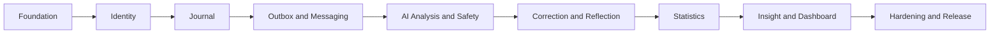

# MYLOG – BACKEND IMPLEMENTATION PLAN

| Thuộc tính | Giá trị |
| --- | --- |
| Version | 1.0 |
| Status | M0–M4 complete; M5 ready for implementation |
| Owner | Backend developer |
| Baseline | Pragmatic modular monolith, package-by-feature |
| Database | Supabase PostgreSQL |
| Cache | Redis |
| Message broker | RabbitMQ |
| Target | MVP/P0 |
| Estimated duration | 6 tuần, 1 backend developer |
| Last updated | 2026-09-21 |

---

## 1. Mục tiêu

Tài liệu này chuyển các yêu cầu trong PRD, SRS, Backend Architecture và Database Design thành kế hoạch triển khai backend có thể thực thi. Plan xác định:

- Thứ tự phát triển và dependency giữa các module.
- Deliverable của từng milestone.
- API, migration và event cần hoàn thành.
- Test bắt buộc và acceptance criteria.
- Điều kiện release, rollback và vận hành.
- Phần P0 phải có và phần có thể trì hoãn khi thiếu thời gian.

Tài liệu liên quan:

- [Product Requirements](./PRODUCT_REQUIREMENTS.md)
- [Software Requirements Specification](./SOFTWARE_REQUIREMENTS_SPECIFICATION.md)
- [Backend Architecture](./BACKEND_ARCHITECTURE.md)
- [Database Design](./DATABASE_DESIGN.md)

---

## 2. Trạng thái hiện tại

### 2.1. Đã hoàn thành

- Spring Boot 4, Java 21 và Maven Wrapper.
- Profile `local`, `api`, `worker`, `supabase`, `test`.
- Kết nối Supabase Session pooler qua SSL.
- PostgreSQL, Redis và RabbitMQ cho local development bằng Docker Compose.
- Flyway, JPA/Hibernate và PostgreSQL driver.
- RabbitMQ exchange, queue, binding và dead-letter baseline.
- Spring Security baseline, CORS và stateless session.
- Global exception response baseline.
- OpenAPI/Swagger UI.
- Actuator, Prometheus và OpenTelemetry dependencies.
- Dockerfile.
- Migration `V001` cho identity, journal và operational core.
- Migration `V002` khóa Supabase Data API roles và bật RLS.
- Migration `V003` hoàn thiện identity/consent schema.
- Migration `V004` khóa quyền kế thừa từ PostgreSQL pseudo-role `PUBLIC`.
- Supabase project `my-log-platform` tại Singapore.

### 2.2. Chưa hoàn thành

- Entity, repository và application service thực tế.
- JWT authentication và refresh token rotation.
- Journal CRUD và autosave.
- Transactional outbox publisher.
- RabbitMQ consumers và idempotency.
- AI provider, analysis, reflection và safety pipeline.
- Correction, statistics, insight, dashboard và feedback.
- Integration/E2E test suite.
- CI/CD và production observability hoàn chỉnh.

### 2.3. Quy tắc migration hiện tại

`V001`–`V004` đã chạy trên Supabase và được xem là immutable. Mọi thay đổi schema tiếp theo phải bắt đầu từ `V005`.

---

## 3. Phạm vi release

### 3.1. P0 bắt buộc

- Register, login, refresh token, logout và authorization.
- User profile và preferences.
- Journal create/read/update/delete, history và autosave.
- Mood, stress, energy và multiple journals per day.
- Async AI analysis: sentiment, emotion, topic và explanation.
- Risk classification và safety response.
- User correction cho emotion/topic.
- Reflection questions và regenerate.
- Daily mood, emotion/topic frequency, basic trend/correlation.
- Insight có evidence, confidence và lifecycle.
- Dashboard 7 ngày.
- Suggested action và helpful/not-helpful feedback.
- OpenAPI contract, health check, metrics và structured logging.

### 3.2. P1 sau MVP

- Weekly/monthly reports và PDF export.
- Media/image attachment.
- Emergency contact.
- Free/Plus quota chính thức.
- Semantic search/pgvector.
- Notification nâng cao.

### 3.3. Không thuộc backend MVP

- OAuth, payment gateway và mobile API riêng.
- Therapy chatbot hoặc medical diagnosis.
- Tự động liên hệ emergency contact.
- RAG và semantic recommendation nâng cao.

---

## 4. Nguyên tắc triển khai

1. Mỗi module dùng cấu trúc rõ ràng `controller`, `dto`, `service`, `entity`, `repository`; thêm `port`, `provider`, `messaging`, `security`, `config` khi thực sự cần.
2. Luồng mặc định là `controller/messaging → service → repository/port → provider`.
3. Controller và messaging consumer không truy cập repository trực tiếp; service không phụ thuộc controller hoặc HTTP DTO.
4. Entity không phụ thuộc controller, DTO, service, repository hoặc transport. JPA annotation được chấp nhận cho MVP để tránh duplicate persistence model.
5. Chỉ tạo port/interface cho boundary có khả năng thay đổi như AI provider, messaging, storage và external API.
6. Mọi query theo user phải chứa ownership condition ngay tại repository/query service. Read-model và ownership lookup được phép đọc bảng module khác nhưng không được ghi chéo module.
7. Journal commit không phụ thuộc AI provider hoặc RabbitMQ availability.
8. Event được ghi cùng transaction với dữ liệu nghiệp vụ bằng outbox.
9. Consumer phải idempotent; message delivery được xem là at-least-once.
10. Không đưa journal content, password, JWT hoặc AI prompt chứa dữ liệu riêng tư vào log.
11. Không sửa migration đã chạy; chỉ thêm migration mới.
12. Mỗi API hoàn thành phải có OpenAPI annotation và automated test.

---

## 5. Dependency và critical path



Critical path:

```text
Identity → Journal → Outbox → AI/Safety → Statistics → Insight/Dashboard → Release
```

Frontend có thể tích hợp sớm sau khi Identity và Journal API ổn định; không cần chờ AI pipeline hoàn tất.

---

## 6. Kế hoạch theo milestone

### M0 – Foundation hardening và Supabase schema

**Thời lượng:** 2–3 ngày  
**Mục tiêu:** Biến scaffold hiện tại thành nền tảng đủ an toàn để phát triển feature.

#### Công việc

- [x] Chạy `V001`–`V004` trên Supabase bằng Flyway.
- [x] Kiểm tra tables, indexes, constraints và RLS state.
- [x] Thêm Testcontainers base cho PostgreSQL, Redis và RabbitMQ.
- [x] Thêm integration-test profile riêng, không dùng Supabase thật trong CI.
- [x] Chuẩn hóa `ApiErrorResponse`, error code và validation response.
- [x] Thêm request/correlation ID filter.
- [x] Thêm log masking cho Authorization, cookie và secret headers.
- [x] Thêm ArchUnit rules cho module boundaries.
- [x] Thêm CI workflow: compile → unit test → integration test → package.
- [x] Chốt JWT signing key format và secret management.

#### Migration

- `V003__complete_identity_schema.sql`
  - `user_consents` thuộc MVP.
  - Bổ sung constraint/index còn thiếu cho identity.
- `V004__harden_public_schema_privileges.sql`
  - Thu hồi quyền kế thừa từ PostgreSQL pseudo-role `PUBLIC`.
  - Chặn `anon`/`authenticated` truy cập trực tiếp application schema.

#### Acceptance criteria

- [x] Supabase schema ở đúng Flyway version `004`.
- [x] CI workflow chạy integration test trên database sạch bằng Testcontainers.
- [x] Không có secret trong source control hoặc test output.
- [x] `mvnw verify` thành công.
- [x] Architecture test chặn dependency sai chiều.

---

### M1 – Identity, authentication và authorization

**Thời lượng:** 4–5 ngày  
**Requirement:** `FR-AUTH-*`, `FR-USER-*`, `NFR-SEC-*`.

#### Domain và persistence

- [x] `User`, `UserPreference`, `RefreshToken` entities.
- [x] Normalize email bằng `trim + lowercase` trước unique check.
- [x] Password hashing bằng BCrypt baseline; benchmark trước khi đổi Argon2id.
- [x] Refresh token chỉ lưu hash.
- [x] Token family để phát hiện refresh token reuse.
- [x] Account status guard: active, locked, deletion pending, deleted.

#### API

```text
POST  /api/v1/auth/register
POST  /api/v1/auth/login
POST  /api/v1/auth/refresh
POST  /api/v1/auth/logout
GET   /api/v1/users/me
PATCH /api/v1/users/me
```

#### Security

- [x] JWT access token ngắn hạn.
- [x] Refresh token rotation khi refresh.
- [x] Revoke token family khi phát hiện reuse.
- [x] Security filter tạo authenticated principal từ JWT.
- [x] Rate-limit register, login và refresh bằng Redis.
- [x] CORS theo allowlist, không dùng wildcard với credentials.
- [x] Refresh token qua cookie HttpOnly, Secure ở production và SameSite Strict. Nếu frontend chuyển sang cross-site, phải bổ sung CSRF trước khi dùng SameSite None.

#### Tests

- [x] Register thành công và duplicate email.
- [x] Password policy validation.
- [x] Login đúng/sai password.
- [x] Access token hết hạn.
- [x] Refresh rotation và reuse detection.
- [x] Logout revoke token.
- [x] User không đọc/sửa profile của user khác.

#### Acceptance criteria

- [x] Không lưu raw password hoặc raw refresh token.
- [x] Mọi protected endpoint trả `401` khi thiếu/sai token.
- [x] Profile endpoint chỉ dùng subject của authenticated principal; resource ownership trong các milestone sau dùng repository-scoped query và trả `404`.
- [x] Swagger mô tả Bearer authentication và mọi response chính.

---

### M2 – Journal core

**Thời lượng:** 4–5 ngày  
**Requirement:** `FR-JOURNAL-*` và journal state model.

#### Domain

- [x] `JournalEntry` entity và aggregate rules.
- [x] Score validation: mood bắt buộc 1–10; stress/energy nullable 1–10.
- [x] `journalVersion` tăng khi content ảnh hưởng analysis thay đổi.
- [x] Optimistic lock bằng `version`.
- [x] Soft delete và ownership-safe query.
- [x] Entry date được tính từ `occurredAt + timezoneAtEntry`.

#### API

```text
POST   /api/v1/journals
GET    /api/v1/journals?cursor=&limit=&from=&to=
GET    /api/v1/journals/{journalId}
PATCH  /api/v1/journals/{journalId}
DELETE /api/v1/journals/{journalId}
```

#### Contract rules

- [x] Cursor pagination theo `(created_at, id)`.
- [x] `POST` hỗ trợ `Idempotency-Key` bền vững trong PostgreSQL và từ chối reuse với request khác.
- [x] `PATCH` dùng request `version` để phát hiện concurrent edit; response đồng thời trả `ETag`.
- [x] Autosave dùng cùng update API, debounce thuộc trách nhiệm frontend.
- [x] Response không trả owner ID, soft-delete timestamp hoặc idempotency metadata.

#### Tests

- [x] CRUD happy path.
- [x] Multiple journals cùng ngày.
- [x] Validation score/content.
- [x] Pagination ổn định khi insert journal mới.
- [x] Optimistic conflict.
- [x] User A không đọc/update/delete journal của user B.
- [x] Soft-deleted journal không xuất hiện trong history/dashboard.

#### Acceptance criteria

- [x] Journal core không phụ thuộc Redis, RabbitMQ hoặc AI provider; architecture test bảo vệ invariant này.
- [x] History API p95 local dưới target 2 giây của SRS với dataset 1.000 journals.
- [x] Swagger mô tả contract đủ để frontend triển khai editor/history.

---

### M3 – Transactional outbox và messaging

**Thời lượng:** 3–4 ngày  
**Dependency:** M2.

#### Công việc

- [x] Tạo outbox event trong cùng transaction khi journal được save/update/delete.
- [x] Outbox publisher claim batch bằng `FOR UPDATE SKIP LOCKED` và reclaim `PUBLISHING` lease hết hạn.
- [x] Publisher confirm và retry có exponential backoff/jitter.
- [x] Event envelope chuẩn: `messageId`, `eventType`, `eventVersion`, `occurredAt`, `aggregateId`, `payload`.
- [x] Payload chỉ chứa identifier/version, không chứa journal content.
- [x] Consumer idempotency bằng `processed_messages` trong cùng business transaction.
- [x] Manual acknowledgement sau commit; lỗi dùng nack không requeue để vào DLQ.
- [x] Dead-letter queue và operational replay procedure trong `MESSAGING_RUNBOOK.md`.
- [x] Health/metrics cho outbox lag, publish failure, retry và queue/DLQ depth.

#### Events baseline

```text
journal.created
journal.updated
journal.deleted
journal.analysis.requested
journal.analysis.completed
journal.analysis.failed
journal.corrected
statistics.updated
```

#### Tests

- [x] Commit journal và outbox là atomic.
- [x] RabbitMQ down không làm mất event.
- [x] Publisher restart không làm mất pending row.
- [x] Duplicate message không tạo duplicate result.
- [x] Poison message đi DLQ sau max attempts.
- [x] Multiple publisher không claim cùng event.

#### Acceptance criteria

- [x] Delivery semantics được chứng minh là at-least-once + idempotent consumer.
- [x] Có metric cho pending outbox, publish failure, retry, queue lag và DLQ count.
- [x] Có runbook kiểm tra, recovery và replay message.

---

### M4 – AI analysis, safety, correction và reflection

**Thời lượng:** 7–8 ngày  
**Dependency:** M3.

#### Schema migrations

- `V005__create_analysis_schema.sql`
  - `journal_analyses`
  - `journal_emotions`
  - `topics`
  - `journal_topics`
  - `journal_corrections`
- `V006__create_reflection_and_safety_schema.sql`
  - `reflection_questions`
  - `reflection_responses` nếu thuộc MVP interaction.
  - `safety_events`
  - `ai_usage_records`

#### Provider abstraction

- [x] `AiAnalysisPort` trong `analysis/port`; implementation nằm trong `analysis/provider`.
- [x] Mock adapter deterministic cho local/test.
- [x] Một production adapter duy nhất cho MVP.
- [x] Connect timeout, response timeout và circuit breaker.
- [x] Structured JSON output schema và strict validation.
- [x] Prompt version, model name và provider metadata.
- [x] Token/cost tracking không chứa journal text.

#### Analysis pipeline

- [x] Claim `analysis_jobs` an toàn.
- [x] Load journal theo `journalId + userId + journalVersion`.
- [x] Chạy deterministic safety rules trước AI-generated action.
- [x] Gọi provider, parse và validate output.
- [x] Persist analysis, emotion, topic và safety result trong transaction.
- [x] Chỉ analysis đúng current journal version được active.
- [x] Retry transient errors; không retry validation error vô hạn.
- [x] Update journal state và publish completion/failure event.

#### API

```text
GET   /api/v1/journals/{journalId}/analysis
POST  /api/v1/journals/{journalId}/analysis/retry
PATCH /api/v1/journals/{journalId}/corrections
GET   /api/v1/journals/{journalId}/reflections
POST  /api/v1/journals/{journalId}/reflections/regenerate
```

#### Safety invariants

- [x] HIGH/CRITICAL không nhận normal coaching hoặc suggested action.
- [x] Không tạo diagnosis, medication advice hoặc therapy claim.
- [x] Safety event không lưu toàn bộ journal content.
- [x] Response trả safety metadata để frontend hiển thị popup phù hợp.

#### Tests

- [x] Provider success, timeout, 429, 5xx và malformed JSON.
- [x] Retry/backoff và circuit breaker.
- [x] Stale analysis không ghi đè version mới.
- [x] HIGH/CRITICAL chặn normal response.
- [x] Correction giữ nguyên AI original và tạo audit record.
- [x] Effective emotion/topic ưu tiên user correction.

#### Acceptance criteria

- Journal API không chờ AI hoàn tất.
- Analysis có trạng thái rõ ràng: pending, processing, completed, failed, outdated.
- Mọi AI output đi qua schema validation và safety guard.
- Không có journal content trong message/log/metric label.

---

### M5 – Statistics, insight, dashboard và feedback

**Thời lượng:** 5–6 ngày  
**Dependency:** M4.

#### Schema migrations

- `V007__create_statistics_and_insight_schema.sql`
  - `daily_user_statistics`
  - `daily_emotion_statistics`
  - `insights`
  - `insight_evidence`
  - `suggested_actions`
  - `feedback`
- `V008__add_statistics_and_insight_indexes.sql`

#### Statistics

- [x] Daily mood average theo timezone.
- [x] Emotion distribution dùng effective value.
- [x] Topic frequency dùng effective value.
- [x] Day-of-week pattern.
- [x] Trend direction và basic period comparison.
- [x] Topic–mood association dưới dạng evidence, không tuyên bố causation.
- [x] Calculation version cho mọi derived result.

#### Insight

- [x] Minimum evidence threshold.
- [x] Confidence category: weak/moderate/strong theo rule đã chốt.
- [x] Evidence rows truy ngược được về aggregate/query basis.
- [x] Lifecycle: active, fading, expired.
- [x] Suggested action nhỏ, cụ thể và tối đa theo product rule.
- [x] Feedback upsert idempotent theo user/target.

#### API

```text
GET /api/v1/dashboard?from=&to=&timezone=
GET /api/v1/statistics/mood?from=&to=
GET /api/v1/statistics/emotions?from=&to=
GET /api/v1/statistics/topics?from=&to=
GET /api/v1/insights
GET /api/v1/insights/{insightId}
PUT /api/v1/feedback/{targetType}/{targetId}
```

#### Redis

- [x] Cache dashboard/statistics theo user + range + timezone + calculation version.
- [x] Invalidate cache khi journal/analysis/correction thay đổi.
- [x] Redis failure fallback về PostgreSQL cho read API.
- [x] Không cache raw journal content nếu không cần thiết.

#### Tests

- [x] Timezone và day boundary.
- [x] NULL stress/energy không biến thành 0.
- [x] Correction ảnh hưởng statistics đúng cách.
- [x] Threshold thiếu data không sinh insight giả.
- [x] Cache hit/miss/invalidation.
- [x] Redis down vẫn trả kết quả core.
- [x] Feedback PUT idempotent.

#### Acceptance criteria

- Dashboard 7 ngày trả đủ mood trend, emotion distribution, mood calendar và topic frequency.
- Mọi insight có evidence và confidence.
- API không đưa ra causal claim từ correlation.

**Trạng thái:** Hoàn thành trong code. Integration test dùng PostgreSQL/Redis/RabbitMQ Testcontainers và tự skip khi Docker không khả dụng.

---

### M6 – Hardening, observability và release

**Thời lượng:** 4–5 ngày  
**Dependency:** M1–M5.

#### Security và privacy

- [ ] Verify RLS/Data API state trên Supabase.
- [ ] Dependency vulnerability scan.
- [ ] Authorization matrix test cho toàn bộ resource endpoints.
- [ ] Rate limit auth, retry analysis và expensive analytics.
- [ ] Log redaction test.
- [ ] Account/journal deletion workflow.
- [ ] Data retention jobs nếu bắt buộc trong MVP.

#### Reliability

- [ ] Graceful shutdown cho API, worker và message listener.
- [ ] Readiness phản ánh PostgreSQL; policy Redis/RabbitMQ theo runtime role.
- [ ] Timeout cho DB, Redis, RabbitMQ và AI provider.
- [ ] Retry chỉ áp dụng transient failure.
- [ ] Outbox backlog alert và DLQ alert.

#### Observability

- [ ] Structured JSON logs ở production.
- [ ] Correlation: request ID → trace ID → message ID → job ID.
- [ ] Metrics cho HTTP, DB pool, Redis, RabbitMQ, outbox, AI latency/cost và job status.
- [ ] Tracing qua API → DB/outbox → worker → AI provider.
- [ ] Dashboard vận hành tối thiểu và alert thresholds.

#### Release

- [ ] OpenAPI document được export/validate trong CI.
- [ ] Docker image chạy non-root và có health check.
- [ ] Separate API/worker deployment bằng profile.
- [ ] Production secrets nằm trong secret manager của platform deploy.
- [ ] Migration job chạy trước application rollout.
- [ ] Backup/restore smoke test cho Supabase.
- [ ] Rollback runbook cho app và forward-fix migration.

#### Acceptance criteria

- E2E backend flow pass trên staging.
- Không có high/critical vulnerability chưa xử lý.
- API và worker restart không mất job/event.
- Release checklist được ký xác nhận.

---

## 7. Timeline đề xuất

| Tuần | Milestone | Kết quả chính |
| --- | --- | --- |
| 1 | M0 + M1 | Foundation, Supabase migrations, authentication |
| 2 | M2 + đầu M3 | Journal CRUD, history, outbox transaction |
| 3 | M3 + đầu M4 | Messaging, worker, mock AI, analysis state |
| 4 | M4 | Production AI adapter, safety, correction, reflection |
| 5 | M5 | Statistics, insight, dashboard, feedback |
| 6 | M6 | Security, E2E, observability, deployment |

### Đường cắt nếu chỉ có 4 tuần

Giữ lại:

- Identity.
- Journal CRUD/history/autosave.
- Async analysis với một provider.
- Safety classification.
- Correction cơ bản.
- Dashboard 7 ngày và một loại insight có evidence.
- Integration/E2E tests cho critical path.

Trì hoãn sang P1:

- Reports/PDF/media.
- Advanced correlations và period comparisons.
- Nhiều AI provider.
- Reflection response history phức tạp.
- Plus quota và advanced retention automation.

Không được cắt:

- Authorization isolation.
- Password/token security.
- Transactional outbox/idempotent consumer.
- Stale analysis protection.
- Safety guard.
- Migration và integration tests.

---

## 8. Migration roadmap

| Version | Nội dung |
| --- | --- |
| V001 | Core identity, journal, jobs, outbox, idempotency |
| V002 | Supabase Data API lockdown và RLS baseline |
| V003 | Complete identity/consent schema |
| V004 | Thu hồi quyền kế thừa từ `PUBLIC` trên application schema |
| V005 | Analysis, emotion, topic và correction schema |
| V006 | Reflection, safety và AI usage schema |
| V007 | Statistics, insight, action và feedback schema |
| V008 | Statistics/insight indexes và query optimization |
| V009+ | Chỉ thêm theo feature thực tế; report/media/privacy thuộc P1 |

Mỗi migration phải được test với:

- Database sạch.
- Database ở version liền trước.
- PostgreSQL Testcontainer cùng major version gần Supabase.
- `spring.jpa.hibernate.ddl-auto=validate` sau migrate.

---

## 9. Test strategy và quality gates

| Layer | Tool/phạm vi | Quality gate |
| --- | --- | --- |
| Unit | JUnit, AssertJ, Mockito khi cần | Domain rules và branch quan trọng |
| Repository | PostgreSQL Testcontainers | Query, constraint, index behavior |
| Module integration | Spring Boot Test + Testcontainers | Use case qua real adapters |
| Messaging | RabbitMQ Testcontainer | Publish, retry, idempotency, DLQ |
| Cache | Redis Testcontainer | TTL, invalidation, degraded mode |
| API | MockMvc/REST client | Contract, auth, validation, errors |
| Provider contract | Mock HTTP server | Timeout, malformed output, rate limit |
| Architecture | ArchUnit | Module dependency rules |
| E2E | API + worker + all infrastructure | Critical user journey |

### Critical E2E journey

```text
register
→ login
→ create journal
→ outbox publish
→ analysis worker
→ safety check
→ analysis persisted
→ statistics updated
→ insight generated
→ dashboard query
→ correction
→ dashboard recalculated
```

### Pull request gate

- Compile thành công.
- Unit và integration tests pass.
- Flyway migration test pass.
- `git diff --check` pass.
- Không có secret scan finding.
- OpenAPI không có breaking change ngoài chủ đích.
- Code coverage không giảm ở critical domain rules.

---

## 10. API delivery workflow với frontend

Cho mỗi endpoint:

1. Chốt request/response/error schema.
2. Thêm OpenAPI annotation và example.
3. Export `/v3/api-docs` hoặc cung cấp Swagger URL.
4. Frontend review contract trước khi implementation khóa.
5. Backend viết API contract test.
6. Thông báo breaking change; không silently đổi field semantics.

Quy ước trạng thái async cần thống nhất sớm:

```text
PENDING
PROCESSING
COMPLETED
FAILED
OUTDATED
```

Frontend không được suy luận AI status từ việc field analysis có `null` hay không.

---

## 11. Environment strategy

| Environment | PostgreSQL | Redis/RabbitMQ | AI |
| --- | --- | --- | --- |
| Unit test | Không hoặc fake | Không | Fake |
| Integration test | Testcontainers | Testcontainers | Mock server |
| Local offline | Docker PostgreSQL | Docker | Mock provider mặc định |
| Local Supabase | Supabase Session pooler | Docker | Mock/real theo flag |
| Staging | Supabase | Managed/container | Provider sandbox/limited key |
| Production | Supabase | Managed | Production provider |

Không dùng production Supabase cho automated tests. Không commit `.env`, DB password, JWT key hoặc AI API key.

---

## 12. Risk register

| Risk | Impact | Mitigation |
| --- | --- | --- |
| Scope MVP quá lớn cho một backend developer | Trễ tiến độ | Dùng đường cắt 4 tuần; khóa P0/P1 |
| AI output không ổn định | Data sai, pipeline lỗi | Strict JSON schema, retry giới hạn, mock contract tests |
| Journal update khi analysis đang chạy | Stale result | Journal version check trước persist |
| RabbitMQ/message duplicate | Duplicate analysis/statistics | Processed message key và unique constraints |
| Supabase connection exhaustion | API outage | Hikari pool nhỏ, metric pool, Session pooler |
| Data API vô tình mở | Rò rỉ dữ liệu | Data API disabled, revoke roles, RLS, security verification |
| Sensitive data xuất hiện trong logs | Privacy incident | Logging prohibition, masking và log tests |
| Timezone calculation sai | Dashboard sai | Persist timezone-at-entry và boundary tests |
| Redis unavailable | Dashboard/rate limit lỗi | Core reads fallback DB; policy rõ theo endpoint |
| AI provider cost tăng | Vượt ngân sách | Token limit, usage records, quota và alert |

---

## 13. Backend Definition of Done

Backend MVP chỉ được xem là hoàn thành khi:

- Authentication và refresh rotation hoạt động.
- Authorization cô lập dữ liệu giữa users.
- Journal CRUD/history/autosave hoạt động.
- Journal save không phụ thuộc AI provider.
- Outbox không mất event khi RabbitMQ unavailable.
- Consumer idempotent, có retry và DLQ.
- Stale analysis không ghi đè version mới.
- AI output được validate và qua safety guard.
- Correction được audit và statistics dùng effective value.
- Insight có evidence, confidence và lifecycle.
- Redis failure không làm mất core journal functionality.
- Không log journal content, password hoặc token.
- Flyway chạy thành công trên database sạch và staging.
- Integration tests dùng PostgreSQL/Redis/RabbitMQ thật qua containers.
- OpenAPI được frontend chấp nhận.
- Metrics, health, logs và traces đủ cho deployment.
- Có migration, deployment và rollback runbook.

---

## 14. Backlog khởi động ngay

Thứ tự 10 task đầu tiên:

1. ~~Chạy Flyway `V001`–`V004` trên Supabase và xác minh schema.~~ Hoàn thành.
2. ~~Tạo Testcontainers integration-test foundation.~~ Hoàn thành.
3. ~~Tạo `V003__complete_identity_schema.sql`.~~ Hoàn thành.
4. Implement `User` và `RefreshToken` persistence.
5. Implement register + password hashing.
6. Implement login + JWT access token.
7. Implement refresh rotation/reuse detection.
8. Implement logout và `/users/me`.
9. Hoàn thiện security/ownership integration tests.
10. Khóa OpenAPI contract Identity với frontend trước khi sang Journal.

Task tiếp theo sau Identity là Journal CRUD, không bắt đầu AI integration trước khi Journal versioning và outbox transaction đã ổn định.

---

## 15. Theo dõi tiến độ

Mỗi milestone dùng trạng thái:

```text
NOT_STARTED → IN_PROGRESS → BLOCKED → IN_REVIEW → DONE
```

Mỗi task tối thiểu phải có:

- Requirement ID liên quan.
- Owner.
- Estimate.
- Dependency.
- Acceptance criteria.
- Test evidence.
- Migration/API/event impact nếu có.

Review tiến độ cuối mỗi tuần dựa trên deliverable chạy được, không dựa trên phần trăm code đã viết.
