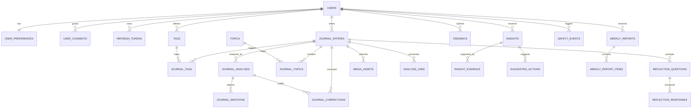

# MYLOG – DATABASE DESIGN

| Field | Value |
| --- | --- |
| Version | 1.0 |
| Status | Proposed |
| Database | PostgreSQL |
| Scope | Backend transactional and operational data |
| Migration tool | Flyway |
| Related document | [Backend Architecture](./BACKEND_ARCHITECTURE.md) |
| Last updated | 2026-09-20 |

---

## 1. Purpose

Tài liệu này mô tả thiết kế database chi tiết cho backend MyLog. Nội dung bao gồm:

- Data ownership và lifecycle.
- Entity relationships.
- Tables, columns, constraints và foreign keys.
- Index strategy.
- Journal và AI analysis versioning.
- User correction và effective data.
- Statistical evidence và insight storage.
- Transactional Outbox, idempotent consumer và job state.
- Privacy, deletion, retention và audit.
- Baseline PostgreSQL DDL để chuyển thành Flyway migrations.

PostgreSQL là nguồn dữ liệu chính. Redis chỉ chứa cache, rate limit và dữ liệu tạm thời; RabbitMQ chỉ vận chuyển message, không thay thế database.

---

## 2. Design Principles

1. Mọi dữ liệu cá nhân phải có ownership rõ ràng.
2. Journal save không phụ thuộc AI provider hoặc message broker.
3. Kết quả AI luôn gắn với một `journal_version` cụ thể.
4. Dữ liệu AI gốc không bị ghi đè khi user correction.
5. Missing value được lưu `NULL`, không chuyển thành `0`.
6. Quantitative insight phải trỏ tới structured evidence.
7. Message delivery được xem là at-least-once; consumer phải idempotent.
8. Thời gian lưu bằng `TIMESTAMPTZ` và chuẩn hóa UTC.
9. User-local date được lưu riêng khi cần phân tích theo ngày.
10. Không lưu journal content trong outbox payload, audit metadata hoặc safety event.
11. Foreign key và check constraint bảo vệ invariant quan trọng.
12. Database schema thay đổi duy nhất qua Flyway migration.

---

## 3. Naming and Type Conventions

### 3.1. Naming

- Table và column dùng `snake_case`.
- Table dùng danh từ số nhiều: `journal_entries`, `insights`.
- Primary key tên `id`.
- Foreign key tên `<entity>_id`.
- Timestamp tên `created_at`, `updated_at`, `<action>_at`.
- Boolean dùng tiền tố mô tả trạng thái: `is_active`, `corrected_by_user`.
- Index tên `idx_<table>_<purpose>`.
- Unique constraint tên `uq_<table>_<purpose>`.
- Check constraint tên `ck_<table>_<rule>`.

### 3.2. ID strategy

- Tất cả business entity sử dụng UUID.
- UUID được sinh ở application, ưu tiên UUIDv7 để tăng locality của B-tree index.
- Database không phụ thuộc extension để sinh ID.
- Message/event ID cũng dùng UUID.

### 3.3. Time

- Mọi instant lưu dưới dạng `TIMESTAMPTZ`.
- Application giao tiếp với database bằng UTC.
- `DATE` chỉ dùng cho period hoặc ngày theo timezone user.
- `journal_entries.entry_date` là ngày local tại thời điểm entry được ghi nhận.
- `journal_entries.timezone_at_entry` lưu timezone IANA dùng để tính `entry_date`.

### 3.4. Enum strategy

Sử dụng `VARCHAR` kết hợp `CHECK`, không dùng PostgreSQL enum trong baseline. Lý do:

- Dễ thay đổi bằng migration.
- Dễ tương thích nhiều environment.
- Vẫn có database-level validation.

Application vẫn phải định nghĩa Java enum tương ứng.

### 3.5. Money and score

- Emotion score dùng `NUMERIC(5,4)` trong khoảng `[0,1]`.
- Mood/stress/energy dùng `SMALLINT` trong khoảng `[1,10]`.
- Token count dùng `INTEGER` hoặc `BIGINT` tùy phạm vi.
- Estimated cost dùng `NUMERIC(14,6)` và currency code.

---

## 4. High-level ERD



Operational tables như `outbox_events`, `processed_messages`, `idempotency_records` và `audit_events` không được nối trực tiếp trong ERD để sơ đồ dễ đọc.

---

## 5. Domain Catalog

| Domain | Tables |
| --- | --- |
| Identity | `users`, `user_preferences`, `user_consents`, `refresh_tokens` |
| Journal | `journal_entries`, `tags`, `journal_tags`, `media_assets` |
| AI analysis | `journal_analyses`, `journal_emotions`, `topics`, `journal_topics` |
| Correction | `journal_corrections` |
| Reflection | `reflection_questions`, `reflection_responses` |
| Insight | `insights`, `insight_evidence`, `suggested_actions` |
| Feedback | `feedback` |
| Report | `weekly_reports`, `weekly_report_items` |
| Safety | `safety_events` |
| Async processing | `analysis_jobs`, `outbox_events`, `processed_messages` |
| API reliability | `idempotency_records` |
| Operations | `ai_usage_records`, `audit_events` |
| Privacy | `data_subject_requests` |

---

## 6. Identity Schema

### 6.1. `users`

Lưu identity và account state. Preference có tốc độ thay đổi khác được tách sang `user_preferences`.

| Column | Type | Null | Description |
| --- | --- | --- | --- |
| `id` | UUID | No | Application-generated UUID. |
| `email` | VARCHAR(320) | No | Email hiển thị. |
| `email_normalized` | VARCHAR(320) | No | Lowercase/normalized email dùng unique lookup. |
| `password_hash` | VARCHAR(255) | No | Argon2id hoặc BCrypt hash. |
| `display_name` | VARCHAR(100) | No | Tên hiển thị. |
| `plan` | VARCHAR(20) | No | `FREE`, `PLUS`, `ADMIN`. |
| `status` | VARCHAR(20) | No | `ACTIVE`, `LOCKED`, `DELETION_PENDING`, `DELETED`. |
| `email_verified_at` | TIMESTAMPTZ | Yes | Thời điểm xác thực email. |
| `last_login_at` | TIMESTAMPTZ | Yes | Login thành công gần nhất. |
| `created_at` | TIMESTAMPTZ | No | Creation timestamp. |
| `updated_at` | TIMESTAMPTZ | No | Last update timestamp. |
| `version` | BIGINT | No | Optimistic lock. |

Constraints:

- Unique `email_normalized`.
- `email_normalized = lower(trim(email))` được application đảm bảo và integration test xác minh.
- `password_hash` không bao giờ được trả ra API.

### 6.2. `user_preferences`

| Column | Type | Null | Description |
| --- | --- | --- | --- |
| `user_id` | UUID | No | PK và FK tới users. |
| `timezone` | VARCHAR(64) | No | IANA timezone, ví dụ `Asia/Ho_Chi_Minh`. |
| `language` | VARCHAR(10) | No | `vi`, `en`. |
| `is_onboarded` | BOOLEAN | No | Onboarding completed. |
| `preferred_journal_time` | TIME | Yes | Local reminder preference. |
| `journaling_goals` | JSONB | No | Array string nhỏ, không chứa journal content. |
| `created_at` | TIMESTAMPTZ | No | Creation timestamp. |
| `updated_at` | TIMESTAMPTZ | No | Last update timestamp. |

### 6.3. `user_consents`

Theo dõi consent theo version policy.

| Column | Type | Null | Description |
| --- | --- | --- | --- |
| `id` | UUID | No | PK. |
| `user_id` | UUID | No | Owner. |
| `consent_type` | VARCHAR(50) | No | `TERMS`, `PRIVACY`, `AI_PROCESSING`. |
| `policy_version` | VARCHAR(30) | No | Version user đã đồng ý. |
| `granted_at` | TIMESTAMPTZ | No | Consent timestamp. |
| `revoked_at` | TIMESTAMPTZ | Yes | Revocation timestamp. |
| `source` | VARCHAR(30) | No | `WEB`, `ADMIN`, `MIGRATION`. |

Unique logical key: `(user_id, consent_type, policy_version)`.

### 6.4. `refresh_tokens`

| Column | Type | Null | Description |
| --- | --- | --- | --- |
| `id` | UUID | No | Token record ID. |
| `user_id` | UUID | No | Token owner. |
| `family_id` | UUID | No | Rotation family. |
| `token_hash` | VARCHAR(255) | No | Hash, không lưu raw token. |
| `expires_at` | TIMESTAMPTZ | No | Expiry. |
| `revoked_at` | TIMESTAMPTZ | Yes | Revocation timestamp. |
| `replaced_by_token_id` | UUID | Yes | Next token in rotation chain. |
| `created_by_ip_hash` | VARCHAR(128) | Yes | Optional hashed IP. |
| `user_agent_hash` | VARCHAR(128) | Yes | Optional hashed user agent. |
| `created_at` | TIMESTAMPTZ | No | Creation timestamp. |

Không lưu IP hoặc user agent plaintext nếu không cần thiết.

---

## 7. Journal Schema

### 7.1. `journal_entries`

| Column | Type | Null | Description |
| --- | --- | --- | --- |
| `id` | UUID | No | Journal ID. |
| `user_id` | UUID | No | Owner. |
| `title` | VARCHAR(200) | Yes | Optional title. |
| `content_text` | TEXT | No | Plain text canonical content dùng cho AI/search. |
| `content_json` | JSONB | Yes | Optional sanitized Tiptap document. |
| `content_format` | VARCHAR(20) | No | `PLAIN_TEXT`, `TIPTAP_JSON`. |
| `mood_score` | SMALLINT | No | Range 1–10. |
| `stress_score` | SMALLINT | Yes | Range 1–10; `NULL` khi thiếu. |
| `energy_score` | SMALLINT | Yes | Range 1–10; `NULL` khi thiếu. |
| `status` | VARCHAR(30) | No | Analysis lifecycle status. |
| `journal_version` | BIGINT | No | Tăng khi input phân tích thay đổi. |
| `occurred_at` | TIMESTAMPTZ | No | Thời điểm entry đại diện. |
| `entry_date` | DATE | No | Local date theo timezone snapshot. |
| `timezone_at_entry` | VARCHAR(64) | No | IANA timezone snapshot. |
| `is_favorite` | BOOLEAN | No | User favorite state. |
| `created_at` | TIMESTAMPTZ | No | Creation timestamp. |
| `updated_at` | TIMESTAMPTZ | No | Last update timestamp. |
| `deleted_at` | TIMESTAMPTZ | Yes | Logical deletion pending purge. |
| `version` | BIGINT | No | JPA optimistic lock của row. |

Phân biệt:

- `journal_version`: version của nội dung dùng cho AI.
- `version`: optimistic locking của database row.

Thay đổi `is_favorite` không nhất thiết tăng `journal_version`; thay đổi content, mood, stress, energy hoặc entry date phải tăng `journal_version`.

Status:

```text
SAVED
ANALYZING
ANALYZED
ANALYSIS_FAILED
ANALYSIS_OUTDATED
```

Draft mặc định nằm ở frontend và không lưu vào table này.

### 7.2. `tags`

Tag do user quản lý, khác với AI topic.

| Column | Type | Null | Description |
| --- | --- | --- | --- |
| `id` | UUID | No | PK. |
| `user_id` | UUID | No | Tag owner. |
| `name` | VARCHAR(50) | No | Display name. |
| `normalized_name` | VARCHAR(50) | No | Lowercase normalized value. |
| `color` | VARCHAR(20) | Yes | UI metadata. |
| `created_at` | TIMESTAMPTZ | No | Creation timestamp. |

Unique `(user_id, normalized_name)`.

### 7.3. `journal_tags`

| Column | Type | Null | Description |
| --- | --- | --- | --- |
| `journal_entry_id` | UUID | No | Journal FK. |
| `tag_id` | UUID | No | Tag FK. |
| `created_at` | TIMESTAMPTZ | No | Mapping timestamp. |

Primary key `(journal_entry_id, tag_id)`.

### 7.4. `media_assets`

| Column | Type | Null | Description |
| --- | --- | --- | --- |
| `id` | UUID | No | PK. |
| `user_id` | UUID | No | Owner. |
| `journal_entry_id` | UUID | Yes | Attached journal. |
| `storage_provider` | VARCHAR(30) | No | `S3`, `MINIO`. |
| `bucket_name` | VARCHAR(100) | No | Storage bucket. |
| `object_key` | VARCHAR(512) | No | Unique object key. |
| `original_filename` | VARCHAR(255) | Yes | Sanitized display filename. |
| `content_type` | VARCHAR(100) | No | Validated MIME type. |
| `size_bytes` | BIGINT | No | Object size. |
| `checksum_sha256` | VARCHAR(64) | Yes | Integrity/dedup metadata. |
| `status` | VARCHAR(20) | No | `PENDING`, `READY`, `FAILED`, `DELETED`. |
| `caption` | VARCHAR(500) | Yes | Optional caption. |
| `created_at` | TIMESTAMPTZ | No | Creation timestamp. |
| `updated_at` | TIMESTAMPTZ | No | Last update timestamp. |

Database chỉ lưu metadata; binary object nằm trong S3-compatible storage.

---

## 8. AI Analysis Schema

### 8.1. `journal_analyses`

Một journal version có tối đa một accepted analysis. Retry attempt nằm trong `analysis_jobs`.

| Column | Type | Null | Description |
| --- | --- | --- | --- |
| `id` | UUID | No | PK. |
| `journal_entry_id` | UUID | No | Journal FK. |
| `journal_version` | BIGINT | No | Input version. |
| `sentiment` | VARCHAR(20) | No | `POSITIVE`, `NEUTRAL`, `NEGATIVE`. |
| `risk_level` | VARCHAR(20) | No | Risk classification. |
| `summary` | TEXT | Yes | Bounded AI summary. |
| `explanation` | TEXT | Yes | Optional analysis explanation. |
| `provider` | VARCHAR(50) | No | Provider identifier. |
| `model` | VARCHAR(100) | No | Model identifier. |
| `prompt_version` | VARCHAR(30) | No | Prompt version. |
| `schema_version` | VARCHAR(30) | No | Structured output version. |
| `input_token_count` | INTEGER | Yes | Provider-reported input tokens. |
| `output_token_count` | INTEGER | Yes | Provider-reported output tokens. |
| `latency_ms` | BIGINT | Yes | Provider latency. |
| `is_current` | BOOLEAN | No | Current result for journal. |
| `analyzed_at` | TIMESTAMPTZ | No | Completion time. |
| `created_at` | TIMESTAMPTZ | No | Persistence time. |

Unique `(journal_entry_id, journal_version)`.

Chỉ một analysis của journal được `is_current = true`; partial unique index bảo vệ invariant này.

### 8.2. `journal_emotions`

| Column | Type | Null | Description |
| --- | --- | --- | --- |
| `id` | UUID | No | PK. |
| `analysis_id` | UUID | No | Analysis FK. |
| `emotion_type` | VARCHAR(30) | No | Fixed taxonomy. |
| `original_score` | NUMERIC(5,4) | No | AI score `[0,1]`. |
| `corrected_score` | NUMERIC(5,4) | Yes | User-corrected score. |
| `corrected_by_user` | BOOLEAN | No | Correction marker. |
| `corrected_at` | TIMESTAMPTZ | Yes | Correction timestamp. |
| `created_at` | TIMESTAMPTZ | No | Creation timestamp. |

Unique `(analysis_id, emotion_type)`.

Effective score:

```sql
COALESCE(corrected_score, original_score)
```

### 8.3. `topics`

Topic dictionary dùng chung toàn hệ thống.

| Column | Type | Null | Description |
| --- | --- | --- | --- |
| `id` | UUID | No | PK. |
| `normalized_name` | VARCHAR(100) | No | Unique normalized topic. |
| `display_name` | VARCHAR(100) | No | Default display value. |
| `created_at` | TIMESTAMPTZ | No | Creation timestamp. |

Không lưu topic nhạy cảm vào application log dù topic dictionary nằm trong database.

### 8.4. `journal_topics`

| Column | Type | Null | Description |
| --- | --- | --- | --- |
| `journal_entry_id` | UUID | No | Journal FK. |
| `topic_id` | UUID | No | Topic FK. |
| `source` | VARCHAR(20) | No | `AI`, `USER`. |
| `confidence` | NUMERIC(5,4) | Yes | AI confidence, nullable for USER. |
| `is_active` | BOOLEAN | No | Effective membership. |
| `created_at` | TIMESTAMPTZ | No | Creation timestamp. |
| `updated_at` | TIMESTAMPTZ | No | Last correction timestamp. |

Primary key `(journal_entry_id, topic_id)`.

Rules:

- User thêm topic: `source = USER`, `is_active = true`.
- User xóa AI topic: giữ row và chuyển `is_active = false`.
- Statistics chỉ dùng row `is_active = true`.

### 8.5. `journal_corrections`

Append-only audit của user correction.

| Column | Type | Null | Description |
| --- | --- | --- | --- |
| `id` | UUID | No | PK. |
| `user_id` | UUID | No | Actor. |
| `journal_entry_id` | UUID | No | Journal FK. |
| `analysis_id` | UUID | Yes | Related analysis. |
| `field_type` | VARCHAR(30) | No | `EMOTION`, `TOPIC`. |
| `field_key` | VARCHAR(100) | No | Emotion type hoặc topic ID/name. |
| `operation` | VARCHAR(20) | No | `ADD`, `UPDATE`, `REMOVE`. |
| `original_value` | JSONB | Yes | Before value. |
| `corrected_value` | JSONB | Yes | After value. |
| `created_at` | TIMESTAMPTZ | No | Correction timestamp. |

Correction row không được update hoặc delete trong normal operation.

---

## 9. Reflection Schema

### 9.1. `reflection_questions`

| Column | Type | Null | Description |
| --- | --- | --- | --- |
| `id` | UUID | No | PK. |
| `user_id` | UUID | No | Owner for direct scoping. |
| `journal_entry_id` | UUID | No | Journal FK. |
| `journal_version` | BIGINT | No | Source version. |
| `generation_batch_id` | UUID | No | Questions generated together. |
| `position` | SMALLINT | No | 1-based order. |
| `question` | TEXT | No | Generated question. |
| `provider` | VARCHAR(50) | No | Provider. |
| `model` | VARCHAR(100) | No | Model. |
| `prompt_version` | VARCHAR(30) | No | Prompt version. |
| `created_at` | TIMESTAMPTZ | No | Creation timestamp. |

Unique `(generation_batch_id, position)`.

### 9.2. `reflection_responses`

| Column | Type | Null | Description |
| --- | --- | --- | --- |
| `id` | UUID | No | PK. |
| `user_id` | UUID | No | Owner. |
| `reflection_question_id` | UUID | No | Question FK. |
| `response_text` | TEXT | No | User response, sensitive data. |
| `created_at` | TIMESTAMPTZ | No | Creation timestamp. |
| `updated_at` | TIMESTAMPTZ | No | Last update timestamp. |

Unique `(user_id, reflection_question_id)` nếu MVP chỉ cho một response/question.

---

## 10. Insight Schema

### 10.1. `insights`

| Column | Type | Null | Description |
| --- | --- | --- | --- |
| `id` | UUID | No | PK. |
| `user_id` | UUID | No | Owner. |
| `type` | VARCHAR(50) | No | Insight algorithm type. |
| `fingerprint` | VARCHAR(128) | No | Stable dedup fingerprint. |
| `title` | VARCHAR(250) | No | Display title. |
| `description` | TEXT | No | LLM or template explanation. |
| `confidence` | VARCHAR(20) | No | `WEAK`, `MODERATE`, `STRONG`. |
| `status` | VARCHAR(20) | No | `ACTIVE`, `FADING`, `EXPIRED`, `DISMISSED`. |
| `period_start` | DATE | No | Evidence period start. |
| `period_end` | DATE | No | Evidence period end. |
| `explanation_provider` | VARCHAR(50) | Yes | LLM provider. |
| `explanation_model` | VARCHAR(100) | Yes | Model. |
| `explanation_prompt_version` | VARCHAR(30) | Yes | Prompt version. |
| `created_at` | TIMESTAMPTZ | No | Creation timestamp. |
| `updated_at` | TIMESTAMPTZ | No | Last update timestamp. |
| `expires_at` | TIMESTAMPTZ | Yes | Optional lifecycle timestamp. |
| `version` | BIGINT | No | Optimistic lock. |

Unique `(user_id, fingerprint, period_start, period_end)`.

### 10.2. `insight_evidence`

| Column | Type | Null | Description |
| --- | --- | --- | --- |
| `id` | UUID | No | PK. |
| `insight_id` | UUID | No | Insight FK. |
| `evidence_type` | VARCHAR(50) | No | Structured evidence type. |
| `sample_size` | INTEGER | No | Sample count. |
| `matching_count` | INTEGER | Yes | Matching count. |
| `metric` | VARCHAR(100) | No | Metric name. |
| `numeric_value` | NUMERIC(18,6) | Yes | Primary numeric value. |
| `unit` | VARCHAR(30) | Yes | `RATIO`, `COUNT`, `SCORE`. |
| `evidence_json` | JSONB | No | Additional structured values. |
| `calculation_version` | VARCHAR(50) | No | Statistical algorithm version. |
| `created_at` | TIMESTAMPTZ | No | Creation timestamp. |

Constraints:

- `sample_size >= 0`.
- `matching_count IS NULL OR matching_count BETWEEN 0 AND sample_size`.

### 10.3. `suggested_actions`

| Column | Type | Null | Description |
| --- | --- | --- | --- |
| `id` | UUID | No | PK. |
| `user_id` | UUID | No | Owner. |
| `insight_id` | UUID | No | Insight FK. |
| `description` | TEXT | No | Low-risk action. |
| `status` | VARCHAR(20) | No | `PENDING`, `ACCEPTED`, `IGNORED`. |
| `provider` | VARCHAR(50) | Yes | AI provider. |
| `model` | VARCHAR(100) | Yes | AI model. |
| `prompt_version` | VARCHAR(30) | Yes | Prompt version. |
| `created_at` | TIMESTAMPTZ | No | Creation timestamp. |
| `responded_at` | TIMESTAMPTZ | Yes | Accept/ignore time. |

---

## 11. Feedback Schema

### 11.1. `feedback`

| Column | Type | Null | Description |
| --- | --- | --- | --- |
| `id` | UUID | No | PK. |
| `user_id` | UUID | No | Feedback owner. |
| `target_type` | VARCHAR(30) | No | `REFLECTION`, `ACTION`, `INSIGHT`. |
| `target_id` | UUID | No | Polymorphic target ID. |
| `value` | VARCHAR(20) | No | `HELPFUL`, `NOT_HELPFUL`. |
| `created_at` | TIMESTAMPTZ | No | Creation timestamp. |
| `updated_at` | TIMESTAMPTZ | No | Last update timestamp. |

Unique `(user_id, target_type, target_id)` giúp `PUT feedback` idempotent.

Polymorphic FK được validate trong application service vì PostgreSQL không thể tạo một FK trỏ tới nhiều tables.

---

## 12. Report Schema

### 12.1. `weekly_reports`

| Column | Type | Null | Description |
| --- | --- | --- | --- |
| `id` | UUID | No | PK. |
| `user_id` | UUID | No | Owner. |
| `period_start` | DATE | No | Inclusive. |
| `period_end` | DATE | No | Inclusive. |
| `status` | VARCHAR(20) | No | `VALID`, `STALE`. |
| `journal_count` | INTEGER | No | Snapshot count. |
| `mood_average` | NUMERIC(5,2) | Yes | Snapshot average. |
| `summary` | TEXT | Yes | Generated summary. |
| `snapshot_json` | JSONB | No | Complete report snapshot. |
| `calculation_version` | VARCHAR(50) | No | Algorithm version. |
| `created_at` | TIMESTAMPTZ | No | Generation time. |
| `stale_at` | TIMESTAMPTZ | Yes | Marked stale time. |

Unique `(user_id, period_start, period_end)`.

### 12.2. `weekly_report_items`

| Column | Type | Null | Description |
| --- | --- | --- | --- |
| `id` | UUID | No | PK. |
| `weekly_report_id` | UUID | No | Report FK. |
| `item_type` | VARCHAR(30) | No | `INSIGHT`, `REFLECTION`, `ACTION`, `METRIC`. |
| `source_id` | UUID | Yes | Optional source resource. |
| `position` | SMALLINT | No | Display order. |
| `snapshot_json` | JSONB | No | Immutable item snapshot. |

Unique `(weekly_report_id, position)`.

---

## 13. Safety Schema

### 13.1. `safety_events`

| Column | Type | Null | Description |
| --- | --- | --- | --- |
| `id` | UUID | No | PK. |
| `user_id` | UUID | No | Owner. |
| `journal_entry_id` | UUID | Yes | Related journal; nullable after privacy purge if retained. |
| `journal_version` | BIGINT | Yes | Version detected. |
| `risk_level` | VARCHAR(20) | No | `HIGH`, `CRITICAL`; optionally all levels if policy requires. |
| `detection_source` | VARCHAR(30) | No | `RULE`, `AI`, `COMBINED`. |
| `action_taken` | VARCHAR(100) | No | Safety action code, not free-form journal content. |
| `provider` | VARCHAR(50) | Yes | Provider if AI involved. |
| `model` | VARCHAR(100) | Yes | Model if AI involved. |
| `created_at` | TIMESTAMPTZ | No | Event timestamp. |

Không có column chứa raw journal excerpt.

---

## 14. Async and Operational Schema

### 14.1. `analysis_jobs`

Theo dõi business-visible processing state độc lập với RabbitMQ delivery.

| Column | Type | Null | Description |
| --- | --- | --- | --- |
| `id` | UUID | No | PK. |
| `user_id` | UUID | No | Owner. |
| `journal_entry_id` | UUID | No | Journal FK. |
| `journal_version` | BIGINT | No | Input version. |
| `job_type` | VARCHAR(30) | No | `ANALYSIS`, `REFLECTION`, `STATISTICS`, `INSIGHT`. |
| `status` | VARCHAR(20) | No | Job status. |
| `attempt_count` | INTEGER | No | Attempts performed. |
| `max_attempts` | INTEGER | No | Retry cap. |
| `next_attempt_at` | TIMESTAMPTZ | Yes | Next retry time. |
| `started_at` | TIMESTAMPTZ | Yes | Current/last start. |
| `completed_at` | TIMESTAMPTZ | Yes | Completion time. |
| `last_error_code` | VARCHAR(100) | Yes | Sanitized code. |
| `last_error_at` | TIMESTAMPTZ | Yes | Failure time. |
| `created_at` | TIMESTAMPTZ | No | Creation timestamp. |
| `updated_at` | TIMESTAMPTZ | No | Last update timestamp. |

Unique `(journal_entry_id, journal_version, job_type)`.

Status:

```text
PENDING
PROCESSING
RETRY_WAIT
COMPLETED
FAILED
CANCELLED
OBSOLETE
```

### 14.2. `outbox_events`

| Column | Type | Null | Description |
| --- | --- | --- | --- |
| `id` | UUID | No | Event/message ID. |
| `aggregate_type` | VARCHAR(50) | No | Aggregate type. |
| `aggregate_id` | UUID | No | Aggregate ID without FK. |
| `event_type` | VARCHAR(100) | No | Routing event name. |
| `event_version` | INTEGER | No | Payload schema version. |
| `payload` | JSONB | No | Metadata-only payload. |
| `status` | VARCHAR(20) | No | Publish state. |
| `attempt_count` | INTEGER | No | Publish attempts. |
| `next_attempt_at` | TIMESTAMPTZ | No | Claim eligibility. |
| `occurred_at` | TIMESTAMPTZ | No | Domain event time. |
| `published_at` | TIMESTAMPTZ | Yes | Broker-confirmed time. |
| `last_error_code` | VARCHAR(100) | Yes | Sanitized publish error. |

Không tạo FK từ `aggregate_id`; event phải tồn tại đủ lâu ngay cả khi aggregate đã xóa.

### 14.3. `processed_messages`

| Column | Type | Null | Description |
| --- | --- | --- | --- |
| `consumer_name` | VARCHAR(100) | No | Stable consumer identifier. |
| `message_id` | UUID | No | Outbox/event ID. |
| `processed_at` | TIMESTAMPTZ | No | Successful processing time. |

Primary key `(consumer_name, message_id)`.

Business result và processed marker phải commit trong cùng transaction.

### 14.4. `idempotency_records`

PostgreSQL giữ durable idempotency record cho create/mutation quan trọng; Redis có thể làm read-through accelerator.

| Column | Type | Null | Description |
| --- | --- | --- | --- |
| `id` | UUID | No | PK. |
| `user_id` | UUID | No | Request owner. |
| `idempotency_key` | VARCHAR(100) | No | Client-provided key. |
| `request_method` | VARCHAR(10) | No | HTTP method. |
| `request_path` | VARCHAR(255) | No | Normalized path. |
| `request_hash` | VARCHAR(64) | No | SHA-256 canonical request hash. |
| `status` | VARCHAR(20) | No | `PROCESSING`, `COMPLETED`, `FAILED`. |
| `response_status` | INTEGER | Yes | HTTP response code. |
| `response_body` | JSONB | Yes | Bounded replay response. |
| `resource_id` | UUID | Yes | Created resource. |
| `created_at` | TIMESTAMPTZ | No | Creation timestamp. |
| `completed_at` | TIMESTAMPTZ | Yes | Completion timestamp. |
| `expires_at` | TIMESTAMPTZ | No | Cleanup eligibility. |

Unique `(user_id, request_method, request_path, idempotency_key)`.

### 14.5. `ai_usage_records`

Không chứa prompt hoặc response content.

| Column | Type | Null | Description |
| --- | --- | --- | --- |
| `id` | UUID | No | PK. |
| `user_id` | UUID | Yes | Nullable after account deletion. |
| `task_type` | VARCHAR(30) | No | AI task. |
| `resource_type` | VARCHAR(30) | Yes | Related resource type. |
| `resource_id` | UUID | Yes | Related resource ID. |
| `provider` | VARCHAR(50) | No | Provider. |
| `model` | VARCHAR(100) | No | Model. |
| `input_tokens` | INTEGER | Yes | Input tokens. |
| `output_tokens` | INTEGER | Yes | Output tokens. |
| `estimated_cost` | NUMERIC(14,6) | Yes | Cost estimate. |
| `currency` | CHAR(3) | Yes | ISO currency code. |
| `latency_ms` | BIGINT | Yes | Latency. |
| `status` | VARCHAR(20) | No | `SUCCESS`, `FAILED`, `REJECTED`. |
| `created_at` | TIMESTAMPTZ | No | Request timestamp. |

### 14.6. `audit_events`

| Column | Type | Null | Description |
| --- | --- | --- | --- |
| `id` | UUID | No | PK. |
| `actor_user_id` | UUID | Yes | Nullable for system/after deletion. |
| `actor_type` | VARCHAR(20) | No | `USER`, `SYSTEM`, `ADMIN`. |
| `event_type` | VARCHAR(100) | No | Audit event code. |
| `target_type` | VARCHAR(50) | Yes | Target category. |
| `target_id` | UUID | Yes | Target ID. |
| `metadata` | JSONB | No | Sanitized metadata. |
| `created_at` | TIMESTAMPTZ | No | Event timestamp. |

Audit metadata không chứa journal content, prompt, token hoặc raw AI response.

---

## 15. Privacy Workflow Schema

### 15.1. `data_subject_requests`

| Column | Type | Null | Description |
| --- | --- | --- | --- |
| `id` | UUID | No | PK. |
| `user_id` | UUID | Yes | Nullable after completed deletion. |
| `request_type` | VARCHAR(20) | No | `EXPORT`, `DELETE`. |
| `status` | VARCHAR(20) | No | `REQUESTED`, `PROCESSING`, `COMPLETED`, `FAILED`, `CANCELLED`. |
| `requested_at` | TIMESTAMPTZ | No | Request time. |
| `started_at` | TIMESTAMPTZ | Yes | Processing start. |
| `completed_at` | TIMESTAMPTZ | Yes | Completion time. |
| `expires_at` | TIMESTAMPTZ | Yes | Export expiration. |
| `result_object_key` | VARCHAR(512) | Yes | Export object key. |
| `failure_code` | VARCHAR(100) | Yes | Sanitized error. |

Export object phải có thời hạn và access control riêng.

---

## 16. Deletion and Retention

### 16.1. Journal deletion

Recommended flow:

1. Đặt `deleted_at` và ẩn journal khỏi mọi query user-facing.
2. Trong cùng transaction, ghi `journal.deleted` vào outbox.
3. Worker nhận event và xóa media object/cache.
4. Purge job hard-delete journal và child rows trong SLA cấu hình, đề xuất tối đa 24 giờ.
5. In-flight analysis thấy deleted journal thì chuyển `CANCELLED/OBSOLETE` và ACK message.

Nếu sản phẩm không cần undo, có thể hard-delete ngay sau khi tạo cleanup event; không lưu nội dung trong cleanup event.

### 16.2. Account deletion

- Chuyển account sang `DELETION_PENDING`.
- Revoke refresh tokens.
- Ngăn login mới.
- Xóa journal/media/insight/feedback và dữ liệu cá nhân liên quan.
- Xóa Redis keys theo user.
- Anonymize operational cost/audit record nếu retention hợp lệ.
- Hoàn thành `data_subject_requests` sau khi purge thành công.

### 16.3. Baseline retention proposal

| Data | Retention |
| --- | --- |
| Journal and derived personal data | Until user deletes/account deletion |
| Published outbox events | 7–30 days |
| Processed message markers | 30–90 days, dài hơn broker redelivery window |
| Idempotency records | 24–48 hours |
| AI usage records | Product/security policy, anonymize after deletion |
| Audit events | Security policy, sanitized/anonymized |
| Export files | 24 hours–7 days |
| Dead-letter messages | Limited retention; payload must not contain journal content |

Retention phải được xác nhận với privacy policy trước production.

---

## 17. Index Strategy

### 17.1. Identity indexes

```sql
CREATE UNIQUE INDEX uq_users_email_normalized
    ON users (email_normalized);

CREATE INDEX idx_refresh_tokens_user_active
    ON refresh_tokens (user_id, expires_at)
    WHERE revoked_at IS NULL;

CREATE INDEX idx_refresh_tokens_family
    ON refresh_tokens (family_id);
```

### 17.2. Journal indexes

```sql
CREATE INDEX idx_journal_entries_user_created
    ON journal_entries (user_id, created_at DESC, id DESC)
    WHERE deleted_at IS NULL;

CREATE INDEX idx_journal_entries_user_entry_date
    ON journal_entries (user_id, entry_date DESC)
    WHERE deleted_at IS NULL;

CREATE INDEX idx_journal_entries_user_status
    ON journal_entries (user_id, status)
    WHERE deleted_at IS NULL;

CREATE UNIQUE INDEX uq_tags_user_normalized
    ON tags (user_id, normalized_name);
```

### 17.3. Analysis indexes

```sql
CREATE UNIQUE INDEX uq_journal_analysis_version
    ON journal_analyses (journal_entry_id, journal_version);

CREATE UNIQUE INDEX uq_journal_analysis_current
    ON journal_analyses (journal_entry_id)
    WHERE is_current = TRUE;

CREATE INDEX idx_journal_emotions_analysis
    ON journal_emotions (analysis_id);

CREATE INDEX idx_journal_topics_topic_active
    ON journal_topics (topic_id, journal_entry_id)
    WHERE is_active = TRUE;

CREATE INDEX idx_journal_topics_journal_active
    ON journal_topics (journal_entry_id, topic_id)
    WHERE is_active = TRUE;
```

### 17.4. Insight indexes

```sql
CREATE INDEX idx_insights_user_status_period
    ON insights (user_id, status, period_end DESC);

CREATE UNIQUE INDEX uq_insights_fingerprint_period
    ON insights (user_id, fingerprint, period_start, period_end);

CREATE INDEX idx_insight_evidence_insight
    ON insight_evidence (insight_id);
```

### 17.5. Operational indexes

```sql
CREATE INDEX idx_analysis_jobs_claim
    ON analysis_jobs (status, next_attempt_at, created_at)
    WHERE status IN ('PENDING', 'RETRY_WAIT');

CREATE INDEX idx_outbox_events_claim
    ON outbox_events (status, next_attempt_at, occurred_at)
    WHERE status IN ('PENDING', 'FAILED');

CREATE INDEX idx_idempotency_expiry
    ON idempotency_records (expires_at);

CREATE INDEX idx_ai_usage_created_provider
    ON ai_usage_records (created_at, provider, model);
```

Không tạo index chỉ vì column xuất hiện trong schema. Mỗi index phải phục vụ query đã biết và được kiểm tra bằng `EXPLAIN ANALYZE`.

---

## 18. Core Query Patterns

### 18.1. Ownership-safe journal lookup

```sql
SELECT *
FROM journal_entries
WHERE id = :journal_id
  AND user_id = :authenticated_user_id
  AND deleted_at IS NULL;
```

### 18.2. Cursor journal history

```sql
SELECT *
FROM journal_entries
WHERE user_id = :user_id
  AND deleted_at IS NULL
  AND (created_at, id) < (:cursor_created_at, :cursor_id)
ORDER BY created_at DESC, id DESC
LIMIT :limit;
```

### 18.3. Daily mood average

```sql
SELECT entry_date,
       COUNT(*) AS journal_count,
       AVG(mood_score)::NUMERIC(5,2) AS mood_average
FROM journal_entries
WHERE user_id = :user_id
  AND entry_date BETWEEN :from_date AND :to_date
  AND deleted_at IS NULL
GROUP BY entry_date
ORDER BY entry_date;
```

### 18.4. Effective emotion distribution

```sql
SELECT je.entry_date,
       e.emotion_type,
       AVG(COALESCE(e.corrected_score, e.original_score)) AS average_score,
       COUNT(*) AS sample_size
FROM journal_entries je
JOIN journal_analyses a
  ON a.journal_entry_id = je.id
 AND a.is_current = TRUE
JOIN journal_emotions e
  ON e.analysis_id = a.id
WHERE je.user_id = :user_id
  AND je.entry_date BETWEEN :from_date AND :to_date
  AND je.deleted_at IS NULL
GROUP BY je.entry_date, e.emotion_type
ORDER BY je.entry_date, e.emotion_type;
```

### 18.5. Topic frequency

```sql
SELECT t.id,
       t.display_name,
       COUNT(DISTINCT jt.journal_entry_id) AS journal_count
FROM journal_topics jt
JOIN topics t ON t.id = jt.topic_id
JOIN journal_entries je ON je.id = jt.journal_entry_id
WHERE je.user_id = :user_id
  AND je.entry_date BETWEEN :from_date AND :to_date
  AND je.deleted_at IS NULL
  AND jt.is_active = TRUE
GROUP BY t.id, t.display_name
ORDER BY journal_count DESC, t.display_name;
```

### 18.6. Topic–mood association evidence

```sql
SELECT t.id AS topic_id,
       t.display_name,
       COUNT(DISTINCT je.id) AS sample_size,
       AVG(je.mood_score)::NUMERIC(5,2) AS average_mood,
       COUNT(DISTINCT je.id) FILTER (WHERE je.mood_score <= :low_mood_threshold)
           AS low_mood_count
FROM journal_topics jt
JOIN topics t ON t.id = jt.topic_id
JOIN journal_entries je ON je.id = jt.journal_entry_id
WHERE je.user_id = :user_id
  AND je.entry_date BETWEEN :from_date AND :to_date
  AND je.deleted_at IS NULL
  AND jt.is_active = TRUE
GROUP BY t.id, t.display_name
HAVING COUNT(DISTINCT je.id) >= :minimum_sample;
```

### 18.7. Claim outbox batch

```sql
SELECT id
FROM outbox_events
WHERE status IN ('PENDING', 'FAILED')
  AND next_attempt_at <= now()
ORDER BY occurred_at
FOR UPDATE SKIP LOCKED
LIMIT :batch_size;
```

---

## 19. Optional Read Projections

Không cần tạo ở MVP nếu query trực tiếp và Redis cache đáp ứng latency. Khi dữ liệu tăng, có thể thêm:

### 19.1. `daily_user_statistics`

```text
user_id
entry_date
journal_count
mood_average
stress_average
energy_average
calculation_version
calculated_at
PRIMARY KEY (user_id, entry_date)
```

### 19.2. `daily_emotion_statistics`

```text
user_id
entry_date
emotion_type
sample_size
average_score
calculation_version
calculated_at
PRIMARY KEY (user_id, entry_date, emotion_type)
```

### 19.3. Projection rules

- Projection không phải source of truth.
- Có thể rebuild từ journal và current analysis.
- User correction phải trigger recalculation.
- Xóa journal phải trigger recalculation.
- Mỗi row có calculation version.

---

## 20. Baseline DDL

Đoạn DDL dưới đây là baseline tham khảo. Khi triển khai, chia thành nhiều Flyway migration theo domain và thứ tự dependency.

```sql
CREATE TABLE users (
    id UUID PRIMARY KEY,
    email VARCHAR(320) NOT NULL,
    email_normalized VARCHAR(320) NOT NULL,
    password_hash VARCHAR(255) NOT NULL,
    display_name VARCHAR(100) NOT NULL,
    plan VARCHAR(20) NOT NULL DEFAULT 'FREE',
    status VARCHAR(20) NOT NULL DEFAULT 'ACTIVE',
    email_verified_at TIMESTAMPTZ,
    last_login_at TIMESTAMPTZ,
    created_at TIMESTAMPTZ NOT NULL,
    updated_at TIMESTAMPTZ NOT NULL,
    version BIGINT NOT NULL DEFAULT 0,
    CONSTRAINT uq_users_email_normalized UNIQUE (email_normalized),
    CONSTRAINT ck_users_plan CHECK (plan IN ('FREE', 'PLUS', 'ADMIN')),
    CONSTRAINT ck_users_status CHECK (
        status IN ('ACTIVE', 'LOCKED', 'DELETION_PENDING', 'DELETED')
    )
);

CREATE TABLE user_preferences (
    user_id UUID PRIMARY KEY REFERENCES users(id) ON DELETE CASCADE,
    timezone VARCHAR(64) NOT NULL DEFAULT 'UTC',
    language VARCHAR(10) NOT NULL DEFAULT 'vi',
    is_onboarded BOOLEAN NOT NULL DEFAULT FALSE,
    preferred_journal_time TIME,
    journaling_goals JSONB NOT NULL DEFAULT '[]'::jsonb,
    created_at TIMESTAMPTZ NOT NULL,
    updated_at TIMESTAMPTZ NOT NULL,
    CONSTRAINT ck_user_preferences_language CHECK (language IN ('vi', 'en')),
    CONSTRAINT ck_user_preferences_goals_array CHECK (
        jsonb_typeof(journaling_goals) = 'array'
    )
);

CREATE TABLE user_consents (
    id UUID PRIMARY KEY,
    user_id UUID NOT NULL REFERENCES users(id) ON DELETE CASCADE,
    consent_type VARCHAR(50) NOT NULL,
    policy_version VARCHAR(30) NOT NULL,
    granted_at TIMESTAMPTZ NOT NULL,
    revoked_at TIMESTAMPTZ,
    source VARCHAR(30) NOT NULL,
    CONSTRAINT uq_user_consents_policy
        UNIQUE (user_id, consent_type, policy_version),
    CONSTRAINT ck_user_consents_type CHECK (
        consent_type IN ('TERMS', 'PRIVACY', 'AI_PROCESSING')
    ),
    CONSTRAINT ck_user_consents_source CHECK (
        source IN ('WEB', 'ADMIN', 'MIGRATION')
    )
);

CREATE TABLE refresh_tokens (
    id UUID PRIMARY KEY,
    user_id UUID NOT NULL REFERENCES users(id) ON DELETE CASCADE,
    family_id UUID NOT NULL,
    token_hash VARCHAR(255) NOT NULL UNIQUE,
    expires_at TIMESTAMPTZ NOT NULL,
    revoked_at TIMESTAMPTZ,
    replaced_by_token_id UUID REFERENCES refresh_tokens(id) ON DELETE SET NULL,
    created_by_ip_hash VARCHAR(128),
    user_agent_hash VARCHAR(128),
    created_at TIMESTAMPTZ NOT NULL
);

CREATE TABLE journal_entries (
    id UUID PRIMARY KEY,
    user_id UUID NOT NULL REFERENCES users(id) ON DELETE CASCADE,
    title VARCHAR(200),
    content_text TEXT NOT NULL,
    content_json JSONB,
    content_format VARCHAR(20) NOT NULL DEFAULT 'PLAIN_TEXT',
    mood_score SMALLINT NOT NULL,
    stress_score SMALLINT,
    energy_score SMALLINT,
    status VARCHAR(30) NOT NULL DEFAULT 'SAVED',
    journal_version BIGINT NOT NULL DEFAULT 1,
    occurred_at TIMESTAMPTZ NOT NULL,
    entry_date DATE NOT NULL,
    timezone_at_entry VARCHAR(64) NOT NULL,
    is_favorite BOOLEAN NOT NULL DEFAULT FALSE,
    created_at TIMESTAMPTZ NOT NULL,
    updated_at TIMESTAMPTZ NOT NULL,
    deleted_at TIMESTAMPTZ,
    version BIGINT NOT NULL DEFAULT 0,
    CONSTRAINT ck_journal_content_not_blank CHECK (
        length(btrim(content_text)) > 0
    ),
    CONSTRAINT ck_journal_content_format CHECK (
        content_format IN ('PLAIN_TEXT', 'TIPTAP_JSON')
    ),
    CONSTRAINT ck_journal_mood CHECK (mood_score BETWEEN 1 AND 10),
    CONSTRAINT ck_journal_stress CHECK (
        stress_score IS NULL OR stress_score BETWEEN 1 AND 10
    ),
    CONSTRAINT ck_journal_energy CHECK (
        energy_score IS NULL OR energy_score BETWEEN 1 AND 10
    ),
    CONSTRAINT ck_journal_status CHECK (
        status IN (
            'SAVED', 'ANALYZING', 'ANALYZED',
            'ANALYSIS_FAILED', 'ANALYSIS_OUTDATED'
        )
    ),
    CONSTRAINT ck_journal_version_positive CHECK (journal_version >= 1)
);

CREATE TABLE tags (
    id UUID PRIMARY KEY,
    user_id UUID NOT NULL REFERENCES users(id) ON DELETE CASCADE,
    name VARCHAR(50) NOT NULL,
    normalized_name VARCHAR(50) NOT NULL,
    color VARCHAR(20),
    created_at TIMESTAMPTZ NOT NULL,
    CONSTRAINT uq_tags_user_name UNIQUE (user_id, normalized_name)
);

CREATE TABLE journal_tags (
    journal_entry_id UUID NOT NULL
        REFERENCES journal_entries(id) ON DELETE CASCADE,
    tag_id UUID NOT NULL REFERENCES tags(id) ON DELETE CASCADE,
    created_at TIMESTAMPTZ NOT NULL,
    PRIMARY KEY (journal_entry_id, tag_id)
);

CREATE TABLE journal_analyses (
    id UUID PRIMARY KEY,
    journal_entry_id UUID NOT NULL
        REFERENCES journal_entries(id) ON DELETE CASCADE,
    journal_version BIGINT NOT NULL,
    sentiment VARCHAR(20) NOT NULL,
    risk_level VARCHAR(20) NOT NULL,
    summary TEXT,
    explanation TEXT,
    provider VARCHAR(50) NOT NULL,
    model VARCHAR(100) NOT NULL,
    prompt_version VARCHAR(30) NOT NULL,
    schema_version VARCHAR(30) NOT NULL,
    input_token_count INTEGER,
    output_token_count INTEGER,
    latency_ms BIGINT,
    is_current BOOLEAN NOT NULL DEFAULT TRUE,
    analyzed_at TIMESTAMPTZ NOT NULL,
    created_at TIMESTAMPTZ NOT NULL,
    CONSTRAINT uq_journal_analysis_version
        UNIQUE (journal_entry_id, journal_version),
    CONSTRAINT ck_analysis_sentiment CHECK (
        sentiment IN ('POSITIVE', 'NEUTRAL', 'NEGATIVE')
    ),
    CONSTRAINT ck_analysis_risk CHECK (
        risk_level IN ('NORMAL', 'LOW', 'MODERATE', 'HIGH', 'CRITICAL')
    ),
    CONSTRAINT ck_analysis_tokens CHECK (
        (input_token_count IS NULL OR input_token_count >= 0)
        AND (output_token_count IS NULL OR output_token_count >= 0)
    ),
    CONSTRAINT ck_analysis_latency CHECK (latency_ms IS NULL OR latency_ms >= 0)
);

CREATE UNIQUE INDEX uq_journal_analysis_current
    ON journal_analyses (journal_entry_id)
    WHERE is_current = TRUE;

CREATE TABLE journal_emotions (
    id UUID PRIMARY KEY,
    analysis_id UUID NOT NULL
        REFERENCES journal_analyses(id) ON DELETE CASCADE,
    emotion_type VARCHAR(30) NOT NULL,
    original_score NUMERIC(5,4) NOT NULL,
    corrected_score NUMERIC(5,4),
    corrected_by_user BOOLEAN NOT NULL DEFAULT FALSE,
    corrected_at TIMESTAMPTZ,
    created_at TIMESTAMPTZ NOT NULL,
    CONSTRAINT uq_journal_emotion_type UNIQUE (analysis_id, emotion_type),
    CONSTRAINT ck_emotion_type CHECK (
        emotion_type IN (
            'JOY', 'SADNESS', 'ANGER', 'FEAR', 'ANXIETY', 'CALM',
            'HOPE', 'GRATITUDE', 'LONELINESS', 'FRUSTRATION', 'EXCITEMENT'
        )
    ),
    CONSTRAINT ck_emotion_original_score CHECK (
        original_score BETWEEN 0 AND 1
    ),
    CONSTRAINT ck_emotion_corrected_score CHECK (
        corrected_score IS NULL OR corrected_score BETWEEN 0 AND 1
    ),
    CONSTRAINT ck_emotion_correction_consistency CHECK (
        (
            corrected_by_user = FALSE
            AND corrected_score IS NULL
            AND corrected_at IS NULL
        )
        OR
        (
            corrected_by_user = TRUE
            AND corrected_score IS NOT NULL
            AND corrected_at IS NOT NULL
        )
    )
);

CREATE TABLE topics (
    id UUID PRIMARY KEY,
    normalized_name VARCHAR(100) NOT NULL UNIQUE,
    display_name VARCHAR(100) NOT NULL,
    created_at TIMESTAMPTZ NOT NULL
);

CREATE TABLE journal_topics (
    journal_entry_id UUID NOT NULL
        REFERENCES journal_entries(id) ON DELETE CASCADE,
    topic_id UUID NOT NULL REFERENCES topics(id) ON DELETE RESTRICT,
    source VARCHAR(20) NOT NULL,
    confidence NUMERIC(5,4),
    is_active BOOLEAN NOT NULL DEFAULT TRUE,
    created_at TIMESTAMPTZ NOT NULL,
    updated_at TIMESTAMPTZ NOT NULL,
    PRIMARY KEY (journal_entry_id, topic_id),
    CONSTRAINT ck_journal_topic_source CHECK (source IN ('AI', 'USER')),
    CONSTRAINT ck_journal_topic_confidence CHECK (
        confidence IS NULL OR confidence BETWEEN 0 AND 1
    )
);

CREATE TABLE journal_corrections (
    id UUID PRIMARY KEY,
    user_id UUID NOT NULL REFERENCES users(id) ON DELETE CASCADE,
    journal_entry_id UUID NOT NULL
        REFERENCES journal_entries(id) ON DELETE CASCADE,
    analysis_id UUID REFERENCES journal_analyses(id) ON DELETE CASCADE,
    field_type VARCHAR(30) NOT NULL,
    field_key VARCHAR(100) NOT NULL,
    operation VARCHAR(20) NOT NULL,
    original_value JSONB,
    corrected_value JSONB,
    created_at TIMESTAMPTZ NOT NULL,
    CONSTRAINT ck_correction_field_type CHECK (
        field_type IN ('EMOTION', 'TOPIC')
    ),
    CONSTRAINT ck_correction_operation CHECK (
        operation IN ('ADD', 'UPDATE', 'REMOVE')
    )
);

CREATE TABLE reflection_questions (
    id UUID PRIMARY KEY,
    user_id UUID NOT NULL REFERENCES users(id) ON DELETE CASCADE,
    journal_entry_id UUID NOT NULL
        REFERENCES journal_entries(id) ON DELETE CASCADE,
    journal_version BIGINT NOT NULL,
    generation_batch_id UUID NOT NULL,
    position SMALLINT NOT NULL,
    question TEXT NOT NULL,
    provider VARCHAR(50) NOT NULL,
    model VARCHAR(100) NOT NULL,
    prompt_version VARCHAR(30) NOT NULL,
    created_at TIMESTAMPTZ NOT NULL,
    CONSTRAINT uq_reflection_batch_position
        UNIQUE (generation_batch_id, position),
    CONSTRAINT ck_reflection_position CHECK (position BETWEEN 1 AND 10),
    CONSTRAINT ck_reflection_question_not_blank CHECK (
        length(btrim(question)) > 0
    )
);

CREATE TABLE reflection_responses (
    id UUID PRIMARY KEY,
    user_id UUID NOT NULL REFERENCES users(id) ON DELETE CASCADE,
    reflection_question_id UUID NOT NULL
        REFERENCES reflection_questions(id) ON DELETE CASCADE,
    response_text TEXT NOT NULL,
    created_at TIMESTAMPTZ NOT NULL,
    updated_at TIMESTAMPTZ NOT NULL,
    CONSTRAINT uq_reflection_response_user_question
        UNIQUE (user_id, reflection_question_id),
    CONSTRAINT ck_reflection_response_not_blank CHECK (
        length(btrim(response_text)) > 0
    )
);

CREATE TABLE insights (
    id UUID PRIMARY KEY,
    user_id UUID NOT NULL REFERENCES users(id) ON DELETE CASCADE,
    type VARCHAR(50) NOT NULL,
    fingerprint VARCHAR(128) NOT NULL,
    title VARCHAR(250) NOT NULL,
    description TEXT NOT NULL,
    confidence VARCHAR(20) NOT NULL,
    status VARCHAR(20) NOT NULL,
    period_start DATE NOT NULL,
    period_end DATE NOT NULL,
    explanation_provider VARCHAR(50),
    explanation_model VARCHAR(100),
    explanation_prompt_version VARCHAR(30),
    created_at TIMESTAMPTZ NOT NULL,
    updated_at TIMESTAMPTZ NOT NULL,
    expires_at TIMESTAMPTZ,
    version BIGINT NOT NULL DEFAULT 0,
    CONSTRAINT uq_insight_fingerprint_period
        UNIQUE (user_id, fingerprint, period_start, period_end),
    CONSTRAINT ck_insight_confidence CHECK (
        confidence IN ('WEAK', 'MODERATE', 'STRONG')
    ),
    CONSTRAINT ck_insight_status CHECK (
        status IN ('ACTIVE', 'FADING', 'EXPIRED', 'DISMISSED')
    ),
    CONSTRAINT ck_insight_period CHECK (period_start <= period_end)
);

CREATE TABLE insight_evidence (
    id UUID PRIMARY KEY,
    insight_id UUID NOT NULL REFERENCES insights(id) ON DELETE CASCADE,
    evidence_type VARCHAR(50) NOT NULL,
    sample_size INTEGER NOT NULL,
    matching_count INTEGER,
    metric VARCHAR(100) NOT NULL,
    numeric_value NUMERIC(18,6),
    unit VARCHAR(30),
    evidence_json JSONB NOT NULL DEFAULT '{}'::jsonb,
    calculation_version VARCHAR(50) NOT NULL,
    created_at TIMESTAMPTZ NOT NULL,
    CONSTRAINT ck_evidence_sample_size CHECK (sample_size >= 0),
    CONSTRAINT ck_evidence_matching_count CHECK (
        matching_count IS NULL
        OR matching_count BETWEEN 0 AND sample_size
    ),
    CONSTRAINT ck_evidence_json_object CHECK (
        jsonb_typeof(evidence_json) = 'object'
    )
);

CREATE TABLE suggested_actions (
    id UUID PRIMARY KEY,
    user_id UUID NOT NULL REFERENCES users(id) ON DELETE CASCADE,
    insight_id UUID NOT NULL REFERENCES insights(id) ON DELETE CASCADE,
    description TEXT NOT NULL,
    status VARCHAR(20) NOT NULL DEFAULT 'PENDING',
    provider VARCHAR(50),
    model VARCHAR(100),
    prompt_version VARCHAR(30),
    created_at TIMESTAMPTZ NOT NULL,
    responded_at TIMESTAMPTZ,
    CONSTRAINT ck_action_status CHECK (
        status IN ('PENDING', 'ACCEPTED', 'IGNORED')
    ),
    CONSTRAINT ck_action_description_not_blank CHECK (
        length(btrim(description)) > 0
    )
);

CREATE TABLE feedback (
    id UUID PRIMARY KEY,
    user_id UUID NOT NULL REFERENCES users(id) ON DELETE CASCADE,
    target_type VARCHAR(30) NOT NULL,
    target_id UUID NOT NULL,
    value VARCHAR(20) NOT NULL,
    created_at TIMESTAMPTZ NOT NULL,
    updated_at TIMESTAMPTZ NOT NULL,
    CONSTRAINT uq_feedback_user_target
        UNIQUE (user_id, target_type, target_id),
    CONSTRAINT ck_feedback_target_type CHECK (
        target_type IN ('REFLECTION', 'ACTION', 'INSIGHT')
    ),
    CONSTRAINT ck_feedback_value CHECK (
        value IN ('HELPFUL', 'NOT_HELPFUL')
    )
);

CREATE TABLE safety_events (
    id UUID PRIMARY KEY,
    user_id UUID NOT NULL REFERENCES users(id) ON DELETE CASCADE,
    journal_entry_id UUID REFERENCES journal_entries(id) ON DELETE SET NULL,
    journal_version BIGINT,
    risk_level VARCHAR(20) NOT NULL,
    detection_source VARCHAR(30) NOT NULL,
    action_taken VARCHAR(100) NOT NULL,
    provider VARCHAR(50),
    model VARCHAR(100),
    created_at TIMESTAMPTZ NOT NULL,
    CONSTRAINT ck_safety_risk CHECK (
        risk_level IN ('NORMAL', 'LOW', 'MODERATE', 'HIGH', 'CRITICAL')
    ),
    CONSTRAINT ck_safety_source CHECK (
        detection_source IN ('RULE', 'AI', 'COMBINED')
    )
);

CREATE TABLE analysis_jobs (
    id UUID PRIMARY KEY,
    user_id UUID NOT NULL REFERENCES users(id) ON DELETE CASCADE,
    journal_entry_id UUID NOT NULL
        REFERENCES journal_entries(id) ON DELETE CASCADE,
    journal_version BIGINT NOT NULL,
    job_type VARCHAR(30) NOT NULL,
    status VARCHAR(20) NOT NULL,
    attempt_count INTEGER NOT NULL DEFAULT 0,
    max_attempts INTEGER NOT NULL DEFAULT 4,
    next_attempt_at TIMESTAMPTZ,
    started_at TIMESTAMPTZ,
    completed_at TIMESTAMPTZ,
    last_error_code VARCHAR(100),
    last_error_at TIMESTAMPTZ,
    created_at TIMESTAMPTZ NOT NULL,
    updated_at TIMESTAMPTZ NOT NULL,
    CONSTRAINT uq_analysis_job_version_type
        UNIQUE (journal_entry_id, journal_version, job_type),
    CONSTRAINT ck_analysis_job_type CHECK (
        job_type IN ('ANALYSIS', 'REFLECTION', 'STATISTICS', 'INSIGHT')
    ),
    CONSTRAINT ck_analysis_job_status CHECK (
        status IN (
            'PENDING', 'PROCESSING', 'RETRY_WAIT', 'COMPLETED',
            'FAILED', 'CANCELLED', 'OBSOLETE'
        )
    ),
    CONSTRAINT ck_analysis_job_attempts CHECK (
        attempt_count >= 0 AND max_attempts > 0
    )
);

CREATE TABLE outbox_events (
    id UUID PRIMARY KEY,
    aggregate_type VARCHAR(50) NOT NULL,
    aggregate_id UUID NOT NULL,
    event_type VARCHAR(100) NOT NULL,
    event_version INTEGER NOT NULL DEFAULT 1,
    payload JSONB NOT NULL,
    status VARCHAR(20) NOT NULL DEFAULT 'PENDING',
    attempt_count INTEGER NOT NULL DEFAULT 0,
    next_attempt_at TIMESTAMPTZ NOT NULL,
    occurred_at TIMESTAMPTZ NOT NULL,
    published_at TIMESTAMPTZ,
    last_error_code VARCHAR(100),
    CONSTRAINT ck_outbox_status CHECK (
        status IN ('PENDING', 'PUBLISHING', 'PUBLISHED', 'FAILED')
    ),
    CONSTRAINT ck_outbox_attempt_count CHECK (attempt_count >= 0),
    CONSTRAINT ck_outbox_payload_object CHECK (
        jsonb_typeof(payload) = 'object'
    )
);

CREATE TABLE processed_messages (
    consumer_name VARCHAR(100) NOT NULL,
    message_id UUID NOT NULL,
    processed_at TIMESTAMPTZ NOT NULL,
    PRIMARY KEY (consumer_name, message_id)
);

CREATE TABLE idempotency_records (
    id UUID PRIMARY KEY,
    user_id UUID NOT NULL REFERENCES users(id) ON DELETE CASCADE,
    idempotency_key VARCHAR(100) NOT NULL,
    request_method VARCHAR(10) NOT NULL,
    request_path VARCHAR(255) NOT NULL,
    request_hash VARCHAR(64) NOT NULL,
    status VARCHAR(20) NOT NULL,
    response_status INTEGER,
    response_body JSONB,
    resource_id UUID,
    created_at TIMESTAMPTZ NOT NULL,
    completed_at TIMESTAMPTZ,
    expires_at TIMESTAMPTZ NOT NULL,
    CONSTRAINT uq_idempotency_request
        UNIQUE (user_id, request_method, request_path, idempotency_key),
    CONSTRAINT ck_idempotency_status CHECK (
        status IN ('PROCESSING', 'COMPLETED', 'FAILED')
    )
);
```

Các tables P1 như report, media, privacy request và operational audit nên nằm trong migration riêng khi feature được triển khai.

---

## 21. Flyway Migration Plan

```text
V001__create_identity_tables.sql
V002__create_journal_tables.sql
V003__create_analysis_tables.sql
V004__create_reflection_tables.sql
V005__create_insight_and_feedback_tables.sql
V006__create_safety_tables.sql
V007__create_async_operational_tables.sql
V008__create_core_indexes.sql
V009__create_report_tables.sql
V010__create_media_tables.sql
V011__create_privacy_tables.sql
```

Rules:

- Không sửa migration đã chạy ở shared environment.
- Mỗi schema change tạo migration mới.
- DDL destructive phải dùng expand/contract strategy.
- Migration phải chạy được trên database sạch và database từ version liền trước.
- CI chạy Flyway migrate với PostgreSQL Testcontainer.
- Production migration chạy trước application rollout.

---

## 22. Database Testing Checklist

- Unique email hoạt động với normalized value.
- Stress/energy `NULL` không bị chuyển thành `0`.
- Mood ngoài 1–10 bị database reject.
- Chỉ một current analysis tồn tại cho một journal.
- Duplicate consumer message không tạo duplicate result.
- Duplicate idempotency key với request hash khác bị reject.
- Journal version cũ không trở thành current analysis.
- User correction được dùng trong effective emotion/topic query.
- User A không query được data của User B qua repository method.
- Journal delete loại dữ liệu khỏi mọi dashboard query.
- Account deletion cascade không để lại journal content.
- Outbox event vẫn còn khi RabbitMQ không khả dụng.
- `SKIP LOCKED` cho phép nhiều publisher/worker claim song song.
- Cursor pagination ổn định khi có journal mới được insert.
- Flyway chạy thành công trên PostgreSQL thật bằng Testcontainers.

---

## 23. Open Database Decisions

| ID | Decision | Recommended default |
| --- | --- | --- |
| DBD-01 | Có lưu Tiptap JSON không? | Có, nhưng `content_text` vẫn là canonical text cho AI/statistics. |
| DBD-02 | Journal deletion grace period | Tối đa 24 giờ hoặc hard-delete ngay nếu không có undo. |
| DBD-03 | Application-level encryption | Security review trước public production. |
| DBD-04 | RLS | Chưa bật trong MVP; application ownership query bắt buộc. |
| DBD-05 | Read projections | Chỉ thêm khi query + Redis cache không đạt latency target. |
| DBD-06 | pgvector | Chỉ bật khi semantic search/RAG được đưa vào scope. |
| DBD-07 | Partitioning | Chưa cần; đánh giá khi operational tables tăng lớn. |
| DBD-08 | Audit retention | Chốt cùng privacy/security policy. |
| DBD-09 | User-defined historical entry time | Cho phép `occurred_at`, luôn snapshot timezone và local date. |
| DBD-10 | Insight thresholds | Lưu calculation version; threshold cấu hình ngoài schema. |

---

## 24. Database Definition of Done

Database design được xem là triển khai hoàn chỉnh khi:

- Tất cả core tables được tạo qua Flyway.
- Foreign key, unique constraint và check constraint có integration test.
- Core query có index phù hợp và được kiểm tra bằng `EXPLAIN ANALYZE` với seed data.
- Journal versioning và current analysis invariant hoạt động.
- Transactional Outbox không mất event khi broker unavailable.
- Consumer idempotency hoạt động khi message bị deliver nhiều lần.
- User correction được audit và effective query ưu tiên corrected value.
- Deletion workflow loại journal khỏi user-facing query ngay lập tức.
- Không có journal content trong operational/audit/message tables.
- Backup/restore được thử nghiệm trước production.
- Database role của application không có quyền superuser hoặc schema owner không cần thiết.
- Migration rollback/recovery procedure được ghi trong runbook.
