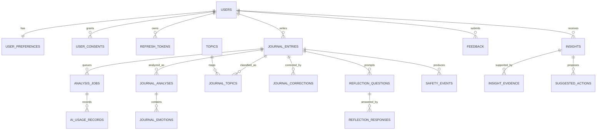

# MYLOG – DATABASE OVERVIEW

| Thuộc tính | Giá trị |
| --- | --- |
| Trạng thái | Current implementation |
| Cập nhật lần cuối | 2026-09-23 |
| Database chính | PostgreSQL 17 |
| Production | Supabase PostgreSQL qua JDBC Session pooler |
| Local/test | PostgreSQL Docker và Testcontainers |
| Quản lý schema | Flyway |
| Schema version hiện tại | `V008` |
| Số bảng hiện tại | 24 |

Tài liệu này mô tả **schema đang được triển khai thực tế** bởi các migration trong
[`backend/src/main/resources/db/migration`](../backend/src/main/resources/db/migration).
Nếu nội dung tài liệu khác với migration, migration là nguồn sự thật cuối cùng.

[`DATABASE_DESIGN.md`](./DATABASE_DESIGN.md) mô tả thiết kế chi tiết và một số khả năng tương lai. Các bảng chỉ xuất hiện trong tài liệu thiết kế nhưng chưa có Flyway migration, chẳng hạn tag, media, report hoặc privacy request, chưa được xem là một phần của database hiện tại.

---

## 1. Vai trò của từng hệ thống lưu trữ

| Hệ thống | Vai trò | Có phải source of truth? |
| --- | --- | --- |
| PostgreSQL | Dữ liệu user, journal, kết quả AI, insight, feedback, job và outbox | Có |
| Redis | Rate limit và cache statistics | Không |
| RabbitMQ | Vận chuyển message giữa API và worker | Không |

Journal phải được commit vào PostgreSQL ngay cả khi Redis, RabbitMQ hoặc AI provider không khả dụng. Event cần phát đi được ghi vào `outbox_events` trong cùng transaction với thay đổi nghiệp vụ, sau đó publisher mới chuyển event sang RabbitMQ.

---

## 2. Kết nối database

### 2.1. Local development

PostgreSQL local được khai báo trong [`backend/compose.yaml`](../backend/compose.yaml):

```text
Host: localhost
Port: 5432
Database: mylog
Username: mylog
```

Khởi động hạ tầng và backend:

```powershell
cd backend
docker compose up -d
.\mvnw.cmd spring-boot:run
```

Profile `local` đọc cấu hình tại [`application-local.yml`](../backend/src/main/resources/application-local.yml). Có thể override bằng `DB_URL`, `DB_USERNAME` và `DB_PASSWORD`.

### 2.2. Supabase

Profile `supabase` đọc cấu hình tại [`application-supabase.yml`](../backend/src/main/resources/application-supabase.yml):

```powershell
$env:SPRING_PROFILES_ACTIVE = 'api,supabase'
$env:DB_URL = 'jdbc:postgresql://YOUR_SESSION_POOLER_HOST:5432/postgres'
$env:DB_USERNAME = 'postgres.YOUR_PROJECT_REF'
$env:DB_PASSWORD = 'YOUR_DATABASE_PASSWORD'
$env:DB_SSL_MODE = 'require'
```

Flyway mặc định dùng cùng datasource với application. Nếu cần kết nối migration riêng:

```powershell
$env:FLYWAY_URL = 'jdbc:postgresql://db.YOUR_PROJECT_REF.supabase.co:5432/postgres'
$env:FLYWAY_USERNAME = 'postgres'
$env:FLYWAY_PASSWORD = 'YOUR_DATABASE_PASSWORD'
```

Không commit connection string có password, database password hoặc file `.env`.

---

## 3. Quy ước dữ liệu

- Table và column dùng `snake_case`; table dùng danh từ số nhiều.
- Business ID và event ID dùng `UUID`, được application sinh.
- Instant dùng `TIMESTAMPTZ`; application xử lý theo UTC.
- Ngày theo timezone user dùng `DATE`, ví dụ `journal_entries.entry_date`.
- Trạng thái dùng `VARCHAR` kết hợp `CHECK`, không dùng PostgreSQL enum.
- Dữ liệu có cấu trúc linh hoạt dùng `JSONB`, nhưng vẫn có constraint kiểm tra array/object khi cần.
- Mood, stress và energy nằm trong khoảng `1–10`; giá trị không được cung cấp lưu bằng `NULL`, không dùng `0`.
- Emotion/confidence score dùng `NUMERIC` trong khoảng `0–1`.
- Business entity thuộc user thường có `user_id` để ownership được kiểm tra ngay trong query.
- `ON DELETE CASCADE` được dùng cho dữ liệu phụ thuộc hoàn toàn vào user hoặc aggregate cha.

---

## 4. Danh mục bảng theo module

| Module | Bảng | Mục đích |
| --- | --- | --- |
| Identity | `users` | Tài khoản, plan, trạng thái và optimistic version |
| Identity | `user_preferences` | Timezone, ngôn ngữ, onboarding và journaling goals |
| Identity | `user_consents` | Consent theo loại và policy version |
| Identity | `refresh_tokens` | Refresh-token rotation; chỉ lưu token hash |
| Journal | `journal_entries` | Nội dung journal, score, local date, soft delete và version |
| Analysis | `analysis_jobs` | Hàng đợi bền vững cho analysis/reflection worker |
| Analysis | `journal_analyses` | Kết quả phân tích theo journal version |
| Analysis | `journal_emotions` | Emotion gốc và giá trị user correction |
| Analysis | `topics` | Từ điển topic dùng chung |
| Analysis | `journal_topics` | Liên kết journal–topic và trạng thái effective |
| Analysis | `journal_corrections` | Audit append-only cho correction |
| Reflection | `reflection_questions` | Câu hỏi phản chiếu được sinh theo batch |
| Reflection | `reflection_responses` | Câu trả lời của user |
| Safety | `safety_events` | Risk level, nguồn phát hiện và hành động an toàn |
| Operations | `ai_usage_records` | Token, latency, provider/model và lỗi AI |
| Statistics | `daily_user_statistics` | Projection thống kê journal theo ngày |
| Statistics | `daily_emotion_statistics` | Projection emotion theo ngày |
| Insight | `insights` | Insight, confidence, lifecycle và evidence period |
| Insight | `insight_evidence` | Bằng chứng định lượng có calculation version |
| Insight | `suggested_actions` | Hành động gợi ý gắn với insight |
| Feedback | `feedback` | Helpful/not-helpful cho reflection, action hoặc insight |
| Messaging | `outbox_events` | Transactional outbox và trạng thái publish |
| Messaging | `processed_messages` | Consumer deduplication cho delivery at-least-once |
| API reliability | `idempotency_records` | Idempotency của request tạo resource |

---

## 5. Quan hệ chính



`feedback.target_id` là polymorphic reference. Database không tạo foreign key từ cột này đến ba bảng khác nhau; `FeedbackRepository` kiểm tra target và ownership trước khi upsert.

Các bảng `outbox_events`, `processed_messages` và `idempotency_records` là bảng kỹ thuật nên không nằm trong ERD nghiệp vụ trên.

---

## 6. Các aggregate và invariant quan trọng

### 6.1. User và authentication

- `users.email_normalized` là unique key dùng khi đăng ký/đăng nhập.
- Password chỉ được lưu dưới dạng `password_hash`.
- Refresh token plaintext không được lưu; database chỉ giữ `token_hash`.
- `family_id` nhóm các refresh token cùng rotation chain.
- Khi phát hiện token reuse, application có thể revoke cả token family.
- `user_consents` unique theo `(user_id, consent_type, policy_version)`.

### 6.2. Journal versioning

`journal_entries` có hai loại version độc lập:

| Column | Ý nghĩa |
| --- | --- |
| `version` | Optimistic lock của JPA row |
| `journal_version` | Version của input gửi sang pipeline AI |

Thay đổi content, mood, stress, energy hoặc thời điểm journal làm tăng `journal_version`. Kết quả AI cũ không được trở thành current result cho version mới.

Journal sử dụng soft delete qua `deleted_at`. Mọi query user-facing phải lọc `deleted_at IS NULL`.

### 6.3. Analysis và correction

- `(journal_entry_id, journal_version)` trong `journal_analyses` là unique.
- Partial unique index `uq_journal_analysis_current` bảo đảm mỗi journal chỉ có một analysis `is_current = TRUE`.
- Emotion hiệu lực được tính bằng:

```sql
COALESCE(corrected_score, original_score)
```

- Topic hiệu lực là row `journal_topics.is_active = TRUE`.
- `journal_corrections` là audit append-only; correction không xóa dữ liệu AI gốc.
- Job unique theo `(journal_entry_id, journal_version, job_type)` để tránh enqueue trùng.

### 6.4. Insight và feedback

- Insight unique theo `(user_id, fingerprint, period_start, period_end)`.
- Evidence lưu `calculation_version` để kết quả có thể truy nguyên khi thuật toán thay đổi.
- Lifecycle insight gồm `ACTIVE`, `FADING`, `EXPIRED`, `DISMISSED`.
- Feedback unique theo `(user_id, target_type, target_id)`, vì vậy `PUT` có tính idempotent.

### 6.5. Messaging và idempotency

- Business transaction ghi event vào `outbox_events` trước khi commit.
- Publisher claim event bằng trạng thái và `FOR UPDATE SKIP LOCKED`.
- `processed_messages` có primary key `(consumer_name, message_id)` để cùng message không được xử lý hai lần bởi một consumer.
- `idempotency_records` unique theo user, method, path và idempotency key.
- Outbox payload chỉ chứa ID/version cần thiết, không chứa journal content.

---

## 7. Data ownership giữa các module

Mỗi module sở hữu write model của các bảng thuộc module đó. Cross-module write không được thực hiện trực tiếp.

Có ba ngoại lệ đọc có chủ đích:

- `statistics` đọc journal, analysis, emotion và topic để tạo read model.
- `insight` đọc user preference, journal và analysis để tạo evidence.
- `feedback` đọc reflection/action/insight để xác minh target thuộc user.

Các query này phải nằm trong repository, luôn có user scope phù hợp và được review khi schema nguồn thay đổi. ArchUnit chỉ kiểm tra dependency Java, không nhìn thấy table name bên trong SQL.

---

## 8. Index strategy

Các nhóm index quan trọng hiện tại:

- Journal history: `(user_id, created_at DESC, id DESC)` với điều kiện `deleted_at IS NULL`.
- Journal theo local date: `(user_id, entry_date DESC)`.
- Job claim: `(status, next_attempt_at, created_at)` cho `PENDING`/`RETRY_WAIT`.
- Outbox claim: `(status, next_attempt_at, occurred_at)` cho `PENDING`/`FAILED`.
- Current analysis: partial unique index theo `journal_entry_id`.
- Insight list: `(user_id, status, period_end DESC)`.
- Suggested action: `(user_id, status, created_at DESC)`.
- Feedback history: `(user_id, updated_at DESC)`.

Không thêm index chỉ vì một column thường xuất hiện trong schema. Index mới cần dựa trên query thật và nên được xác minh bằng `EXPLAIN (ANALYZE, BUFFERS)` với dữ liệu có kích thước đại diện.

---

## 9. Bảo mật và quyền truy cập

- Backend truy cập PostgreSQL trực tiếp bằng JDBC; frontend không truy cập application tables qua Supabase Data API.
- RLS được bật cho toàn bộ application tables.
- Không có client policy cho `anon` hoặc `authenticated`.
- Migration thu hồi schema/table/sequence/routine privileges khỏi `anon`, `authenticated` và pseudo-role `PUBLIC`.
- Authentication và authorization nghiệp vụ được thực thi trong Spring Security và repository-scoped query.
- RLS hiện là lớp phòng vệ cho Data API roles, không thay thế ownership check trong backend.
- Journal content, reflection response và safety data là dữ liệu nhạy cảm; không được đưa vào application log, outbox payload hoặc error response.

Production nên dùng application role có đúng quyền cần thiết thay vì superuser/schema owner, đồng thời tách migration credential khỏi runtime credential khi hạ tầng cho phép.

---

## 10. Flyway migrations

| Version | Nội dung |
| --- | --- |
| `V001` | Identity core, journal, analysis jobs, outbox và idempotency |
| `V002` | Chặn Supabase Data API roles và bật RLS cho core tables |
| `V003` | User consent, refresh-token metadata và identity indexes |
| `V004` | Thu hồi quyền kế thừa từ PostgreSQL `PUBLIC` |
| `V005` | Analysis, emotion, topic và correction schema |
| `V006` | Reflection, safety event và AI usage |
| `V007` | Statistics projection, insight, action và feedback |
| `V008` | Index cho statistics, insight, action và feedback |

Quy tắc migration:

1. Không sửa migration đã chạy trên shared environment.
2. Mọi schema change tạo file migration version mới.
3. Migration phải chạy được từ database sạch và từ version liền trước.
4. Thay đổi destructive dùng expand/contract thay vì drop/rename tức thời.
5. Deploy migration trước application code cần schema mới.
6. Không đặt business seed data hoặc secret trong migration.

---

## 11. Kiểm tra database

Chạy unit và architecture tests:

```powershell
cd backend
.\mvnw.cmd clean test
```

Chạy toàn bộ integration tests với Docker đang hoạt động:

```powershell
.\mvnw.cmd verify
```

Integration suite dùng Testcontainers để tạo PostgreSQL sạch, chạy toàn bộ Flyway migrations và kiểm tra repository/API. Test Supabase thật chỉ chạy khi thiết lập `RUN_SUPABASE_IT=true` cùng credential tương ứng.

Các invariant nên luôn được kiểm tra:

- Unique normalized email và consent version.
- Score ngoài range bị database từ chối.
- Chỉ có một current analysis cho mỗi journal.
- Job, message và HTTP idempotency không tạo kết quả trùng.
- Journal version cũ không ghi đè kết quả của version mới.
- Query user A không đọc được dữ liệu user B.
- Soft-deleted journal không xuất hiện trong history/statistics.
- Outbox vẫn giữ event khi RabbitMQ không khả dụng.
- Missing stress/energy vẫn là `NULL` trong statistics.

---

## 12. Checklist khi thêm bảng hoặc column

- Xác định module sở hữu dữ liệu và write path.
- Chọn rõ FK behavior: `CASCADE`, `SET NULL` hoặc `RESTRICT`.
- Thêm `CHECK`, `UNIQUE` và `NOT NULL` cho invariant có thể bảo vệ ở database.
- Với dữ liệu user-owned, thêm ownership column hoặc đường join ownership rõ ràng.
- Bật RLS và thu hồi quyền Data API theo cùng convention hiện tại.
- Chỉ thêm index dựa trên query path thực tế.
- Cập nhật repository/entity, integration test và tài liệu này.
- Kiểm tra payload event không chứa dữ liệu nhạy cảm.
- Tạo migration mới; không chỉnh sửa V001–V008.

